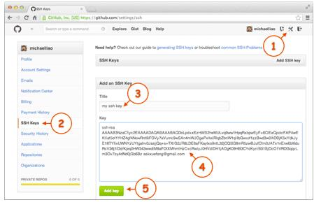
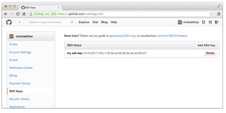
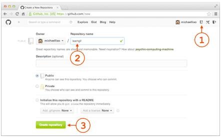
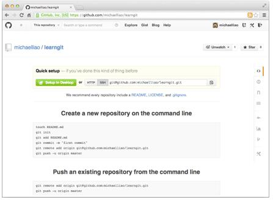
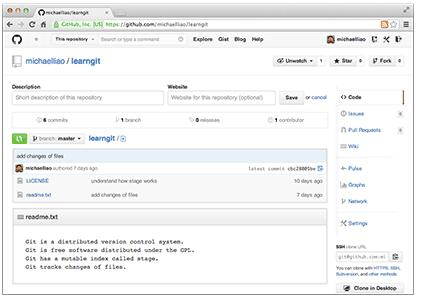
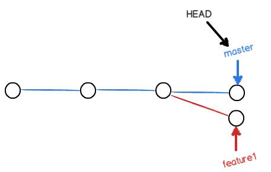
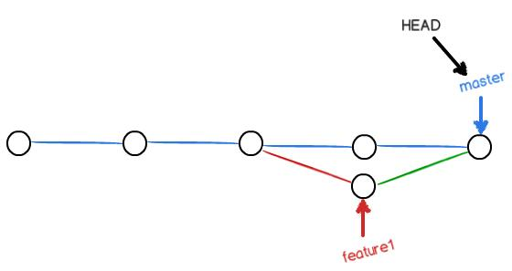

# 1. **安装Git**[^1]
[^1]:https://www.liaoxuefeng.com/wiki/0013739516305929606dd18361248578c67b8067c8c017b000
* ***windows环境***
	* [Git官网直接下载安装程序](https://git-scm.com)
	* 安装完成后，还需要最后一步设置，在命令行输入：  
	 
			$ git config --global user.name "Your Name"
			$ git config --global user.email "email@example.com"
* ***linux环境***  
	* 	Ubuntu系统,使用命令 
		> sudo apt-get install git
	*   其他系统
		>从Git官网下载**[源码](https://github.com/git/git)**，然后解压，[依次输入：./config，make，sudo make install这几个命令安装就好了](https://github.com/git/git/blob/master/INSTALL)。

# 2. **关于repository**
  repository是被git管理的目录  

1. **创建 repository**  
	* 创建一个空目录并进入,以/learngit为例
	* 让其变成Git可以管理的仓库
	 
			git init

2. **把文件添加到repository**
	* 在/learngit下添加文件或文件夹,以添加readme.txt为例,查看 仓库当前的状态 
	 
			git status
	* 添加盖文件至仓库
	 
			git add readme.txt
			
	
	* 文件提交到仓库,简单解释一下git commit命令，-m后面输入的是本次提交的说明，可以输入任意内容，当然最好是有意义的，这样你就能从历史记录里方便地找到改动记录。
	 	
			git commit -m "wrote a readme file"  
	* 继续修改readme.txt文件内容,运行git status
	 
			$ git status
			# On branch master
			# Changes not staged for commit:
			#   (use "git add <file>..." to update what will be committed)
			#   (use "git checkout -- <file>..." to discard changes in working directory)
			#
			#    modified:   readme.txt
			#
			no changes added to commit (use "git add" and/or "git commit -a") 

	    上面的命令告诉我们，readme.txt被修改过了，但还没有准备提交的修改。
		
	    虽然Git告诉我们readme.txt被修改了，但如果能看看具体修改了什么内容，自然是很好的。比如你休假两周从国外回来，第一天上班时，已经记不清上次怎么修改的readme.txt，所以，需要用git diff这个命令看看：

			$ git diff readme.txt 
			diff --git a/readme.txt b/readme.txt
			index 46d49bf..9247db6 100644
			--- a/readme.txt
			+++ b/readme.txt
			@@ -1,2 +1,2 @@
			-Git is a version control system.
			+Git is a distributed version control system.
			 Git is free software.

		git diff顾名思义就是查看difference，显示的格式正是Unix通用的diff格式，可以从上面的命令输出看到，我们在第一行添加了一个“distributed”单词。
		
		知道了对readme.txt作了什么修改后，再把它提交到仓库就放心多了，提交修改和提交新文件是一样的两步  

			$ git add readme.txt
			$ git status
			$ git commit -m "add distributed"  

# 3. **版本及文件管理**
1. **版本回退**
	
	在Git中，我们用git log命令查看：
		
		$ git log
		commit 3628164fb26d48395383f8f31179f24e0882e1e0
		Author: Michael Liao <askxuefeng@gmail.com>
		Date:   Tue Aug 20 15:11:49 2013 +0800
		
		    append GPL
		
		commit ea34578d5496d7dd233c827ed32a8cd576c5ee85
		Author: Michael Liao <askxuefeng@gmail.com>
		Date:   Tue Aug 20 14:53:12 2013 +0800
		
		    add distributed
		
		commit cb926e7ea50ad11b8f9e909c05226233bf755030
		Author: Michael Liao <askxuefeng@gmail.com>
		Date:   Mon Aug 19 17:51:55 2013 +0800
		
		    wrote a readme file  
	
	git log命令显示从最近到最远的提交日志，我们可以看到3次提交，最近的一次是append GPL，上一次是add distributed，最早的一次是wrote a readme file。
	如果嫌输出信息太多，看得眼花缭乱的，可以试试加上--pretty=oneline参数:

		$ git log --pretty=oneline
		3628164fb26d48395383f8f31179f24e0882e1e0 append GPL
		ea34578d5496d7dd233c827ed32a8cd576c5ee85 add distributed
		cb926e7ea50ad11b8f9e909c05226233bf755030 wrote a readme file  

	类似3628164...882e1e0的是commit id（版本号）.
	Git的版本回退速度非常快，因为Git在内部有个指向当前版本的HEAD指针，当你回退版本的时候，Git仅仅是把HEAD从指向改为之前的commit id（版本号).
	在Git中，用HEAD表示当前版本，也就是最新的提交3628164...882e1e0（注意我的提交ID和你的肯定不一样），上一个版本就是HEAD^，上上一个版本就是HEAD^^，当然往上100个版本写100个^比较容易数不过来，所以写成HEAD~100。
	
		$ git reset --hard HEAD^
		HEAD is now at ea34578 add distributed

	

	现在再看readme.txt就回退到上一个版本了.
	
	如果我后悔了又想恢复到新版本.Git提供了一个命令git reflog用来记录你的每一次命令：

		$ git reflog
		ea34578 HEAD@{0}: reset: moving to HEAD^
		3628164 HEAD@{1}: commit: append GPL
		ea34578 HEAD@{2}: commit: add distributed
		cb926e7 HEAD@{3}: commit (initial): wrote a readme file  

2. **工作区和暂存区**  
	* 工作区（Working Directory）:就是你在电脑里能看到的目录，比如我的learngit文件夹就是一个工作区.
	* 版本库（Repository）:工作区有一个隐藏目录.git，这个不算工作区，而是Git的版本库。

	Git的版本库里存了很多东西，其中最重要的就是称为stage（或者叫index）的暂存区，还有Git为我们自动创建的第一个分支master，以及指向master的一个指针叫HEAD。
	
	把文件往Git版本库里添加的时候，是分两步执行的：

	第一步是用git add把文件添加进去，实际上就是把文件修改添加到暂存区；
	
	第二步是用git commit提交更改，实际上就是把暂存区的所有内容提交到当前分支。
	
	因为我们创建Git版本库时，Git自动为我们创建了唯一一个master分支，所以，现在，git commit就是往master分支上提交更改。

	俗话说，实践出真知。现在，我们再练习一遍，先对readme.txt做个修改，比如加上一行内容：

	Git is a distributed version control system.
	Git is free software distributed under the GPL.
	Git has a mutable index called stage.
	然后，在工作区新增一个LICENSE文本文件（内容随便写）。
	
	先用git status查看一下状态：
	
		$ git status
		# On branch master
		# Changes not staged for commit:
		#   (use "git add <file>..." to update what will be committed)
		#   (use "git checkout -- <file>..." to discard changes in working directory)
		#
		#       modified:   readme.txt
		#
		# Untracked files:
		#   (use "git add <file>..." to include in what will be committed)
		#
		#       LICENSE
		no changes added to commit (use "git add" and/or "git commit -a")
	Git非常清楚地告诉我们，readme.txt被修改了，而LICENSE还从来没有被添加过，所以它的状态是Untracked。
	
	现在，使用两次命令git add，把readme.txt和LICENSE都添加后，用git status再查看一下：
		
		$ git status
		# On branch master
		# Changes to be committed:
		#   (use "git reset HEAD <file>..." to unstage)
		#
		#       new file:   LICENSE
		#       modified:   readme.txt
		#
	现在，暂存区的状态就变成这样了：
	

	
   所以，git add命令实际上就是把要提交的所有修改放到暂存区（Stage），然后，执行git commit就可以一次性把暂存区的所有修改提交到分支。

			$ git commit -m "understand how stage works"
			[master 27c9860] understand how stage works
			 2 files changed, 675 insertions(+)
			 create mode 100644 LICENSE  

   一旦提交后，如果你又没有对工作区做任何修改，那么工作区就是“干净”的：

		$ git status
		# On branch master
		nothing to commit (working directory clean)    

   现在版本库变成了这样，暂存区就没有任何内容了：  
 
  

3. **管理修改**  
	现在，假定你已经完全掌握了暂存区的概念。下面，我们要讨论的就是，为什么Git比其他版本控制系统设计得优秀，因为Git跟踪并管理的是修改，而非文件。

	你会问，什么是修改？比如你新增了一行，这就是一个修改，删除了一行，也是一个修改，更改了某些字符，也是一个修改，删了一些又加了一些，也是一个修改，甚至创建一个新文件，也算一个修改。

	为什么说Git管理的是修改，而不是文件呢？我们还是做实验。第一步，对readme.txt做一个修改，比如加一行内容：

		$ cat readme.txt
		Git is a distributed version control system.
		Git is free software distributed under the GPL.
		Git has a mutable index called stage.
		Git tracks changes.
	然后，添加：

		$ git add readme.txt
		$ git status
		# On branch master
		# Changes to be committed:
		#   (use "git reset HEAD <file>..." to unstage)
		#
		#       modified:   readme.txt
		#
	然后，再修改readme.txt：

		$ cat readme.txt 
		Git is a distributed version control system.
		Git is free software distributed under the GPL.
		Git has a mutable index called stage.
		Git tracks changes of files.
	提交：

		$ git commit -m "git tracks changes"
		[master d4f25b6] git tracks changes
		 1 file changed, 1 insertion(+)
	提交后，再看看状态：

		$ git status
		# On branch master
		# Changes not staged for commit:
		#   (use "git add <file>..." to update what will be committed)
		#   (use "git checkout -- <file>..." to discard changes in working directory)
		#
		#       modified:   readme.txt
		#
		no changes added to commit (use "git add" and/or "git commit -a")
	咦，怎么第二次的修改没有被提交？

	别激动，我们回顾一下操作过程：

	第一次修改 -> git add -> 第二次修改 -> git commit

	你看，我们前面讲了，Git管理的是修改，当你用git add命令后，在工作区的第一次修改被放入暂存区，准备提交，但是，在工作区的第二次修改并没有放入暂存区，所以，git commit只负责把暂存区的修改提交了，也就是第一次的修改被提交了，第二次的修改不会被提交。

	提交后，用git diff HEAD -- readme.txt命令可以查看工作区和版本库里面最新版本的区别：

		$ git diff HEAD -- readme.txt 
		diff --git a/readme.txt b/readme.txt
		index 76d770f..a9c5755 100644
		--- a/readme.txt
		+++ b/readme.txt
		@@ -1,4 +1,4 @@
		 Git is a distributed version control system.
		 Git is free software distributed under the GPL.
		 Git has a mutable index called stage.
		-Git tracks changes.
		+Git tracks changes of files.
	可见，第二次修改确实没有被提交。

 	那怎么提交第二次修改呢？你可以继续git add再git commit，也可以别着急提交第一次修改，先git add第二次修改，再git commit，就相当于把两次修改合并后一块提交了：

	第一次修改 -> git add -> 第二次修改 -> git add -> git commit  

4. **撤销修改**

	* git checkout -- file可以丢弃**工作区**的修改：
	
		$ git checkout -- readme.txt
		命令git checkout -- readme.txt意思就是，把readme.txt文件在工作区的修改全部撤销，这里有两种情况：
	
		* 一种是readme.txt自修改后还没有被放到暂存区，现在，撤销修改就回到和版本库一模一样的状态；
	
		* 一种是readme.txt已经添加到暂存区后，又作了修改，现在，撤销修改就回到添加到暂存区后的状态。
	
		总之，就是让这个文件回到最近一次git commit或git add时的状态。git checkout -- file命令中的--很重要，没有--，就变成了“切换到另一个分支”的命令，我们在后面的分支管理中会再次遇到git checkout命令。
	
	* 现在假定是凌晨3点，你不但写了一些胡话，还git add到暂存区了：

			$ cat readme.txt
			Git is a distributed version control system.
			Git is free software distributed under the GPL.
			Git has a mutable index called stage.
			Git tracks changes of files.
			My stupid boss still prefers SVN.
		
			$ git add readme.txt
	庆幸的是，在commit之前，你发现了这个问题。用git status查看一下，修改只是添加到了暂存区，还没有提交：

				$ git status
				# On branch master
				# Changes to be committed:
				#   (use "git reset HEAD <file>..." to unstage)
				#
				#       modified:   readme.txt
				#
	Git同样告诉我们，用命令git reset HEAD file可以把**暂存区的修改撤销掉**（unstage），重新放回工作区：

			$ git reset HEAD readme.txt
			Unstaged changes after reset:
			M       readme.txt
	git reset命令既可以回退版本，也可以把暂存区的修改回退到工作区。当我们用HEAD时，表示最新的版本。
	再用git status查看一下，现在暂存区是干净的，工作区有修改：

			$ git status
			# On branch master
			# Changes not staged for commit:
			#   (use "git add <file>..." to update what will be committed)
			#   (use "git checkout -- <file>..." to discard changes in working directory)
			#
			#       modified:   readme.txt
			#
			no changes added to commit (use "git add" and/or "git commit -a")
	还记得如何丢弃工作区的修改吗？

			$ git checkout -- readme.txt
			
			$ git status
			# On branch master
			nothing to commit (working directory clean)
	整个世界终于清静了！

5. **删除文件**  

	在Git中，删除也是一个修改操作，我们实战一下，先添加一个新文件test.txt到Git并且提交：

		$ git add test.txt
		$ git commit -m "add test.txt"
		[master 94cdc44] add test.txt
		 1 file changed, 1 insertion(+)
		 create mode 100644 test.txt
	一般情况下，你通常直接在文件管理器中把没用的文件删了，或者用rm命令删了：

		$ rm test.txt
	这个时候，Git知道你删除了文件，因此，工作区和版本库就不一致了，git status命令会立刻告诉你哪些文件被删除了：

		$ git status
		# On branch master
		# Changes not staged for commit:
		#   (use "git add/rm <file>..." to update what will be committed)
		#   (use "git checkout -- <file>..." to discard changes in working directory)
		#
		#       deleted:    test.txt
		#
		no changes added to commit (use "git add" and/or "git commit -a")
	现在你有两个选择，一是确实要从版本库中删除该文件，那就用命令git rm删掉，并且git commit：

		$ git rm test.txt
		rm 'test.txt'
		$ git commit -m "remove test.txt"
		[master d17efd8] remove test.txt
		 1 file changed, 1 deletion(-)
		 delete mode 100644 test.txt
	现在，文件就从版本库中被删除了。

	另一种情况是删错了，因为版本库里还有呢，所以可以很轻松地把误删的文件恢复到最新版本：

		$ git checkout -- test.txt
	git checkout其实是用版本库里的版本替换工作区的版本，无论工作区是修改还是删除，都可以“一键还原”。

	
# **4.远程仓库**  

* **github**  

	 到目前为止，我们已经掌握了如何在Git仓库里对一个文件进行时光穿梭，你再也不用担心文件备份或者丢失的问题了。
	
	可是有用过集中式版本控制系统SVN的童鞋会站出来说，这些功能在SVN里早就有了，没看出Git有什么特别的地方。
	
	没错，如果只是在一个仓库里管理文件历史，Git和SVN真没啥区别。为了保证你现在所学的Git物超所值，将来绝对不会后悔，同时为了打击已经不幸学了SVN的童鞋，本章开始介绍Git的杀手级功能之一（注意是之一，也就是后面还有之二，之三……）：远程仓库。
	
	Git是分布式版本控制系统，同一个Git仓库，可以分布到不同的机器上。怎么分布呢？最早，肯定只有一台机器有一个原始版本库，此后，别的机器可以“克隆”这个原始版本库，而且每台机器的版本库其实都是一样的，并没有主次之分。
	
	你肯定会想，至少需要两台机器才能玩远程库不是？但是我只有一台电脑，怎么玩？
	
	其实一台电脑上也是可以克隆多个版本库的，只要不在同一个目录下。不过，现实生活中是不会有人这么傻的在一台电脑上搞几个远程库玩，因为一台电脑上搞几个远程库完全没有意义，而且硬盘挂了会导致所有库都挂掉，所以我也不告诉你在一台电脑上怎么克隆多个仓库。
	
	实际情况往往是这样，找一台电脑充当服务器的角色，每天24小时开机，其他每个人都从这个“服务器”仓库克隆一份到自己的电脑上，并且各自把各自的提交推送到服务器仓库里，也从服务器仓库中拉取别人的提交。
	
	完全可以自己搭建一台运行Git的服务器，不过现阶段，为了学Git先搭个服务器绝对是小题大作。好在这个世界上有个叫GitHub的神奇的网站，从名字就可以看出，这个网站就是提供Git仓库托管服务的，所以，只要注册一个GitHub账号，就可以免费获得Git远程仓库。
	
	在继续阅读后续内容前，请自行注册GitHub账号。由于你的本地Git仓库和GitHub仓库之间的传输是通过SSH加密的，所以，需要一点设置：
	
	第1步：创建SSH Key。在用户主目录下，看看有没有.ssh目录，如果有，再看看这个目录下有没有id_rsa和id_rsa.pub这两个文件，如果已经有了，可直接跳到下一步。如果没有，打开Shell（Windows下打开Git Bash），创建SSH Key：
	
		$ ssh-keygen -t rsa -C "youremail@example.com"
	你需要把邮件地址换成你自己的邮件地址，然后一路回车，使用默认值即可，由于这个Key也不是用于军事目的，所以也无需设置密码。
	
	如果一切顺利的话，可以在用户主目录里找到.ssh目录，里面有id_rsa和id_rsa.pub两个文件，这两个就是SSH Key的秘钥对，id_rsa是私钥，不能泄露出去，id_rsa.pub是公钥，可以放心地告诉任何人。
	
	第2步：登陆GitHub，打开“Account settings”，“SSH Keys”页面：
	
	然后，点“Add SSH Key”，填上任意Title，在Key文本框里粘贴id_rsa.pub文件的内容：
	
	
	
	点“Add Key”，你就应该看到已经添加的Key：
	
	
	
	为什么GitHub需要SSH Key呢？因为GitHub需要识别出你推送的提交确实是你推送的，而不是别人冒充的，而Git支持SSH协议，所以，GitHub只要知道了你的公钥，就可以确认只有你自己才能推送。
	
	当然，GitHub允许你添加多个Key。假定你有若干电脑，你一会儿在公司提交，一会儿在家里提交，只要把每台电脑的Key都添加到GitHub，就可以在每台电脑上往GitHub推送了。
	
	最后友情提示，在GitHub上免费托管的Git仓库，任何人都可以看到喔（但只有你自己才能改）。所以，不要把敏感信息放进去。
	
	如果你不想让别人看到Git库，有两个办法，一个是交点保护费，让GitHub把公开的仓库变成私有的，这样别人就看不见了（不可读更不可写）。另一个办法是自己动手，搭一个Git服务器，因为是你自己的Git服务器，所以别人也是看不见的。这个方法我们后面会讲到的，相当简单，公司内部开发必备。
	
	确保你拥有一个GitHub账号后，我们就即将开始远程仓库的学习。

* **添加远程库**

	* **现有本地仓库的情况**  
现在的情景是，你已经在本地创建了一个Git仓库后，又想在GitHub创建一个Git仓库，并且让这两个仓库进行远程同步，这样，GitHub上的仓库既可以作为备份，又可以让其他人通过该仓库来协作，真是一举多得。

		首先，登陆GitHub，然后，在右上角找到“Create a new repo”按钮，创建一个新的仓库：
		
		
		
		在Repository name填入learngit，其他保持默认设置，点击“Create repository”按钮，就成功地创建了一个新的Git仓库：
		
		
		
		目前，在GitHub上的这个learngit仓库还是空的，GitHub告诉我们，可以从这个仓库克隆出新的仓库，也可以把一个已有的本地仓库与之关联，然后，把本地仓库的内容推送到GitHub仓库。
		
		现在，我们根据GitHub的提示，在本地的learngit仓库下运行命令：
		
			$ git remote add origin(也可以自己起远程库名字) git@github.com:pewee-live/learngit.git
		
		添加后，远程库的名字就是origin，这是Git默认的叫法，也可以改成别的，但是origin这个名字一看就知道是远程库。
		
		下一步，就可以把本地库的所有内容推送到远程库上：
		
			$ git push -u origin master
			Counting objects: 19, done.
			Delta compression using up to 4 threads.
			Compressing objects: 100% (19/19), done.
			Writing objects: 100% (19/19), 13.73 KiB, done.
			Total 23 (delta 6), reused 0 (delta 0)
			To git@github.com:michaelliao/learngit.git
			 * [new branch]      master -> master
			Branch master set up to track remote branch master from origin.
		把本地库的内容推送到远程，用git push命令，实际上是把当前分支master推送到远程。
		
		由于远程库是空的，我们第一次推送master分支时，加上了-u参数，Git不但会把本地的master分支内容推送的远程新的master分支，还会把本地的master分支和远程的master分支关联起来，在以后的推送或者拉取时就可以简化命令。
		
		推送成功后，可以立刻在GitHub页面中看到远程库的内容已经和本地一模一样：
		
		
		
		从现在起，只要本地作了提交，就可以通过命令：
		
			$ git push origin master
		把本地master分支的最新修改推送至GitHub，现在，你就拥有了真正的分布式版本库！
		
		SSH警告
		当你第一次使用Git的clone或者push命令连接GitHub时，会得到一个警告：
		
			The authenticity of host 'github.com (xx.xx.xx.xx)' can't be established.
			RSA key fingerprint is xx.xx.xx.xx.xx.
			Are you sure you want to continue connecting (yes/no)?
		这是因为Git使用SSH连接，而SSH连接在第一次验证GitHub服务器的Key时，需要你确认GitHub的Key的指纹信息是否真的来自GitHub的服务器，输入yes回车即可。
		
		Git会输出一个警告，告诉你已经把GitHub的Key添加到本机的一个信任列表里了：
		
			Warning: Permanently added 'github.com' (RSA) to the list of known hosts.
		这个警告只会出现一次，后面的操作就不会有任何警告了。
		
		如果你实在担心有人冒充GitHub服务器，输入yes前可以对照GitHub的RSA Key的指纹信息是否与SSH连接给出的一致。

	* **直接克隆remote仓库**  
用命令git clone克隆

			$ git clone git@github.com:michaelliao/gitskills.git
			Cloning into 'gitskills'...
			remote: Counting objects: 3, done.
			remote: Total 3 (delta 0), reused 0 (delta 0)
			Receiving objects: 100% (3/3), done.
			
			$ cd gitskills
			$ ls
			README.md  

# **5.分支管理**  

1. **创建与合并分支**

		查看分支：git branch
		
		创建分支：git branch <name>
		
		切换分支：git checkout <name>
		
		创建+切换分支：git checkout -b <name>
		
		合并某分支到当前分支：git merge <name>
		
		删除分支：git branch -d <name>

通常，合并分支时，如果可能，Git会用Fast forward模式，但这种模式下，删除分支后，会丢掉分支信息。

如果要强制禁用Fast forward模式，Git就会在merge时生成一个新的commit，这样，从分支历史上就可以看出分支信息。合并分支时，加上--no-ff参数就可以用普通模式合并,因为合并要创建一个新的commit，所以加上-m参数，把commit描述写进去。

		$ git merge --no-ff -m "merge with no-ff" dev
		Merge made by the 'recursive' strategy.
		 readme.txt |    1 +
		 1 file changed, 1 insertion(+)

2. **解决冲突**  

当2个要合并的分支都有修改时则需要解决冲突
准备新的feature1分支，继续我们的新分支开发：

		$ git checkout -b feature1
		Switched to a new branch 'feature1'
修改readme.txt最后一行，改为：

Creating a new branch is quick AND simple.
在feature1分支上提交：

		$ git add readme.txt 
		$ git commit -m "AND simple"
		[feature1 75a857c] AND simple
		 1 file changed, 1 insertion(+), 1 deletion(-)
切换到master分支：

		$ git checkout master
		Switched to branch 'master'
		Your branch is ahead of 'origin/master' by 1 commit.
Git还会自动提示我们当前master分支比远程的master分支要超前1个提交。

在master分支上把readme.txt文件的最后一行改为：

Creating a new branch is quick & simple.
提交：

		$ git add readme.txt 
		$ git commit -m "& simple"
		[master 400b400] & simple
		 1 file changed, 1 insertion(+), 1 deletion(-)
现在，master分支和feature1分支各自都分别有新的提交，变成了这样：

这种情况下，Git无法执行“快速合并”，只能试图把各自的修改合并起来，但这种合并就可能会有冲突，我们试试看：

		$ git merge feature1
		Auto-merging readme.txt
		CONFLICT (content): Merge conflict in readme.txt
		Automatic merge failed; fix conflicts and then commit the result.
果然冲突了！Git告诉我们，readme.txt文件存在冲突，必须手动解决冲突后再提交。git status也可以告诉我们冲突的文件：

		$ git status
		# On branch master
		# Your branch is ahead of 'origin/master' by 2 commits.
		#
		# Unmerged paths:
		#   (use "git add/rm <file>..." as appropriate to mark resolution)
		#
		#       both modified:      readme.txt
		#
		no changes added to commit (use "git add" and/or "git commit -a")
我们可以直接查看readme.txt的内容：

		Git is a distributed version control system.
		Git is free software distributed under the GPL.
		Git has a mutable index called stage.
		Git tracks changes of files.
		<<<<<<< HEAD
		Creating a new branch is quick & simple.
		=======
		Creating a new branch is quick AND simple.
		>>>>>>> feature1

Git用<<<<<<<，=======，>>>>>>>标记出不同分支的内容，我们修改如下后保存：

Creating a new branch is quick and simple.
再提交：

		$ git add readme.txt 
		$ git commit -m "conflict fixed"
		[master 59bc1cb] conflict fixed
现在，master分支和feature1分支变成了下图所示：

用带参数的git log也可以看到分支的合并情况：

		$ git log --graph --pretty=oneline --abbrev-commit
		*   59bc1cb conflict fixed
		|\
		| * 75a857c AND simple
		* | 400b400 & simple
		|/
		* fec145a branch test
		...
最后，删除feature1分支：

		$ git branch -d feature1
		Deleted branch feature1 (was 75a857c). 

3. **Bug分支**  

软件开发中，bug就像家常便饭一样。有了bug就需要修复，在Git中，由于分支是如此的强大，所以，每个bug都可以通过一个新的临时分支来修复，修复后，合并分支，然后将临时分支删除。

当你接到一个修复一个代号101的bug的任务时，很自然地，你想创建一个分支issue-101来修复它，但是，等等，当前正在dev上进行的工作还没有提交：

		$ git status
		# On branch dev
		# Changes to be committed:
		#   (use "git reset HEAD <file>..." to unstage)
		#
		#       new file:   hello.py
		#
		# Changes not staged for commit:
		#   (use "git add <file>..." to update what will be committed)
		#   (use "git checkout -- <file>..." to discard changes in working directory)
		#
		#       modified:   readme.txt
		#
并不是你不想提交，而是工作只进行到一半，还没法提交，预计完成还需1天时间。但是，必须在两个小时内修复该bug，怎么办？

幸好，Git还提供了一个stash功能，可以把当前工作现场“储藏”起来，等以后恢复现场后继续工作：

		$ git stash
		Saved working directory and index state WIP on dev: 6224937 add merge
		HEAD is now at 6224937 add merge
现在，用git status查看工作区，就是干净的（除非有没有被Git管理的文件），因此可以放心地创建分支来修复bug。

首先确定要在哪个分支上修复bug，假定需要在master分支上修复，就从master创建临时分支：

		$ git checkout master
		Switched to branch 'master'
		Your branch is ahead of 'origin/master' by 6 commits.
		$ git checkout -b issue-101
		Switched to a new branch 'issue-101'
现在修复bug，需要把“Git is free software ...”改为“Git is a free software ...”，然后提交：

		$ git add readme.txt 
		$ git commit -m "fix bug 101"
		[issue-101 cc17032] fix bug 101
		 1 file changed, 1 insertion(+), 1 deletion(-)
修复完成后，切换到master分支，并完成合并，最后删除issue-101分支：

		$ git checkout master
		Switched to branch 'master'
		Your branch is ahead of 'origin/master' by 2 commits.
		$ git merge --no-ff -m "merged bug fix 101" issue-101
		Merge made by the 'recursive' strategy.
		 readme.txt |    2 +-
		 1 file changed, 1 insertion(+), 1 deletion(-)
		$ git branch -d issue-101
		Deleted branch issue-101 (was cc17032).
太棒了，原计划两个小时的bug修复只花了5分钟！现在，是时候接着回到dev分支干活了！

		$ git checkout dev
		Switched to branch 'dev'
		$ git status
		# On branch dev
		nothing to commit (working directory clean)
工作区是干净的，刚才的工作现场存到哪去了？用git stash list命令看看：

		$ git stash list
		stash@{0}: WIP on dev: 6224937 add merge
工作现场还在，Git把stash内容存在某个地方了，但是需要恢复一下，有两个办法：

一是用git stash apply恢复，但是恢复后，stash内容并不删除，你需要用git stash drop来删除；

另一种方式是用git stash pop，恢复的同时把stash内容也删了：

		$ git stash pop
		# On branch dev
		# Changes to be committed:
		#   (use "git reset HEAD <file>..." to unstage)
		#
		#       new file:   hello.py
		#
		# Changes not staged for commit:
		#   (use "git add <file>..." to update what will be committed)
		#   (use "git checkout -- <file>..." to discard changes in working directory)
		#
		#       modified:   readme.txt
		#
		Dropped refs/stash@{0} (f624f8e5f082f2df2bed8a4e09c12fd2943bdd40)
再用git stash list查看，就看不到任何stash内容了：

		$ git stash list
你可以多次stash，恢复的时候，先用git stash list查看，然后恢复指定的stash，用命令：

		$ git stash apply stash@{0}

4. **Feature分支**

软件开发中，总有无穷无尽的新的功能要不断添加进来。

添加一个新功能时，你肯定不希望因为一些实验性质的代码，把主分支搞乱了，所以，每添加一个新功能，最好新建一个feature分支，在上面开发，完成后，合并，最后，删除该feature分支。

现在，你终于接到了一个新任务：开发代号为Vulcan的新功能，该功能计划用于下一代星际飞船。

于是准备开发：

		$ git checkout -b feature-vulcan
		Switched to a new branch 'feature-vulcan'
5分钟后，开发完毕：

		$ git add vulcan.py
		$ git status
		# On branch feature-vulcan
		# Changes to be committed:
		#   (use "git reset HEAD <file>..." to unstage)
		#
		#       new file:   vulcan.py
		#
		$ git commit -m "add feature vulcan"
		[feature-vulcan 756d4af] add feature vulcan
		 1 file changed, 2 insertions(+)
		 create mode 100644 vulcan.py
切回dev，准备合并：

		$ git checkout dev
一切顺利的话，feature分支和bug分支是类似的，合并，然后删除。

但是，

就在此时，接到上级命令，因经费不足，新功能必须取消！

虽然白干了，但是这个分支还是必须就地销毁：

		$ git branch -d feature-vulcan
		error: The branch 'feature-vulcan' is not fully merged.
		If you are sure you want to delete it, run 'git branch -D feature-vulcan'.
		销毁失败。Git友情提醒，feature-vulcan分支还没有被合并，如果删除，将丢失掉修改，如果要强行删除，需要使用命令git branch -D feature-vulcan。

现在我们强行删除：

		$ git branch -D feature-vulcan
		Deleted branch feature-vulcan (was 756d4af).
终于删除成功！

6. **多人协作**

当你从远程仓库克隆时，实际上Git自动把本地的master分支和远程的master分支对应起来了，并且，远程仓库的默认名称是origin。

要查看远程库的信息，用git remote：

		$ git remote
		origin
或者，用git remote -v显示更详细的信息：

		$ git remote -v
		origin  git@github.com:michaelliao/learngit.git (fetch)
		origin  git@github.com:michaelliao/learngit.git (push)
上面显示了可以抓取和推送的origin的地址。如果没有推送权限，就看不到push的地址。

* **推送分支**
推送分支，就是把该分支上的所有本地提交推送到远程库。推送时，要指定本地分支，这样，Git就会把该分支推送到远程库对应的远程分支上：

		$ git push origin master
如果要推送其他分支，比如dev，就改成：

		$ git push origin dev
但是，并不是一定要把本地分支往远程推送，那么，哪些分支需要推送，哪些不需要呢？
master分支是主分支，因此要时刻与远程同步；
dev分支是开发分支，团队所有成员都需要在上面工作，所以也需要与远程同步；
bug分支只用于在本地修复bug，就没必要推到远程了，除非老板要看看你每周到底修复了几个bug；
feature分支是否推到远程，取决于你是否和你的小伙伴合作在上面开发。
总之，就是在Git中，分支完全可以在本地自己藏着玩，是否推送，视你的心情而定！

* **抓取分支**
多人协作时，大家都会往master和dev分支上推送各自的修改。
现在，模拟一个你的小伙伴，可以在另一台电脑（注意要把SSH Key添加到GitHub）或者同一台电脑的另一个目录下克隆：

		$ git clone git@github.com:michaelliao/learngit.git
		Cloning into 'learngit'...
		remote: Counting objects: 46, done.
		remote: Compressing objects: 100% (26/26), done.
		remote: Total 46 (delta 16), reused 45 (delta 15)
		Receiving objects: 100% (46/46), 15.69 KiB | 6 KiB/s, done.
		Resolving deltas: 100% (16/16), done.
当你的小伙伴从远程库clone时，默认情况下，你的小伙伴只能看到本地的master分支。不信可以用git branch命令看看：

		$ git branch
		* master
现在，你的小伙伴要在dev分支上开发，就必须创建远程origin的dev分支到本地，于是他用这个命令创建本地dev分支：

		$ git checkout -b dev origin/dev
现在，他就可以在dev上继续修改，然后，时不时地把dev分支push到远程：

		$ git commit -m "add /usr/bin/env"
		[dev 291bea8] add /usr/bin/env
		 1 file changed, 1 insertion(+)
		$ git push origin dev
		Counting objects: 5, done.
		Delta compression using up to 4 threads.
		Compressing objects: 100% (2/2), done.
		Writing objects: 100% (3/3), 349 bytes, done.
		Total 3 (delta 0), reused 0 (delta 0)
		To git@github.com:michaelliao/learngit.git
		   fc38031..291bea8  dev -> dev
 你的小伙伴已经向origin/dev分支推送了他的提交，而碰巧你也对同样的文件作了修改，并试图推送：

		$ git add hello.py 
		$ git commit -m "add coding: utf-8"
		[dev bd6ae48] add coding: utf-8
		 1 file changed, 1 insertion(+)
		$ git push origin dev
		To git@github.com:michaelliao/learngit.git
		 ! [rejected]        dev -> dev (non-fast-forward)
		error: failed to push some refs to 'git@github.com:michaelliao/learngit.git'
		hint: Updates were rejected because the tip of your current branch is behind
		hint: its remote counterpart. Merge the remote changes (e.g. 'git pull')
		hint: before pushing again.
		hint: See the 'Note about fast-forwards' in 'git push --help' for details.
推送失败，因为你的小伙伴的最新提交和你试图推送的提交有冲突，解决办法也很简单，Git已经提示我们，先用git pull把最新的提交从origin/dev抓下来，然后，在本地合并，解决冲突，再推送：

		$ git pull
		remote: Counting objects: 5, done.
		remote: Compressing objects: 100% (2/2), done.
		remote: Total 3 (delta 0), reused 3 (delta 0)
		Unpacking objects: 100% (3/3), done.
		From github.com:michaelliao/learngit
		   fc38031..291bea8  dev        -> origin/dev
		There is no tracking information for the current branch.
		Please specify which branch you want to merge with.
		See git-pull(1) for details
		
		    git pull <remote> <branch>
		
		If you wish to set tracking information for this branch you can do so with:
		
		    git branch --set-upstream dev origin/<branch>
git pull也失败了，原因是没有指定本地dev分支与远程origin/dev分支的链接，根据提示，设置dev和origin/dev的链接：

		$ git branch --set-upstream dev origin/dev
		Branch dev set up to track remote branch dev from origin.
再pull：

		$ git pull
		Auto-merging hello.py
		CONFLICT (content): Merge conflict in hello.py
		Automatic merge failed; fix conflicts and then commit the result.
这回git pull成功，但是合并有冲突，需要手动解决，解决的方法和分支管理中的解决冲突完全一样。解决后，提交，再push：

		$ git commit -m "merge & fix hello.py"
		[dev adca45d] merge & fix hello.py
		$ git push origin dev
		Counting objects: 10, done.
		Delta compression using up to 4 threads.
		Compressing objects: 100% (5/5), done.
		Writing objects: 100% (6/6), 747 bytes, done.
		Total 6 (delta 0), reused 0 (delta 0)
		To git@github.com:michaelliao/learngit.git
		   291bea8..adca45d  dev -> dev
 因此，多人协作的工作模式通常是这样：
 * 首先，可以试图用git push origin branch-name推送自己的修改；
 * 如果推送失败，则因为远程分支比你的本地更新，需要先用git pull试图合并；
 * 如果合并有冲突，则解决冲突，并在本地提交；
 * 没有冲突或者解决掉冲突后，再用git push origin branch-name推送就能成功！
 * 如果git pull提示“no tracking information”，则说明本地分支和远程分支的链接关系没有创建，用命令git branch --set-upstream branch-name origin/branch-name。

这就是多人协作的工作模式，一旦熟悉了，就非常简单。