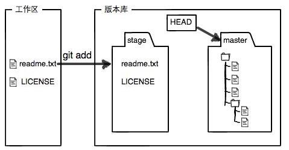
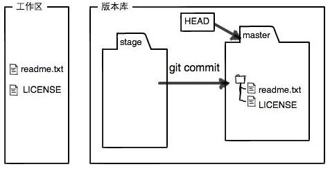

# 1. **安装Git**[^1]
[^1]:https://www.liaoxuefeng.com/wiki/0013739516305929606dd18361248578c67b8067c8c017b000
* ***windows环境***
	* [Git官网直接下载安装程序](https://git-scm.com)
	* 安装完成后，还需要最后一步设置，在命令行输入：  
	 
			$ git config --global user.name "Your Name"
			$ git config --global user.email "email@example.com"
* ***linux环境***  
	* 	Ubuntu系统,使用命令 
		> sudo apt-get install git
	*   其他系统
		>从Git官网下载**[源码](https://github.com/git/git)**，然后解压，[依次输入：./config，make，sudo make install这几个命令安装就好了](https://github.com/git/git/blob/master/INSTALL)。

# 2. **关于repository**
  repository是被git管理的目录  

1. **创建 repository**  
	* 创建一个空目录并进入,以/learngit为例
	* 让其变成Git可以管理的仓库
	 
			git init

2. **把文件添加到repository**
	* 在/learngit下添加文件或文件夹,以添加readme.txt为例,查看 仓库当前的状态 
	 
			git status
	* 添加盖文件至仓库
	 
			git add readme.txt
			
	
	* 文件提交到仓库,简单解释一下git commit命令，-m后面输入的是本次提交的说明，可以输入任意内容，当然最好是有意义的，这样你就能从历史记录里方便地找到改动记录。
	 	
			git commit -m "wrote a readme file"  
	* 继续修改readme.txt文件内容,运行git status
	 
			$ git status
			# On branch master
			# Changes not staged for commit:
			#   (use "git add <file>..." to update what will be committed)
			#   (use "git checkout -- <file>..." to discard changes in working directory)
			#
			#    modified:   readme.txt
			#
			no changes added to commit (use "git add" and/or "git commit -a") 

	    上面的命令告诉我们，readme.txt被修改过了，但还没有准备提交的修改。
		
	    虽然Git告诉我们readme.txt被修改了，但如果能看看具体修改了什么内容，自然是很好的。比如你休假两周从国外回来，第一天上班时，已经记不清上次怎么修改的readme.txt，所以，需要用git diff这个命令看看：

			$ git diff readme.txt 
			diff --git a/readme.txt b/readme.txt
			index 46d49bf..9247db6 100644
			--- a/readme.txt
			+++ b/readme.txt
			@@ -1,2 +1,2 @@
			-Git is a version control system.
			+Git is a distributed version control system.
			 Git is free software.

		git diff顾名思义就是查看difference，显示的格式正是Unix通用的diff格式，可以从上面的命令输出看到，我们在第一行添加了一个“distributed”单词。
		
		知道了对readme.txt作了什么修改后，再把它提交到仓库就放心多了，提交修改和提交新文件是一样的两步  

			$ git add readme.txt
			$ git status
			$ git commit -m "add distributed"  

# 3. **版本及文件管理**
1. **版本回退**
	
	在Git中，我们用git log命令查看：
		
		$ git log
		commit 3628164fb26d48395383f8f31179f24e0882e1e0
		Author: Michael Liao <askxuefeng@gmail.com>
		Date:   Tue Aug 20 15:11:49 2013 +0800
		
		    append GPL
		
		commit ea34578d5496d7dd233c827ed32a8cd576c5ee85
		Author: Michael Liao <askxuefeng@gmail.com>
		Date:   Tue Aug 20 14:53:12 2013 +0800
		
		    add distributed
		
		commit cb926e7ea50ad11b8f9e909c05226233bf755030
		Author: Michael Liao <askxuefeng@gmail.com>
		Date:   Mon Aug 19 17:51:55 2013 +0800
		
		    wrote a readme file  
	
	git log命令显示从最近到最远的提交日志，我们可以看到3次提交，最近的一次是append GPL，上一次是add distributed，最早的一次是wrote a readme file。
	如果嫌输出信息太多，看得眼花缭乱的，可以试试加上--pretty=oneline参数:

		$ git log --pretty=oneline
		3628164fb26d48395383f8f31179f24e0882e1e0 append GPL
		ea34578d5496d7dd233c827ed32a8cd576c5ee85 add distributed
		cb926e7ea50ad11b8f9e909c05226233bf755030 wrote a readme file  

	类似3628164...882e1e0的是commit id（版本号）.
	Git的版本回退速度非常快，因为Git在内部有个指向当前版本的HEAD指针，当你回退版本的时候，Git仅仅是把HEAD从指向改为之前的commit id（版本号).
	在Git中，用HEAD表示当前版本，也就是最新的提交3628164...882e1e0（注意我的提交ID和你的肯定不一样），上一个版本就是HEAD^，上上一个版本就是HEAD^^，当然往上100个版本写100个^比较容易数不过来，所以写成HEAD~100。
	
		$ git reset --hard HEAD^
		HEAD is now at ea34578 add distributed

	

	现在再看readme.txt就回退到上一个版本了.
	
	如果我后悔了又想恢复到新版本.Git提供了一个命令git reflog用来记录你的每一次命令：

		$ git reflog
		ea34578 HEAD@{0}: reset: moving to HEAD^
		3628164 HEAD@{1}: commit: append GPL
		ea34578 HEAD@{2}: commit: add distributed
		cb926e7 HEAD@{3}: commit (initial): wrote a readme file  

2. **工作区和暂存区**  
	* 工作区（Working Directory）:就是你在电脑里能看到的目录，比如我的learngit文件夹就是一个工作区.
	* 版本库（Repository）:工作区有一个隐藏目录.git，这个不算工作区，而是Git的版本库。

	Git的版本库里存了很多东西，其中最重要的就是称为stage（或者叫index）的暂存区，还有Git为我们自动创建的第一个分支master，以及指向master的一个指针叫HEAD。
	
	把文件往Git版本库里添加的时候，是分两步执行的：

	第一步是用git add把文件添加进去，实际上就是把文件修改添加到暂存区；
	
	第二步是用git commit提交更改，实际上就是把暂存区的所有内容提交到当前分支。
	
	因为我们创建Git版本库时，Git自动为我们创建了唯一一个master分支，所以，现在，git commit就是往master分支上提交更改。

	俗话说，实践出真知。现在，我们再练习一遍，先对readme.txt做个修改，比如加上一行内容：

	Git is a distributed version control system.
	Git is free software distributed under the GPL.
	Git has a mutable index called stage.
	然后，在工作区新增一个LICENSE文本文件（内容随便写）。
	
	先用git status查看一下状态：
	
		$ git status
		# On branch master
		# Changes not staged for commit:
		#   (use "git add <file>..." to update what will be committed)
		#   (use "git checkout -- <file>..." to discard changes in working directory)
		#
		#       modified:   readme.txt
		#
		# Untracked files:
		#   (use "git add <file>..." to include in what will be committed)
		#
		#       LICENSE
		no changes added to commit (use "git add" and/or "git commit -a")
	Git非常清楚地告诉我们，readme.txt被修改了，而LICENSE还从来没有被添加过，所以它的状态是Untracked。
	
	现在，使用两次命令git add，把readme.txt和LICENSE都添加后，用git status再查看一下：
		
		$ git status
		# On branch master
		# Changes to be committed:
		#   (use "git reset HEAD <file>..." to unstage)
		#
		#       new file:   LICENSE
		#       modified:   readme.txt
		#
	现在，暂存区的状态就变成这样了：
	

	
   所以，git add命令实际上就是把要提交的所有修改放到暂存区（Stage），然后，执行git commit就可以一次性把暂存区的所有修改提交到分支。

			$ git commit -m "understand how stage works"
			[master 27c9860] understand how stage works
			 2 files changed, 675 insertions(+)
			 create mode 100644 LICENSE  

   一旦提交后，如果你又没有对工作区做任何修改，那么工作区就是“干净”的：

		$ git status
		# On branch master
		nothing to commit (working directory clean)    

   现在版本库变成了这样，暂存区就没有任何内容了：  
 
  

3. **管理修改**  
	现在，假定你已经完全掌握了暂存区的概念。下面，我们要讨论的就是，为什么Git比其他版本控制系统设计得优秀，因为Git跟踪并管理的是修改，而非文件。

	你会问，什么是修改？比如你新增了一行，这就是一个修改，删除了一行，也是一个修改，更改了某些字符，也是一个修改，删了一些又加了一些，也是一个修改，甚至创建一个新文件，也算一个修改。

	为什么说Git管理的是修改，而不是文件呢？我们还是做实验。第一步，对readme.txt做一个修改，比如加一行内容：

		$ cat readme.txt
		Git is a distributed version control system.
		Git is free software distributed under the GPL.
		Git has a mutable index called stage.
		Git tracks changes.
	然后，添加：

		$ git add readme.txt
		$ git status
		# On branch master
		# Changes to be committed:
		#   (use "git reset HEAD <file>..." to unstage)
		#
		#       modified:   readme.txt
		#
	然后，再修改readme.txt：

		$ cat readme.txt 
		Git is a distributed version control system.
		Git is free software distributed under the GPL.
		Git has a mutable index called stage.
		Git tracks changes of files.
	提交：

		$ git commit -m "git tracks changes"
		[master d4f25b6] git tracks changes
		 1 file changed, 1 insertion(+)
	提交后，再看看状态：

		$ git status
		# On branch master
		# Changes not staged for commit:
		#   (use "git add <file>..." to update what will be committed)
		#   (use "git checkout -- <file>..." to discard changes in working directory)
		#
		#       modified:   readme.txt
		#
		no changes added to commit (use "git add" and/or "git commit -a")
	咦，怎么第二次的修改没有被提交？

	别激动，我们回顾一下操作过程：

	第一次修改 -> git add -> 第二次修改 -> git commit

	你看，我们前面讲了，Git管理的是修改，当你用git add命令后，在工作区的第一次修改被放入暂存区，准备提交，但是，在工作区的第二次修改并没有放入暂存区，所以，git commit只负责把暂存区的修改提交了，也就是第一次的修改被提交了，第二次的修改不会被提交。

	提交后，用git diff HEAD -- readme.txt命令可以查看工作区和版本库里面最新版本的区别：

		$ git diff HEAD -- readme.txt 
		diff --git a/readme.txt b/readme.txt
		index 76d770f..a9c5755 100644
		--- a/readme.txt
		+++ b/readme.txt
		@@ -1,4 +1,4 @@
		 Git is a distributed version control system.
		 Git is free software distributed under the GPL.
		 Git has a mutable index called stage.
		-Git tracks changes.
		+Git tracks changes of files.
	可见，第二次修改确实没有被提交。

 	那怎么提交第二次修改呢？你可以继续git add再git commit，也可以别着急提交第一次修改，先git add第二次修改，再git commit，就相当于把两次修改合并后一块提交了：

	第一次修改 -> git add -> 第二次修改 -> git add -> git commit  

4. **撤销修改**

	* git checkout -- file可以丢弃**工作区**的修改：
	
		$ git checkout -- readme.txt
		命令git checkout -- readme.txt意思就是，把readme.txt文件在工作区的修改全部撤销，这里有两种情况：
	
		* 一种是readme.txt自修改后还没有被放到暂存区，现在，撤销修改就回到和版本库一模一样的状态；
	
		* 一种是readme.txt已经添加到暂存区后，又作了修改，现在，撤销修改就回到添加到暂存区后的状态。
	
		总之，就是让这个文件回到最近一次git commit或git add时的状态。git checkout -- file命令中的--很重要，没有--，就变成了“切换到另一个分支”的命令，我们在后面的分支管理中会再次遇到git checkout命令。
	
	* 现在假定是凌晨3点，你不但写了一些胡话，还git add到暂存区了：

			$ cat readme.txt
			Git is a distributed version control system.
			Git is free software distributed under the GPL.
			Git has a mutable index called stage.
			Git tracks changes of files.
			My stupid boss still prefers SVN.
		
			$ git add readme.txt
	庆幸的是，在commit之前，你发现了这个问题。用git status查看一下，修改只是添加到了暂存区，还没有提交：

				$ git status
				# On branch master
				# Changes to be committed:
				#   (use "git reset HEAD <file>..." to unstage)
				#
				#       modified:   readme.txt
				#
	Git同样告诉我们，用命令git reset HEAD file可以把**暂存区的修改撤销掉**（unstage），重新放回工作区：

			$ git reset HEAD readme.txt
			Unstaged changes after reset:
			M       readme.txt
	git reset命令既可以回退版本，也可以把暂存区的修改回退到工作区。当我们用HEAD时，表示最新的版本。
	再用git status查看一下，现在暂存区是干净的，工作区有修改：

			$ git status
			# On branch master
			# Changes not staged for commit:
			#   (use "git add <file>..." to update what will be committed)
			#   (use "git checkout -- <file>..." to discard changes in working directory)
			#
			#       modified:   readme.txt
			#
			no changes added to commit (use "git add" and/or "git commit -a")
	还记得如何丢弃工作区的修改吗？

			$ git checkout -- readme.txt
			
			$ git status
			# On branch master
			nothing to commit (working directory clean)
	整个世界终于清静了！

5. **删除文件**  

	在Git中，删除也是一个修改操作，我们实战一下，先添加一个新文件test.txt到Git并且提交：

		$ git add test.txt
		$ git commit -m "add test.txt"
		[master 94cdc44] add test.txt
		 1 file changed, 1 insertion(+)
		 create mode 100644 test.txt
	一般情况下，你通常直接在文件管理器中把没用的文件删了，或者用rm命令删了：

		$ rm test.txt
	这个时候，Git知道你删除了文件，因此，工作区和版本库就不一致了，git status命令会立刻告诉你哪些文件被删除了：

		$ git status
		# On branch master
		# Changes not staged for commit:
		#   (use "git add/rm <file>..." to update what will be committed)
		#   (use "git checkout -- <file>..." to discard changes in working directory)
		#
		#       deleted:    test.txt
		#
		no changes added to commit (use "git add" and/or "git commit -a")
	现在你有两个选择，一是确实要从版本库中删除该文件，那就用命令git rm删掉，并且git commit：

		$ git rm test.txt
		rm 'test.txt'
		$ git commit -m "remove test.txt"
		[master d17efd8] remove test.txt
		 1 file changed, 1 deletion(-)
		 delete mode 100644 test.txt
	现在，文件就从版本库中被删除了。

	另一种情况是删错了，因为版本库里还有呢，所以可以很轻松地把误删的文件恢复到最新版本：

		$ git checkout -- test.txt
	git checkout其实是用版本库里的版本替换工作区的版本，无论工作区是修改还是删除，都可以“一键还原”。

	
# **4.远程仓库**  

	

