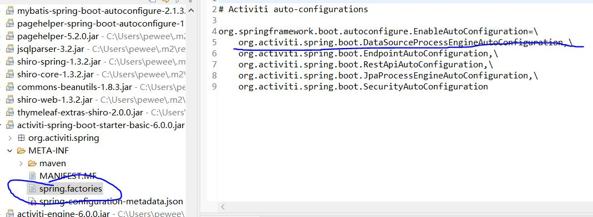
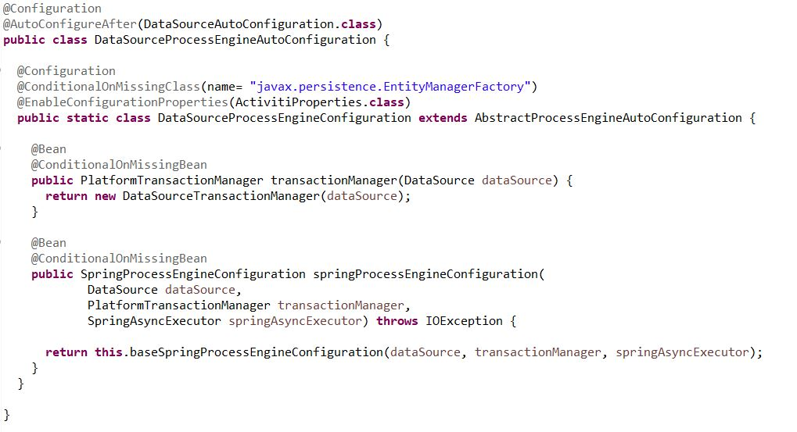
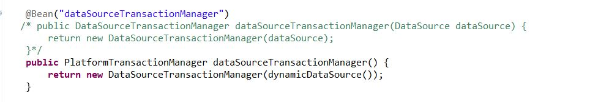
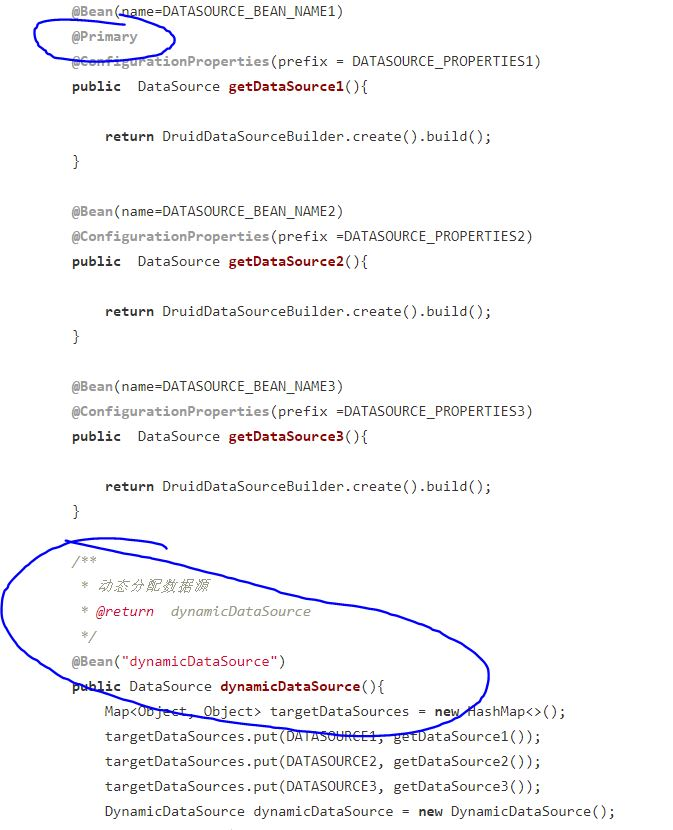

# **事务不一致解决方案**

1. 背景
我们在业务层有一个关于审批的service,这个service直接在Class上打了@Transactional注解,具体方法内代码如下:

		@Override
	    public void completeTask(String comments, String nextPerson, String changeNo, Integer type) {
	        SysUser sysUser = (SysUser) SecurityUtils.getSubject().getPrincipal();
	        PpChangeHeader ppChangeHeader = ppChangeHeaderMapper.selectByPrimaryKey(changeNo);
	        Integer status = ppChangeHeader.getStatus();
	        Integer processFlag = ppChangeHeader.getProcessFlag();
	        String taskDefinitionKey = processService.getTaskDefinitionKey(ppChangeHeader.getProcessId());
	        /** ........ 
			.....省略的业务逻辑处理......
			...........**/
	        //添加审批意见
	        if (!("".equals(comments) || comments == null)) {
	            processService.addComment(ppChangeHeader.getProcessId(), comments, sysUser.getUserName());
	        }
	        //处理当前任务
	        processService.completeTask(ppChangeHeader.getProcessId(), map);
	        System.out.println("status = " + status);
	
	        //修改单据状态
	        ppChangeHeaderMapper.updateStatus(status, ppChangeHeader.getChangeNo());
	    }
在该代码中,我们先调用processService.addCommont,他是对工作流引擎taskService.addComment的包装
再完成该节点的processService.completeTask,他是对工作流引擎taskService.complete(task.getId(), map);的包装.
最后调用我们自己的业务相关的mapper去修改业务表里数据的状态:ppChangeHeaderMapper.updateStatus

2. 问题:
某次因数据问题,在最后修改业务表相关数据时报错,业务数据没有update成功.但是发现工作流节点进入了下一个节点,并没有跟随业务抛出的runtimeException回滚.

3. 排查:打断点重新重现,发现代码执行到和工作流引擎相关的写操作时,会直接把数据提交到数据库,根本就没有被@Transaction管理.
对业务相关aop代码打断点排查,在进入service时aop开启了代理,他会作为顶层事务-parentTx,在service中包含的子事务的aop代码中(包括在关于流程引擎相关的service中),在执行到commit时我发现是会跳过的,这些子事务类似于一个递归调用的结构,在回溯到顶层事务的结束时的aop代码中的commit才会提交事务,而且所有aop中事务处理的platformTXmannger是同一个事务管理器,而且其中的数据源是我们在配置中配置的数据源.*貌似*看上去了没啥问题.

4. 思考:既然不是spring的问题,那肯定是流程相关的写操作没有被纳入aop,这个项目是多数据源项目
我打开starter来看看:

来看看DataSourceProcessEngineAutoConfiguration:

她在不存在事务管理器时,建立了DataSourceTxMannger,
我们自己的项目里是配置了DataSourceTxMannger的,如下图:

那事情一定发生在数据源上:
我们看DataSourceProcessEngineAutoConfiguration中的使用的是@Bean的baseSpringProcessEngineConfiguration这个方法拉起整个流程引擎的数据源配置.
而我们的小伙伴在配置数据源时并没有把动态数据源作为main配置,导致流程引擎初始化时使用的是打了@Primary注解的数据源,他和我们配置给事务管理器的数据源并不一致,所以导致流程引擎执行时会被当做没有事务自动提交.如下图

5. 解决办法:给动态数据源加上@Primary注解,重试发现问题已经解决

