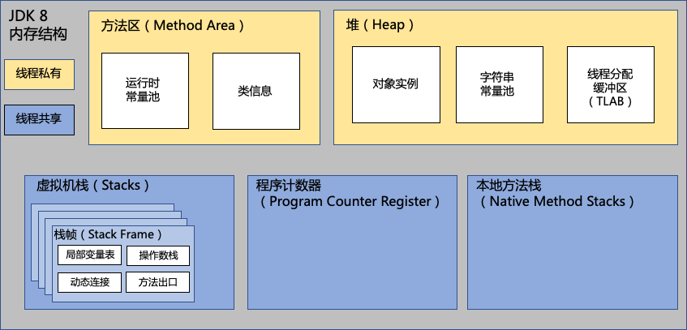

# **jvm**

## 字节码 java bytecode

Java字节码是一组操作Java虚拟机(JVM)的高度优化的指令.他由单字节指令组成,理论支持256个操作码.

他存储在Class文件中的方法表中，它以Code属性的形式存在
分为4大类:

1. 栈操作指令,包括和局部变量交互(*store_?,*load_?,*const_?)
2. 程序流程控制.如if,else等跳转(if_icmpge,goto)
3. 对象操作指令,如方法调用(invokeStatic,invokeVirtual,invokeSpecial,invokeDynamic,invokeInterface)
4. 算数计算及类型转换(*add,*sub,*mul,*div,*2*)

以下为一个最简单的字节码Hello为例:

其中看到了2个code属性:

* 第一个为编译器为Hello生成的隐式的无参构造,其中aload为从本地变量表里取值拿到操作数栈上,a表示引用类型,是数组或对象.

* 第二个为我自己实现的方法:先new在堆分配了对象的内存并向操作数栈放入这块内存引用,之后又在栈顶复制了一份引用.接下来调用invokeSpecial调用构造方法实例化,此时会从栈顶**消耗一个引用给构造器的this**参数,剩下一个由astore_1字节码从操作数栈存入局部变量表.a表示引用类型,是数组或对象

以下为字节码在虚拟机中的运行时:

JVM是一个**基于栈**的计算器,每个线程都有自己的线程栈存储栈帧.

栈帧有如下结构:

* 局部变量表:存方法内的变量
* 操作数栈:用来保存计算结果和调用别的方法
* 动态连接:栈帧的当前方法指向运行时常量池的该栈帧所属方法引用.在invokeVirtual的多态查找.有的类继承了其他类在运行时需要动态分派,连接到实际的类执行他的方法.会在栈顶确认对象的实际类型C,在C类中找到与常量池中符号引用相同的方法.否则取父类查找.实际hotspot会在类加载的链接阶段初始化虚方法表代替查找class的元数据以提高性能.
* 方法出口:return正常返回.抛出异常且不在该方法的异常处理表中异常返回.

## jvm类加载器 classLoader

java字节码的记载过程:

1. 加载:从文件流或网络读取class文件.
2. 验证:验证格式版本,字节码元数据,符号引用是否合法等
3. 准备:准备运行时元数据,为静态变量在堆中分配内存.
4. 解析:把class文件在运行时常量池符号引用转化为实际引用.
5. 初始化:构造器,静态代码快,静态变量赋值cinit.

几种不会初始化的场景:

1. 通过子类引用父类的静态字段不会引起子类初始化,但会初始化父类
2. 对象数组的初始化不会引起对象初始化
3. 引用常量不会初始化,因为在编译期间常量已经放入引用该类的常量池中.
4. 通过classLoader默认loadClass方法不会初始化.
5. 通过XXX.class获取类对象,不会使他初始化.

三类加载器:

1. 启动bootstrap classloader
2. 扩展ext classloader
3. 应用app classloader

加载器特点:

1. 双亲委托:会看父加载器是否加载过这个类,加载过会从父加载器的缓存返回.
2. 负责依赖加载:加载一个类会负责加载其依赖
3. 缓存加载:加载过得类会缓存

## 非堆 

元数据:在jdk1.8中把永久代废弃(永久代是堆的一部分,其中包含方法区),改成了元数据区,是用本地内存,不在会出现永久代OOM.

codeCache:存放jit编译的本地机器码

 