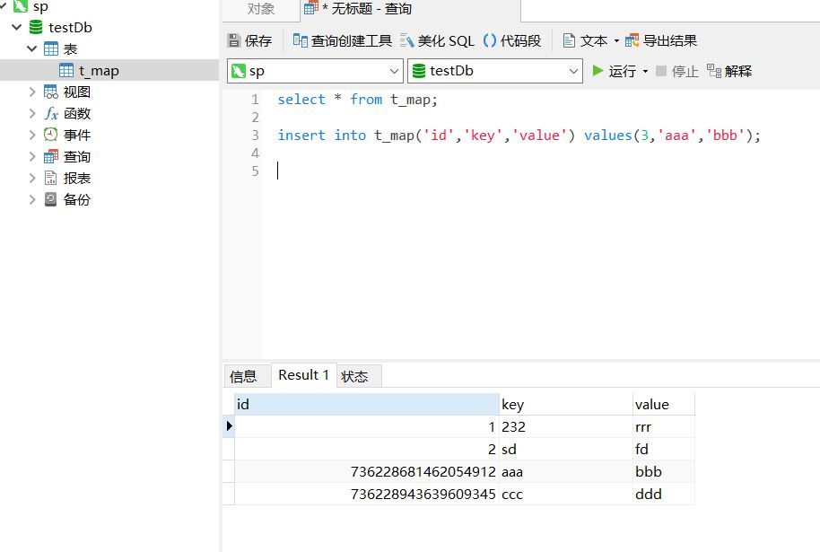
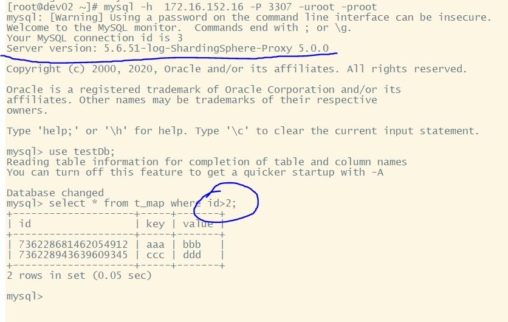
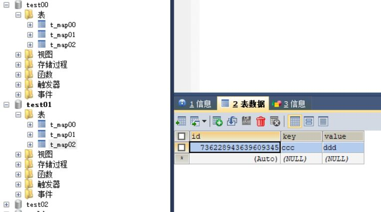
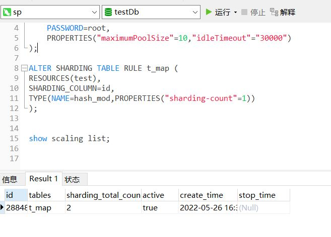
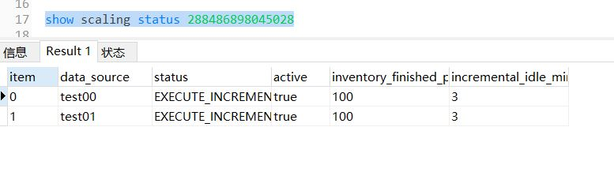

1. 瓶颈

mysql单机 TPS最好不超过5000-6000,超过需要考虑做分布式
QPS也不要超过几万

---
# 主从复制
主库写binlog
从库relaylog

binlog有3种模式ROW,STATEMENT,MIX
默认是statement,记录sql本身.缺点:长
ROW记录二进制数据,简单

传统主从复制为异步复制:主库和单机一样.slave从master拉取最新binlog在本地成为relaylog,在提交给工作线程提交.缺点是异步会导致数据主从不一致.

半同步复制(插件): 保证了主从一致.master的binlog写完后发给一批slave,只要有1个slave ack了就commit事务.

组复制(MGR mysql group replication插件):基于paxos协议实现复制.

局限性:
主从延迟
需要应用(或第三方框架,MGR复制除外)自己解决读写分离问题
不解决高可用问题

# 读写分离

## V1.0
1. spring中配置多数据源master和slave
2. 实现spring的AbstractRoutingDataSource,根据Service方法操作是自定义readonly注解aop切换数据源
3. 支持注解配置多个不同从库

缺点:有侵入性,读写分离应该对业务系统没有侵入.写完马上读因主从延迟会有数据不一致问题.

## V2.0
改进方案:写完读应该都走主库,可以使用sharding-jdbc
缺点:还是对代码有侵入性,需要引入配置和jar包

## V3.0
sharding-sphere,mycat,drds
屏蔽了数据库,对外提供了数据库的接口.源程序只需要改一个ip就可以了.
主从读写分离,分片都只需要在sharding-sphere-proxy上做配置

---
# 高可用HA(解决读问题)
1. 读写分离,提升qps能力
2. 故障转移,master挂了,slave自动变成主

常用策略:
1. 多个实例放在不同主机
2. 跨机房,云可用区部署
3. 俩地三中心容灾

mysql高可用策略:
### MHA:能在30S内实现主从切换,主库挂了会通过SSH拿主库的binlog补偏移量,在发送命令把从改为主
缺点:需要ssh信息,至少3台

### MGR(基于paxos)
主节点挂掉,自动选主.外部需要LVS/VIP才能高可用
.可以支持弹性复制,添加新节点他会哦自动从当前集群同步,同步到最新数据时加入ISR同步列表.
高可用分片,可以把数据分片后做MGR.

## mysql cluster
提供了一个router代理请求进行负载均衡和应用链接的故障转移,类似于sharding-sphere

---
# 分库分表(容量问题,解决写问题)
超过2000W调数据会导致B+树索引层级增加,IO压力变大.数据量变大会导致无法执行DDL,添加索引.备份恢复很难.主从延迟也会很大(延迟会超过几天).

## 垂直分库
分布式服务化,微服务.按照业务拆分,使单表变小,提升性能容量,提高数据读能力.不过这种方式拆分的幅度有限,库表变多管理复杂,对业务系统有强侵入性.他是微服务架构改造的基础.

分库:比如把用户,订单拆成2个库,有各自的微服务管理
分表:比如把订单表拆成主表,订单详细表等子表.


## 水平分库分表

任意扩容,理想化的扩容方式

分库:拆到不同库的同表.是和实例资源够多.注意是拆到不同实例.可以用分库代替分表,因为他降低了单表数据量,把数据平分到不同机器.提高了吞吐量IO.
分表:拆到同库的不同表.单库的数据量没变,但是单表的数据量降低.
分库分表:拆到不同库的不同表.二维结构,目前mycat不支持,sharding-proxy支持.缺点:管理复杂,不支持复杂sql.数据迁移问题.一致性问题.分库分表时,分库和分表的key要选不一样的,否则会出现分到的库的一些表永远不会有数据(如id=3的用户,若按%2座分库和分表,那他落在db01上后只有tb001才会有数据)

建议:业务系统sql单表查询,方便以后拆分系统.报表,跑批项目单独建立,上了大数据平台后,复杂的sql就不需要了.

## sharding-sphere 简单实战!!

在本地db创建2个数据库 test00,test01.并在每个DB其下创建3个表如下:
CREATE TABLE `t_map00` (
  `id` BIGINT(20) NOT NULL AUTO_INCREMENT,
  `mykey` VARCHAR(50) NOT NULL,
  `myvalue` VARCHAR(50) NOT NULL,
  PRIMARY KEY (`id`)
) ENGINE=INNODB DEFAULT CHARSET=utf8mb4;

CREATE TABLE `t_map01` (
  `id` BIGINT(20) NOT NULL AUTO_INCREMENT,
  `mykey` VARCHAR(50) NOT NULL,
  `myvalue` VARCHAR(50) NOT NULL,
  PRIMARY KEY (`id`)
) ENGINE=INNODB DEFAULT CHARSET=utf8mb4;

CREATE TABLE `t_map02` (
  `id` BIGINT(20) NOT NULL AUTO_INCREMENT,
  `mykey` VARCHAR(50) NOT NULL,
  `myvalue` VARCHAR(50) NOT NULL,
  PRIMARY KEY (`id`)
) ENGINE=INNODB DEFAULT CHARSET=utf8mb4;

下载zookeeper:

修改zoo.cfg,启动

下载sharding-sphere,这里下载的是[5.1.0](https://shardingsphere.apache.org/document/5.1.0/cn/overview/).

在conf中有很多配置,比如config-readwrite-splitting.yaml为读写分离配置.
修改config-sharding.yaml,他是分库分表的配置:

---
这里的配置意思是把真实库test00-test01映射成逻辑库testDb
将test00-test01中t_map00-t_map0002映射为逻辑表t_map,最终在proxy层我们看到的视图为testDb下有一张表t_map,它实际是2个库中共计6个表的集合

> 
schemaName: testDb
dataSources:
  test01:#这里的名字和tables中actualDataNodes的名字相对应
    url: jdbc:mysql://127.0.0.1:3306/test01?serverTimezone=UTC&useSSL=false
    username: root
    password: daohao4ggg
    connectionTimeoutMilliseconds: 30000
    idleTimeoutMilliseconds: 60000
    maxLifetimeMilliseconds: 1800000
    maxPoolSize: 50
    minPoolSize: 1
  test00:#这里的名字和tables中actualDataNodes的名字相对应
    url: jdbc:mysql://127.0.0.1:3306/test00?serverTimezone=UTC&useSSL=false
    username: root
    password: daohao4ggg
    connectionTimeoutMilliseconds: 30000
    idleTimeoutMilliseconds: 60000
    maxLifetimeMilliseconds: 1800000
    maxPoolSize: 50
    minPoolSize: 1
rules:
- !SHARDING
  tables:
    t_map:
      actualDataNodes: test0${0..1}.t_map0${0..2}
      tableStrategy:
        standard:
          shardingColumn: id
          shardingAlgorithmName: map_inline # 该column的分片算法名,在下面配置
      keyGenerateStrategy:
          column: id
          keyGeneratorName: snowflake # 该column的自动生成算法名,在keyGenerators配置
  defaultDatabaseStrategy:
    standard:
      shardingColumn: id
      shardingAlgorithmName: database_inline
  defaultTableStrategy:
    none: 
  shardingAlgorithms:
    map_inline:
      type: INLINE
      props:
        algorithm-expression: t_map0${id % 3}
        allow-range-query-with-inline-sharding: true # 允许分片建范围查询,走全路由
    database_inline:
      type: INLINE
      props:
        algorithm-expression: test0${id % 2}
        allow-range-query-with-inline-sharding: true # 允许分片建范围查询,走全路由
  keyGenerators:
    snowflake:
      type: SNOWFLAKE
      props:
          worker-id: 000

```


修改server.yaml,他是sharding-proxy的模拟sql接口的配置


>
mode:
  type: Cluster
  repository:
    type: ZooKeeper
    props:
      namespace: pewee_ds #用来隔离配置的
      server-lists: localhost:2181
      retryIntervalMilliseconds: 500
      timeToLiveSeconds: 60
      maxRetries: 3
      operationTimeoutMilliseconds: 500
  overwrite: false # 是否使用本地配置覆盖持久化配置
rules:
  - !AUTHORITY
    users:
      - root@%:root
      - sharding@:sharding
    provider:
      type: ALL_PRIVILEGES_PERMITTED

下载 [mysql-connector-java-5.1.47.jar](https://repo1.maven.org/maven2/mysql/mysql-connector-java/5.1.47/mysql-connector-java-5.1.47.jar) ,放入lib

启动sharding-proxy

打开navicat
以server中配置的用户名,密码登录,端口默认3307


添加几条数据,id为1,2是我手动添加,其余的是sharding-sphere自动雪花算法生成的;

配置了allow-range-query-with-inline-sharding: true后我们可以在sharding-sphere上做全路由查询(所有的库表都查询再merge);

进入真实示例可以看到,数据时分散到各个库里的表里面的;

---

# 数据的分类管理
系统中有很多数据质量要求并不高

比如订单数据,一致性要求高,肯定不能丢.但是日志和一些计算中间数据我们是允许丢失的,因为它可以不要或者可以从别处恢复;

而同样是订单,也可以用不同策略,一般交易系统里80%以上的订单是机器自动下单然后取消的无意义订单,没有人会查询他所以可以定期清理或转移.

## 冷热处理策略

以订单为例

1. 最近的订单最有可能被查询和支付,时间长的订单我们可以取消掉-一周内的数据为热数据,同时在数据库和缓存中
2. 3个月内的订单会被在线重复查询和系统统计-温数据,放到数据库
3. 查过3月-3年的数据查询的可能性较小可以不提供他在线查询-冷数据,归档到便宜的磁盘如mysql的tokuDb引擎高压缩,需要用户提交工单才可以查询
4. 超过3年的数据不提供任何查询方式.-冰数据,归档到磁带

## 数据迁移


#### 方式:全量
1. 业务系统停机
2. 迁移,校验一致性(md5,sha1)
3. 业务系统升级,接入新的数据源

能dump的话直接全量导入
若是异构数据那得用程序写入

优点:简单
缺点:停机时间长,不可服务.只能在数据量小的系统做

#### 方式:全+增量
依赖数据的时间戳

1. 先同步数据到最近的时间戳(注意按update_time)
2. 发布时停机维护
3. 在同步最后一点变化的数据
4. 升级业务系统,切换数据源

优点:降低了停机时间

#### binlog+全量+增量

通过主库或从库的binlog解析从新构造数据来复制
对于业务系统来看就是主库加了一个从库
需要中间件支持
可以多线程断点续传,全量历史和增量数据同步

可以支持:
1.自定义复杂异构数据结构
2.可以自动扩,缩容

优点:可以完全不停机,锁表

### shardingsphere-scaling实战(目前shardingsphere的迁移为实验功能,这里不做示例)
这里还是从上个例子继续
启动新的mysql端口为3310,启动Zookeeper

目标:把上面2DBX3table的结构-->单库单表(master)配置>单库单表(slave)

mysql的主从配置略

在mysql上创建Db test;
建表
CREATE TABLE `t_map` (
  `id` BIGINT(20) NOT NULL AUTO_INCREMENT,
  `mykey` VARCHAR(50) NOT NULL,
  `myvalue` VARCHAR(50) NOT NULL,
  PRIMARY KEY (`id`)
) ENGINE=INNODB DEFAULT CHARSET=utf8mb4;

接下来将6张表的数据全部迁移到这个表中;

修改配置文件 conf/config-sharding.yaml,在5.0.0中是修改server.yml

在要迁移数据的表中开启binlog
修改mysql的配置文件my.ini(windows)或my.cnf

>
[mysqld]
server-id=2
log-bin=mysql-bin
binlog-format=row
binlog-row-image=full
max_connections=600
port=3311
character_set_server=utf8
basedir="C:\develop\Db\mysql-5.7.26-winx64_2"
datadir="C:\develop\Db\mysql-5.7.26-winx64_2\data"
[mysql]
default-character-set=utf8z

重启mysql,查询
>show variables like '%log_bin%';

看binlog是否开启

赋予 MySQL 账号 Replication 相关权限。

SHOW GRANTS;

必须要有REPLICATION SLAVE, REPLICATION CLIENT权限才能作为mysql的从节点

这里主要是开启 scaling 和 mode 配置,5.1.0版本配置如下

>
schemaName: testDb
dataSources:
  test01:
    url: jdbc:mysql://127.0.0.1:3306/test01?serverTimezone=UTC&useSSL=false
    username: root
    password: daohao4ggg
    connectionTimeoutMilliseconds: 30000
    idleTimeoutMilliseconds: 60000
    maxLifetimeMilliseconds: 1800000
    maxPoolSize: 50
    minPoolSize: 1
  test00:
    url: jdbc:mysql://127.0.0.1:3306/test00?serverTimezone=UTC&useSSL=false
    username: root
    password: daohao4ggg
    connectionTimeoutMilliseconds: 30000
    idleTimeoutMilliseconds: 60000
    maxLifetimeMilliseconds: 1800000
    maxPoolSize: 50
    minPoolSize: 1
rules:
- !SHARDING
  tables:
    t_map:
      actualDataNodes: test0${0..1}.t_map0${0..2}
      tableStrategy:
        standard:
          shardingColumn: id
          shardingAlgorithmName: map_inline
      keyGenerateStrategy:
          column: id
          keyGeneratorName: snowflake
  defaultDatabaseStrategy:
    standard:
      shardingColumn: id
      shardingAlgorithmName: database_inline
  defaultTableStrategy:
    none: 
  shardingAlgorithms:
    map_inline:
      type: INLINE
      props:
        algorithm-expression: t_map0${id % 3}
        allow-range-query-with-inline-sharding: true
    database_inline:
      type: INLINE
      props:
        algorithm-expression: test0${id % 2}
        allow-range-query-with-inline-sharding: true
  keyGenerators:
    snowflake:
      type: SNOWFLAKE
      props:
          worker-id: 000
  scalingName: pewee_scaling
  scaling:
    pewee_scaling:
      input:
        workerThread: 40
        batchSize: 1000
        rateLimiter:
          type: QPS
          props:
            qps: 50
      output:
        workerThread: 40
        batchSize: 1000
        rateLimiter:
          type: TPS
          props:
            tps: 2000
      streamChannel:
        type: MEMORY
        props:
          block-queue-size: 10000
      completionDetector:
        type: IDLE
        props:
          incremental-task-idle-minute-threshold: 30
      dataConsistencyChecker:
        type: DATA_MATCH
        props:
          chunk-size: 1000


预览当前分片规则:

preview select count(1) from t_map;

看到结果有2个数据源,每个里面3个表

1. 添加数据源

ADD RESOURCE test (
    URL="jdbc:mysql://127.0.0.1:3310/test?serverTimezone=UTC&useSSL=false",
    USER=root,
    PASSWORD=root,
    PROPERTIES("maximumPoolSize"=10,"idleTimeout"="30000")
)

2. 修改所有表的分片规则

ALTER SHARDING TABLE RULE t_map (
RESOURCES(test),
SHARDING_COLUMN=id,
TYPE(NAME=hash_mod,PROPERTIES("sharding-count"=1))
);

其他配置参考:https://shardingsphere.apache.org/document/5.1.0/cn/user-manual/shardingsphere-scaling/usage/

3. 查看扩容缩容任务

> show scaling list;



这里会展示任务及任务号

4. 查看迁移进度

> show scaling status 288486898045028
 



在表t_map中插入新数据,发现新配置的数据源中的t_map_0中也出现了数据;

通过preview select count(1) from t_order;看新的数据到哪里去


## 分布式事务

#### 思路1:刚性事务,没有中间状态.要不全成功要不全失败.做成和单机数据库一样,让多个数据库通过某种机制协调实现跨库的一致性;
场景:数据一致性要求严格的一致性,比如金融,交易相关业务

实现方式:XA

#### 思路2:柔性事务,可以容忍一定时间的不一致,通过超时终止回滚,调度补偿等方式实现数据的最终`一致性.

场景:准实时或非实时的处理,比如各种t+1的操作,或电商类操作.

实现方式:
1. 不使用事务,业务补偿冲正,这种方式业务复杂度很高,代码量很大
2. 使用事务框架保证最终一致,侵入性没那么高


