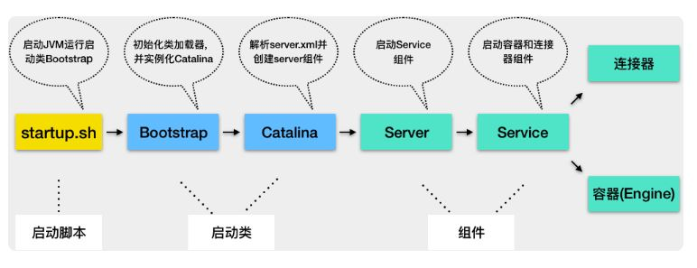

# servlet工作流程

当客户请求某个资源时，HTTP 服务器会用一个 ServletRequest 对象把客户的请求信息封装起来，然后调用 Servlet 容器的 service 方法，Servlet 容器拿到请求后，根据请求的 URL 和 Servlet 的映射关系，找到相应的 Servlet，如果 Servlet 还没有被加载，就用反射机制创建这个 Servlet，并调用 Servlet 的 init 方法来完成初始化，接着调用 Servlet 的 service 方法来处理请求，把 ServletResponse 对象返回给 HTTP 服务器，HTTP 服务器会把响应发送给客户端。

Servlet 规范里定义了 ServletContext 这个接口来对应一个 Web 应用。Servlet 容器在启动时会加载 Web 应用，并为每个 Web 应用创建唯一的 ServletContext 对象。一个 Web 应用可能有多个 Servlet，这些 Servlet 可以通过全局的 ServletContext 来共享数据，这些数据包括 Web 应用的初始化参数、Web 应用目录下的文件资源等。

# tomcat总体架构

连接器负责对外交流，容器负责内部处理.

为了实现支持多种 I/O 模型和应用层协议，一个容器可能对接多个连接器，就好比一个房间有多个门。一个service对应一个容器+一组连接器.连接器与容器之间通过标准的 ServletRequest 和 ServletResponse 通信。

## Connector

connector用来实现网络相关的功能,封装了网络协议和网络IO模型;Tomcat 的每个连接器都监听不同的端口.

连接器内三个组件:
1. Endpoint: 处理IO模型,Endpoint 是通信端点，即通信监听的接口，是具体的 Socket 接收和发送处理器
2. Processor :处理网络协议,Http等
3. Adapter: 处理各种协议的请求,将其适配为ServletRequest,典型的适配器模式

---

### NioEndpoint结构讲解

包含 LimitLatch、Acceptor、Poller、SocketProcessor 和 Executor 共 5 个组件;

LimitLatch 是连接控制器，控制最大连接数，NIO 模式下默认是 10000;实现方式为AQS的共享锁模式；

Acceptor 跑在一个单独的线程里，它在一个死循环里调用 accept 方法来接收新连接，一旦有新的连接请求到来，accept 方法返回一个 Channel 对象，接着把 Channel 对象交给 Poller 去处理。相当于netty的bossNio线程，不过netty是把ServerSocket注册到BossNio线程上，由selector来完成accept的操作；（注意tomcat的serverSocket是blocking模式，所以Acceptor会一直阻塞在serverSock.accept()上）

Poller 的本质是一个 Selector，也跑在单独线程里。Poller 在内部维护一个 Channel 数组，它在一个死循环里不断检测 Channel 的数据就绪状态，一旦有 Channel 可读，就生成一个 SocketProcessor 任务对象扔给 Executor 去处理。类似于netty的workNio线程。不过Taomcat这里全都把请求丢入一个Executor处理

SocketProcessor是由Poller创建的任务。在他的run（）内主要就是调用 Http11Processor 组件来处理请求。Http11Processor 读取 Channel 的数据来生成 ServletRequest 对象

Executor 就是线程池，负责运行 SocketProcessor 任务类，SocketProcessor 的 run 方法会调用 Http11Processor 来读取和解析请求数据；这里面的工作线程最终会调用到servlet；

## 容器

容器的4层结构,他们有父子关系,分别为:

1. engine

    Engine 表示引擎，用来管理多个虚拟站点，一个 Service 最多只能有一个 Engine.

2. host

    Host 代表的是一个虚拟主机，或者说一个站点，可以给 Tomcat 配置多个虚拟主机地址，而一个虚拟主机下可以部署多个 Web 应用程序

3. context

    context代表一个web应用,也就是webapps下的一个文件(夹)

4. Wrapper 

    表示一个 Servlet，一个 Web 应用程序中可能会有多个 Servlet

请求过来时，根据端口号确定连接器，连接器确定了也就确定了解析的网络协议.同样也就确定了Service和Engine(容器)；根据域名确认对应容器下哪个Host；根据URL路径找到Context；Context确定后再根据web.xml确定是哪个Servlet.

这些容器具有父子关系，形成一个树形结构,是一个组合模式.所有容器组件都实现了 Container 接口:

			
	public interface Container extends Lifecycle {
	    public void setName(String name);
	    public Container getParent();
	    public void setParent(Container container);
	    public void addChild(Container child);
	    public void removeChild(Container child);
	    public Container findChild(String name);
	}

这种设计方便对容器的统一管理;Container 接口扩展了 Lifecycle 接口，Lifecycle 接口用来统一管理各组件的生命周期.

#### 请求定位 Servlet 的过程
Tomcat 是用 Mapper 组件定位servlet

Mapper 组件的功能就是将用户请求的 URL 定位到一个 Servlet，它的工作原理是：Mapper 组件里保存了 Web 应用的配置信息，其实就是容器组件与访问路径的映射关系，比如 Host 容器里配置的域名、Context 容器里的 Web 应用路径，以及 Wrapper 容器里 Servlet 映射的路径，你可以想象这些配置信息就是一个多层次的 Map。

并不是说只有 Servlet 才会去处理请求，实际上这个查找路径上的父子容器都会对请求做一些处理。我在上一期说过，连接器中的 Adapter 会调用容器的 Service 方法来执行 Servlet，最先拿到请求的是 Engine 容器，Engine 容器对请求做一些处理后，会把请求传给自己子容器 Host 继续处理，依次类推，最后这个请求会传给 Wrapper 容器，Wrapper 会使用 Pipeline-Valve 管道调用最终的 Servlet 来处理。

Mapper组件在映射请求的时候，会在Request对象中存储相应的Host、Context等对象，这些选定的容器用来处理这个特定的请求，因此Engine中的Valve是从Request对象拿到Host容器的。

#### Pipeline-Valve(流水线阀门)

如其名,他是一个责任链模式,责任链的节点会依次队请求做处理处理完了调用下一个处理者.Valve 表示一个处理点，比如权限认证和记录日志。

每一个容器都有一个 Pipeline 对象，只要触发这个 Pipeline 的第一个 Valve，这个容器里 Pipeline 中的 Valve 就都会被调用到。但是，不同容器的 Pipeline 是怎么链式触发的呢，比如 Engine 中 Pipeline 需要调用下层容器 Host 中的 Pipeline。Pipeline 中还有个 BasicValve负责调用下层容器的 Pipeline 里的第一个 Valve.

tomcat整个调用过程由连接器中的 Adapter 触发的，它会调用 Engine 的第一个 Valve;

		
		// Calling the container
		connector.getService().getContainer().getPipeline().getFirst().invoke(request, response);

Wrapper 容器的最后一个 Valve 会创建一个 Filter 链，并调用 doFilter 方法，最终会调到 Servlet 的 service 方法。

Valve 和 Filter区别:

1. Valve 是 Tomcat 的私有机制，与 Tomcat 的基础架构 /API 是紧耦合的。Servlet API 是公有的标准，所有的 Web 容器包括 Jetty 都支持 Filter 机制。
2. Valve 工作在 Web 容器级别，拦截所有应用的请求；而 Servlet Filter 工作在应用级别，只能拦截某个 Web 应用的所有请求。如果想做整个 Web 容器的拦截器，必须通过 Valve 来实现。

## tomcat组件统一管理

如何统一管理组件的创建、初始化、启动、停止和销毁？如何做到代码逻辑清晰？如何方便地添加或者删除组件？如何做到组件启动和停止不遗漏、不重复？

原则:

1. 先创建子组件，再创建父组件，子组件需要被“注入”到父组件中。
2. 先创建内层组件，再创建外层组件，内层组件需要被“注入”到外层组件。

** tomcat内的管理方式:Lifecycle 接口 **

把不变点抽象出来成为一个接口，这个接口跟生命周期有关，叫作 Lifecycle。

Lifecycle 接口里应该定义这么几个方法：init、start、stop 和 destroy，每个具体的组件去实现这些方法。

理所当然，在父组件的 init 方法里需要创建子组件并调用子组件的 init 方法。同样，在父组件的 start 方法里也需要调用子组件的 start 方法，因此调用者可以无差别的调用各组件的 init 方法和 start 方法，这就是组合模式的使用，并且只要调用最顶层组件，也就是 Server 组件的 init 和 start 方法，整个 Tomcat 就被启动起来了。下面是 Lifecycle 接口的定义。

关于lifecycle的可扩展性:
组件的 init 和 start 调用是由它的父组件的状态变化触发的，上层组件的初始化会触发子组件的初始化，上层组件的启动会触发子组件的启动，因此我们把组件的生命周期定义成一个个状态，把状态的转变看作是一个事件。而事件是有监听器的，在监听器里可以实现一些逻辑，并且监听器也可以方便的添加和删除，这就是典型的观察者模式。

实现类LifecycleBase，其中tomcat的组件server，service，engine，host，container都继承了LifecycleBase。

		private final List<LifecycleListener> lifecycleListeners = new CopyOnWriteArrayList<>();

关于lifecycle的可重用性:
通过抽象几类LifecycleBase完成了通用代码:关于监听器的的功能实现,这是所有container都需要的功能,其中在调用LifecycleBase中自定义的抽象方法让子类实现.是模板设计模式.代码如下:
		
		//LifecycleBase 的 init 方法实现
		@Override
		public final synchronized void init() throws LifecycleException {
		    //1. 状态检查
		    if (!state.equals(LifecycleState.NEW)) {
		        invalidTransition(Lifecycle.BEFORE_INIT_EVENT);
		    }
		
		    try {
		        //2.触发INITIALIZING事件的监听器
		        setStateInternal(LifecycleState.INITIALIZING, null, false);
		        
		        //3.调用具体子类的初始化方法
		        initInternal();
		        
		        //4. 触发INITIALIZED事件的监听器
		        setStateInternal(LifecycleState.INITIALIZED, null, false);
		    } catch (Throwable t) {
		      ...
		    }
		}

比如springcontext的上下文在Context做start的时候启动的.就是通过ContextLoaderListener的contextInitialized,会初始化全局的Spring根容器ApplicationContext，初始化完毕后，Spring将其存储到ServletContext中。

如何添加监听器:

1. Tomcat 自定义了一些监听器，这些监听器是父组件在创建子组件的过程中注册到子组件的。比如 MemoryLeakTrackingListener 监听器，用来检测 Context 容器中的内存泄漏，这个监听器是 Host 容器在创建 Context 容器时注册到 Context 中的。
2. 通过我们自己定义在server.xml里面

---

## tomcat如何启动

### Catalina
1. 解析server.xml
2. 启动Server
3. 创建并注册关闭钩子

代码如下:

org.apache.catalina.startup.Catalina
		
		public void start() {
		    //1. 如果持有的Server实例为空，就解析server.xml创建出来
		    if (getServer() == null) {
		        load();
		    }
		    //2. 如果创建失败，报错退出
		    if (getServer() == null) {
		        log.fatal(sm.getString("catalina.noServer"));
		        return;
		    }
		
		    //3.启动Server
		    try {
		        getServer().start();
		    } catch (LifecycleException e) {
		        return;
		    }
		
		    //创建并注册关闭钩子,Ctrl + C”关闭 Tomcat 时，Tomcat 将优雅的停止并且清理资源
		    if (useShutdownHook) {
		        if (shutdownHook == null) {
		            shutdownHook = new CatalinaShutdownHook();
		        }
		        Runtime.getRuntime().addShutdownHook(shutdownHook);
		    }
		
		    //用await方法监听停止请求
		    if (await) {
		        await();
		        stop();
		    }
		}

所谓关闭钩子CatalinaShutdownHook就是一个线程,他的代码就是Catalina.this.stop();JVM 在停止之前会尝试执行这个线程的 run 方法。

注意springboot的启动流程不是通弄过org.apache.catalina.startup.Catalina,而是通过Tomcat.start()启动,这些区别之后将在spring系列笔记中讲解;

### Server 组件

Server 组件的具体实现类是 StandardServer，继承了 LifecycleBase.Server 在内部维护了若干 Service ，它是以数组来保存的.

他在initInternal和startInternal中初始化并启动了数组内的全部Service;

StandardServer在await()方法中开启了一个ServerSocket监听8085端口,收到SHUTDOWN就关闭退出.这个方法在Catalina的start()内调用.

    /**
     * Await and shutdown.
     */
    public void await() {
        getServer().await();
    }

### service 组件

其实现类为StandardService：

	public class StandardService extends LifecycleBase implements Service {
	    //名字
	    private String name = null;
	    
	    //Server实例，是它的父节点
	    private Server server = null;
	
	    //连接器数组
	    protected Connector connectors[] = new Connector[0];
	    private final Object connectorsLock = new Object();
	
	    //对应的Engine容器
	    private Engine engine = null;
	    
	    //映射器及其监听器
	    protected final Mapper mapper = new Mapper();
		//当 Web 应用的部署发生变化时，Mapper 中的映射信息也要跟着变化，MapperListener 就是一个监听器，它监听容器的变化，并把信息更新到 Mapper 中，这是典型的观察者模式
	    protected final MapperListener mapperListener = new MapperListener(this);
		

service会启动它的engine，完成后再启动connector，这是因为组件有依赖关系。组件停止的顺序跟启动顺序正好相反的，也是基于它们的依赖关系。

		protected void startInternal() throws LifecycleException {
		
		    //1. 触发启动监听器
		    setState(LifecycleState.STARTING);
		
		    //2. 先启动Engine，Engine会启动它子容器
		    if (engine != null) {
		        synchronized (engine) {
		            engine.start();
		        }
		    }
		    
		    //3. 再启动Mapper监听器
		    mapperListener.start();
		
		    //4.最后启动连接器，连接器会启动它子组件，比如Endpoint
		    synchronized (connectorsLock) {
		        for (Connector connector: connectors) {
		            if (connector.getState() != LifecycleState.FAILED) {
		                connector.start();
		            }
		        }
		    }
		}

### ContainerBase ，所有容器的基类

containerbase的注释，它提供了所有container关于pipeline功能的实现：

注释说明，ContainerBase的实现类需要将自己处理的逻辑概括成一个Valve并用setBasic（）设置入该container的pipeline；同时他还实现了container的监听器功能，使用一个CopyOnWriteArrayList存所有的监听器（container的start和stop属于lifecycle的listener管理）；

	/**
     * The container event listeners for this Container. Implemented as a
     * CopyOnWriteArrayList since listeners may invoke methods to add/remove
     * themselves or other listeners and with a ReadWriteLock that would trigger
     * a deadlock.
     */
    protected final List<ContainerListener> listeners = new CopyOnWriteArrayList<>();

使用map存放该容器的子容器：

	/**
     * The child Containers belonging to this Container, keyed by name.
     */
    protected final HashMap<String, Container> children = new HashMap<>();

使用parent和parentClassLoader存放父容器

	/**
     * The parent Container to which this Container is a child.
     */
    protected Container parent = null;

    /**
     * The parent class loader to be configured when we install a Loader.
     */
    protected ClassLoader parentClassLoader = null;

每个容器实例会持有自己的valve流水线：

	/**
     * The Pipeline object with which this Container is associated.
     */
    protected final Pipeline pipeline = new StandardPipeline(this);

启动子容器，可以看到启动容器用了一个线程池，遍历他的全部子容器包装成任务提交启动任务到这个线程池：

	/**
     * Start this component and implement the requirements
     * of {@link org.apache.catalina.util.LifecycleBase#startInternal()}.
     *
     * @exception LifecycleException if this component detects a fatal error
     *  that prevents this component from being used
     */
    @Override
    protected synchronized void startInternal() throws LifecycleException {

        // Start our subordinate components, if any
        logger = null;
        getLogger();
        Cluster cluster = getClusterInternal();
        if (cluster instanceof Lifecycle) {
            ((Lifecycle) cluster).start();
        }
        Realm realm = getRealmInternal();
        if (realm instanceof Lifecycle) {
            ((Lifecycle) realm).start();
        }

        // 启动全部子容器
        Container children[] = findChildren();
        List<Future<Void>> results = new ArrayList<>();
        for (int i = 0; i < children.length; i++) {
			//这里把子容器包装成CallAble任务提交线程池
            results.add(startStopExecutor.submit(new StartChild(children[i])));
        }

        MultiThrowable multiThrowable = null;
		//遍历future.get()，相当于等待本Container的全部child启动完毕
        for (Future<Void> result : results) {
            try {
                result.get();
            } catch (Throwable e) {
                log.error(sm.getString("containerBase.threadedStartFailed"), e);
                if (multiThrowable == null) {
                    multiThrowable = new MultiThrowable();
                }
                multiThrowable.add(e); 
            }

        }
		//如果任何子容器启动报错，那就抛出一个LifecycleException错误到上层组件，注意本方法重写的是Lifecycle的startInternal，最终会抛到没有实现Lifecycle接口的org.apache.catalina.startup.Catalina.start()，然后会级联摧毁子组件-容器
        if (multiThrowable != null) {
            throw new LifecycleException(sm.getString("containerBase.threadedStartFailed"),
                    multiThrowable.getThrowable());
        }

        // pipeline默认实现为StandardPipeline，它实现了Lifecycle接口
        if (pipeline instanceof Lifecycle) {
            ((Lifecycle) pipeline).start();
        }
		//改变状态，用于触发Lifecycle监听器
        setState(LifecycleState.STARTING);

        // 调度容器的后台任务,如session过期等。他会启动ContainerBackgroundProcessor任务提交到server组件中的utilityExecutorWrapper线程池处理,每60秒执行一次ContainerBackgroundProcessorMonitor的run方法
		//注意在第一个继承ContainerBase的容器StandardEngine的backgroundProcessorDelay = 10;也就是说在顶级容器Engine内级联启动了tomcat的定时任务
        if (backgroundProcessorDelay > 0) {
            monitorFuture = Container.getService(ContainerBase.this).getServer()
                    .getUtilityExecutor().scheduleWithFixedDelay(
                            new ContainerBackgroundProcessorMonitor(), 0, 60, TimeUnit.SECONDS);
        }
    }

我们来看上面ContainerBase中startInternal的 StandardPipeline.start()的启动

    /**
     * Start {@link Valve}s) in this pipeline and implement the requirements
     * of {@link LifecycleBase#startInternal()}.
     *
     * @exception LifecycleException if this component detects a fatal error
     *  that prevents this component from being used
     */
    @Override
    protected synchronized void startInternal() throws LifecycleException {

        // 启动第一个valve，会一直启动到最后一个为止。valve的启动顺序 从链表头-》尾-》basicValve
        Valve current = first;
        if (current == null) {
            current = basic;
        }
        while (current != null) {
            if (current instanceof Lifecycle)
                ((Lifecycle) current).start();
            current = current.getNext();
        }

        setState(LifecycleState.STARTING);
    }

关于容器的调度任务的默认实现在ContainerBase里，通过startInternal（）最后一行代码启动：

    /**
     * Private runnable class to invoke the backgroundProcess method
     * of this container and its children after a fixed delay.
     */
    protected class ContainerBackgroundProcessor implements Runnable {

        @Override
        public void run() {
            processChildren(ContainerBase.this);
        }

        protected void processChildren(Container container) {
            ClassLoader originalClassLoader = null;

            try {
                if (container instanceof Context) {
                    Loader loader = ((Context) container).getLoader();
                    // Loader will be null for FailedContext instances
                    if (loader == null) {
                        return;
                    }

                    // 用来确保 Contexts and Wrappers的后台任务的classloader是 web app's class loader
					//((Context) container).bind(false, null)会把当前thread context class loader 切换为 web applicationclass loader.
                    originalClassLoader = ((Context) container).bind(false, null);
                }
				//启动本Container的后台任务
                container.backgroundProcess();
				//级联启动子Container的后台任务，这是一个深度优先递归
                Container[] children = container.findChildren();
                for (int i = 0; i < children.length; i++) {
					//容器基类有个变量叫做backgroundProcessorDelay，如果大于0，表明子容器有自己的后台线程，无需父容器来调用它的processChildren方法。	
                    if (children[i].getBackgroundProcessorDelay() <= 0) {
                        processChildren(children[i]);
                    }
                }
            } catch (Throwable t) {
                ExceptionUtils.handleThrowable(t);
                log.error(sm.getString("containerBase.backgroundProcess.error"), t);
            } finally {
                if (container instanceof Context) {
                    ((Context) container).unbind(false, originalClassLoader);
                }
            }
        }
    }

可以看到，在其中启动了自己container的backgroundProcess()，完成后还递归调用了所有子container的processChildren()；

来看ContainerBase的backgroundProcess()，他主要启动该container中Realm和pipeline中全部Valve的后台任务，并且触发了Lifecycle.PERIODIC_EVENT的事件。

StandardContext中重写了这个方法，通过Manager的backgroundProcess（）来管理Session；具体文章见：https://blog.csdn.net/xiaolong7713/article/details/106463838

	/**
     * Execute a periodic task, such as reloading, etc. This method will be
     * invoked inside the classloading context of this container. Unexpected
     * throwables will be caught and logged.
     */
    @Override
    public void backgroundProcess() {

        if (!getState().isAvailable())
            return;
		//1.执行容器中Cluster组件的周期性任务
        Cluster cluster = getClusterInternal();
        if (cluster != null) {
            try {
                cluster.backgroundProcess();
            } catch (Exception e) {
                log.warn(sm.getString("containerBase.backgroundProcess.cluster",
                        cluster), e);
            }
        }
		//2.执行容器中Realm组件的周期性任务
        Realm realm = getRealmInternal();
        if (realm != null) {
            try {
                realm.backgroundProcess();
            } catch (Exception e) {
                log.warn(sm.getString("containerBase.backgroundProcess.realm", realm), e);
            }
        }
        //3.执行容器中Valve组件的周期性任务
        Valve current = pipeline.getFirst();
        while (current != null) {
            try {
                current.backgroundProcess();
            } catch (Exception e) {
                log.warn(sm.getString("containerBase.backgroundProcess.valve", current), e);
            }
            current = current.getNext();
        }
        //4. 触发容器的"周期事件"，Host容器的监听器HostConfig就靠它来调用
        fireLifecycleEvent(Lifecycle.PERIODIC_EVENT, null);
    }

### engine 组件

基础实现类StandardEngine，注意tomcat组件从engine开始就是容器组件了，他继承了ContainerBase。

	    /**
     * Create a new StandardEngine component with the default basic Valve.
     */
    public StandardEngine() {

        super();
        pipeline.setBasic(new StandardEngineValve());
        /* Set the jmvRoute using the system property jvmRoute */
        try {
            setJvmRoute(System.getProperty("jvmRoute"));
        } catch(Exception ex) {
            log.warn(sm.getString("standardEngine.jvmRouteFail"));
        }
        // By default, the engine will hold the reloading thread
        backgroundProcessorDelay = 10;

    }

Engine的核心请求调用逻辑如ContainerBase里写的一样，封装到了StandardEngineValve；

	final class StandardEngineValve extends ValveBase {
	
	    public final void invoke(Request request, Response response)
	      throws IOException, ServletException {
	  
	      //拿到请求中的Host容器
	      Host host = request.getHost();
	      if (host == null) {
	          return;
	      }
	  
	      // 调用Host容器中的Pipeline中的第一个Valve
	      host.getPipeline().getFirst().invoke(request, response);
	  }
	  
	}

他的逻辑很简单，就是把请求给host的第一个valve来处理。我们可以看到host是直接从request中获取的。为请求到达 Engine 容器中之前，Mapper 组件已经对请求进行了路由处理，Mapper 组件通过请求的 URL 定位了相应的容器，并且把容器对象保存到了请求对象中。

engine的启动很简单,直接复用了ContainerBase的startInternal(),见上 

    protected synchronized void startInternal() throws LifecycleException {

        // Log our server identification information
        if (log.isInfoEnabled()) {
            log.info(sm.getString("standardEngine.start", ServerInfo.getServerInfo()));
        }

        // Standard container startup
        super.startInternal();
    }

### Host 组件

StandardHost是Host组件的默认实现；

StandardHostValve的请求来的的处理逻辑也很简单,

		Context context = request.getContext();
		context.getPipeline().getFirst().invoke(request, response);

StandardHost的初始化及启动流程:

他重写了addChild(),主要是校验child必须是Context容器,并且添加了内存泄漏的Listener,MemoryLeakTrackingListener做的事情也很简单,在监听每个Context启动完成之后事件,在host中有个map存每个子Context的classloader和contextPath;并通过servlet的接口方式提供对外调用来触发检测内存泄漏,注意!!这个操作会导致fullGc,生产环境慎用;

    /**
     * Add a child Container, only if the proposed child is an implementation
     * of Context.
     *
     * @param child Child container to be added
     */
    @Override
    public void addChild(Container child) {
		
        if (!(child instanceof Context))
            throw new IllegalArgumentException
                (sm.getString("standardHost.notContext"));
		//添加container监听器,监听启动完成事件
        child.addLifecycleListener(new MemoryLeakTrackingListener());
        // Avoid NPE for case where Context is defined in server.xml with only a
        // docBase
        Context context = (Context) child;
        if (context.getPath() == null) {
            ContextName cn = new ContextName(context.getDocBase(), true);
            context.setPath(cn.getPath());
        }
        super.addChild(child);
    }

StandardHost的启动流程

首先会在host的流水线中添加org.apache.catalina.valves.ErrorReportValve;再调用ContainerBase的startInternal()启动它的子类组件

@Override
    protected synchronized void startInternal() throws LifecycleException {

        // Set error report valve
        String errorValve = getErrorReportValveClass();
        if ((errorValve != null) && (!errorValve.equals(""))) {
            
             boolean found = false;
             Valve[] valves = getPipeline().getValves();
             for (Valve valve : valves) {
                 if (errorValve.equals(valve.getClass().getName())) {
                     found = true;
                     break;
                 }
             }
             if(!found) {
                 Valve valve =
                     (Valve) Class.forName(errorValve).getConstructor().newInstance();
                 getPipeline().addValve(valve);
             }           
        }
        super.startInternal();
    }

关于StandardHost的热部署:有时我们再生产环境会检测Web 应用目录的变化在不重启tomcat的情况下去销毁context容器(包括session);

这个功能是通过HostConfig来实现的,来看org.apache.catalina.mbeans.MBeanFactory.createStandardHost()方法

	    StandardHost host = new StandardHost();
        host.setName(name);
        host.setAppBase(appBase);
        host.setAutoDeploy(autoDeploy);
        host.setDeployOnStartup(deployOnStartup);
        host.setDeployXML(deployXML);
        host.setUnpackWARs(unpackWARs);

        // add HostConfig for active reloading
        HostConfig hostConfig = new HostConfig();
        host.addLifecycleListener(hostConfig);

可以看到在catalina启动tomcat创建host实例时,会给host添加一个叫HostConfig的listener;

	public void lifecycleEvent(LifecycleEvent event) {
	    // 执行check方法。
	    if (event.getType().equals(Lifecycle.PERIODIC_EVENT)) {
	        check();
	    } 
	}

可以看到这个hostconfig他是一个周期性事件的listyener;这个Lifecycle.PERIODIC_EVENT事件的调度见ContainerBase的startInternal()中的周期任务调度.会在实现类的backgroundProcess()(ContainerBase的backgroundProcess已经实现了该逻辑,只要实现的子类容器不重写)中去 fireLifecycleEvent(Lifecycle.PERIODIC_EVENT, null);

	protected void check() {	
	    if (host.getAutoDeploy()) {
	        // 检查这个Host下所有已经部署的Web应用
	        DeployedApplication[] apps =
	            deployed.values().toArray(new DeployedApplication[0]);	            
	        for (int i = 0; i < apps.length; i++) {
	            //检查Web应用目录是否有变化
	            checkResources(apps[i], false);
	        }	
	        //执行部署
	        deployApps();
	    }
	}

他的check()方法检测webapp的变化,有变化就重亲部署app;

我们再来看通过Tomcat的方式启动的集成的tomcat容器,在Tomcat.class中,创建StandardHost的方法:

    public Host getHost() {
        Engine engine = getEngine();
        if (engine.findChildren().length > 0) {
            return (Host) engine.findChildren()[0];
        }

        Host host = new StandardHost();
        host.setName(hostname);
        getEngine().addChild(host);
        return host;
    }

其中并没有给host添加HostConfig这个listener;这也能解释为什么ContainerBase有backgroundProcess()也可以直接执行周期性任务,但是host这里并没有把AutoDeploy的功能直接写死在host里面.因为通过集成的方式启动的tomcat并不需要这个功能,所以可以通过拔插listener的方式来,在通过catalina的方式启动时添加这个功能.

### java的类加载机制

Tomcat 是通过 Context 组件来加载管理 Web 应用的,他打破了双亲委派机制.我们先来看java的类加载机制;

java 的类加载，就是把字节码格式“.class”文件加载到 JVM 的方法区，并在 JVM 的堆区建立一个java.lang.Class对象的实例，用来封装 Java 类相关的数据和方法。.class不是在java启动时全部加载,而是运行时按需要加载;

	public abstract class ClassLoader {
	
	    //每个类加载器都有个父加载器
	    private final ClassLoader parent;
	    
	    public Class<?> loadClass(String name) {
	  
	        //查找一下这个类是不是已经加载过了
	        Class<?> c = findLoadedClass(name);
	        
	        //如果没有加载过
	        if( c == null ){
	          //先委托给父加载器去加载，注意这是个递归调用
	          if (parent != null) {
	              c = parent.loadClass(name);
	          }else {
	              // 如果父加载器为空，查找Bootstrap加载器是不是加载过了
	              c = findBootstrapClassOrNull(name);
	          }
	        }
	        // 如果父加载器没加载成功，调用自己的findClass去加载
	        if (c == null) {
	            c = findClass(name);
	        }
	        
	        return c；
	    }
	    
	    protected Class<?> findClass(String name){
	       //1. 根据传入的类名name，到在特定目录下去寻找类文件，把.class文件读入内存
	          ...
	          
	       //2. 调用defineClass将字节数组转成Class对象
	       return defineClass(buf, off, len)；
	    }
	    
	    // 将字节码数组解析成一个Class对象，用native方法实现
	    protected final Class<?> defineClass(byte[] b, int off, int len){
	       ...
	    }
	}

这种机制也叫双亲委托机制.可以有效的防止java核心类库不被破坏;

### tomcat的类加载机制

tomcat的自定义加载器org.apache.catalina.loader.WebappClassLoader,他重写了findClass和loadClass方法;

	public Class<?> findClass(String name) throws ClassNotFoundException {
	    ...
	    
	    Class<?> clazz = null;
	    try {
	            //1. 先在Web应用目录下查找类 
	            clazz = findClassInternal(name);
	    }  catch (RuntimeException e) {
	           throw e;
	       }
	    
	    if (clazz == null) {
	    try {
	            //2. 如果在本地目录没有找到，交给父加载器去查找
	            clazz = super.findClass(name);
	    }  catch (RuntimeException e) {
	           throw e;
	       }
	    
	    //3. 如果父类也没找到，抛出ClassNotFoundException
	    if (clazz == null) {
	        throw new ClassNotFoundException(name);
	     }
	
	    return clazz;
	}

	public Class<?> loadClass(String name, boolean resolve) throws ClassNotFoundException {
	
	    synchronized (getClassLoadingLock(name)) {
	 
	        Class<?> clazz = null;
	
	        //1. 先在本地cache查找该类是否已经加载过
	        clazz = findLoadedClass0(name);
	        if (clazz != null) {
	            if (resolve)
	                resolveClass(clazz);
	            return clazz;
	        }
	
	        //2. 从系统类加载器的cache中查找是否加载过
	        clazz = findLoadedClass(name);
	        if (clazz != null) {
	            if (resolve)
	                resolveClass(clazz);
	            return clazz;
	        }
	
	        // 3. 尝试用ExtClassLoader类加载器类加载，为什么？
	        ClassLoader javaseLoader = getJavaseClassLoader();
	        try {
	            clazz = javaseLoader.loadClass(name);
	            if (clazz != null) {
	                if (resolve)
	                    resolveClass(clazz);
	                return clazz;
	            }
	        } catch (ClassNotFoundException e) {
	            // Ignore
	        }
	
	        // 4. 尝试在Web 应用目录下查找并加载
	        try {
	            clazz = findClass(name);
	            if (clazz != null) {
	                if (resolve)
	                    resolveClass(clazz);
	                return clazz;
	            }
	        } catch (ClassNotFoundException e) {
	            // Ignore
	        }
	
	        // 5. 尝试用系统类加载器(也就是AppClassLoader)来加载
	            try {
	                clazz = Class.forName(name, false, parent);
	                if (clazz != null) {
	                    if (resolve)
	                        resolveClass(clazz);
	                    return clazz;
	                }
	            } catch (ClassNotFoundException e) {
	                // Ignore
	            }
	       }
	    
	    //6. 上述过程都加载失败，抛出异常
	    throw new ClassNotFoundException(name);
	}

Tomcat 的类加载器打破了双亲委托机制，没有一上来就直接委托给父加载器，而是先在本地目录下加载，为了避免本地目录下的类覆盖 JRE 的核心类，先尝试用 JVM 扩展类加载器 ExtClassLoader 去加载。

### tomcat对webapp的隔离机制

考虑的问题:

1. 不同wenapp中的相同名字Servlet应该是不同的servlet;
2. 不同webapp中依赖的相同jar包不应该被重复加载浪费内存
3. 如何隔离tomcat的类和webapp的类,不允许web应用覆盖tomcat的核心类

tomcat的类加载器关系图

问题一的解决方案:
Tomcat给每个webApp创建一个WebappClassLoader实例,每个Context 容器负责创建和维护一个 WebAppClassLoader 加载器实例,这样每个webapp加载的类互相隔离;

问题二的解决方案:
在双亲委托机制里，各个子加载器都可以通过父加载器去加载类，那么把需要共享的类放到父加载器的加载路径下不就行了吗，应用程序也正是通过这种方式共享 JRE 的核心类。因此 Tomcat 的设计者又加了一个类加载器 SharedClassLoader，作为 WebAppClassLoader 的父加载器，专门来加载 Web 应用之间共享的类。如果 WebAppClassLoader 自己没有加载到某个类，就会委托父加载器 SharedClassLoader 去加载这个类，SharedClassLoader 会在指定目录下加载共享类，之后返回给 WebAppClassLoader，这样共享的问题就解决了。

问题三的解决方案:
要共享需要父子关系.要隔离就得兄弟关系了.Tomcat 又设计一个类加载器 CatalinaClassLoader，专门来加载 Tomcat 自身的类。这样设计有个问题，那 Tomcat 和各 Web 应用之间需要共享一些类时该怎么办呢？tomcat再增加一个 CommonClassLoader，作为 CatalinaClassLoader 和 SharedClassLoader 的父加载器。CommonClassLoader 能加载的类都可以被 CatalinaClassLoader 和 SharedClassLoader 使用，而 CatalinaClassLoader 和 SharedClassLoader 能加载的类则与对方相互隔离。WebAppClassLoader 可以使用 SharedClassLoader 加载到的类，但各个 WebAppClassLoader 实例之间相互隔离。

### Context 组件

context组件的实现类为org.apache.catalina.core.StandardContext,一个content代表了一个web容器,即一个context容器中存放了很多servlet容器;

springboot里context实现类为:TomcatEmbeddedContext,他继承自StandardContext

context运行时的核心类为StandardContextValve,他在StandardContext初始化的构造方法中直接通过setBasic()设置入其pipeline的尾;

#### Context调用逻辑:

    /**
     * Select the appropriate child Wrapper to process this request,
     * based on the specified request URI.  If no matching Wrapper can
     * be found, return an appropriate HTTP error.
     *
     * @param request Request to be processed
     * @param response Response to be produced
     *
     * @exception IOException if an input/output error occurred
     * @exception ServletException if a servlet error occurred
     */
    @Override
    public final void invoke(Request request, Response response)
        throws IOException, ServletException {

        // 禁止任何请求访问 WEB-INF 或 META-INF,他是我们的字节码文件或资源属性账号密码配置
        MessageBytes requestPathMB = request.getRequestPathMB();
        if ((requestPathMB.startsWithIgnoreCase("/META-INF/", 0))
                || (requestPathMB.equalsIgnoreCase("/META-INF"))
                || (requestPathMB.startsWithIgnoreCase("/WEB-INF/", 0))
                || (requestPathMB.equalsIgnoreCase("/WEB-INF"))) {
            response.sendError(HttpServletResponse.SC_NOT_FOUND);
            return;
        }

        // 根据请求找到wrapper,这个wrapper就是servlet的包装,因为一个完整的servlet类必须要有mapper路径和初始化参数等;
        Wrapper wrapper = request.getWrapper();
        if (wrapper == null || wrapper.isUnavailable()) {
            response.sendError(HttpServletResponse.SC_NOT_FOUND);
            return;
        }

        if (request.isAsyncSupported()) {
            request.setAsyncSupported(wrapper.getPipeline().isAsyncSupported());
        }
		//调用warpper来处理请求
        wrapper.getPipeline().getFirst().invoke(request, response);
    }

#### context的初始化逻辑

这里删掉了大部分分支逻辑:

	 /**
     * Start this component and implement the requirements
     * of {@link org.apache.catalina.util.LifecycleBase#startInternal()}.
     *
     * @exception LifecycleException if this component detects a fatal error
     *  that prevents this component from being used
     */
    @Override
    protected synchronized void startInternal() throws LifecycleException {
		//设置context的loader为WebappLoader,这个loader主要是检测webapp下的class文件的变化,方便重新加载这个class
        if (getLoader() == null) {
            WebappLoader webappLoader = new WebappLoader(getParentClassLoader());
            webappLoader.setDelegate(getDelegate());
            setLoader(webappLoader);
        }

        // Binding thread,这里webappclassloader还没初始化,这里返回的是null
        ClassLoader oldCCL = bindThread();

        try {
            if (ok) {
                // 启动创建loader,这里start会调用org.apache.catalina.loader.WebappLoader.startInternal(),他会用反射初始化 WebappClassLoaderBase
                if (loader instanceof Lifecycle) {
                    ((Lifecycle) loader).start();
                }   

                // 一起调用unbindThread 和 bindThread 设置当前线程classloader为 webapp classloader,并把oldCCL设置为AppClassloader
                unbindThread(oldCCL);
                oldCCL = bindThread();
          

                // Notify our interested LifecycleListeners
                fireLifecycleEvent(Lifecycle.CONFIGURE_START_EVENT, null);

                // 启动所有子容器,SpringBoot打断点看这里子容器是空的,因为子容器StandardWrapper是在后面ServletContainerInitializer添加进StandardContext的(在StandardContext中context.createWrapper()来实例化)并通过ContainerBase#addChildInternal中调用child.start()启动
                for (Container child : findChildren()) {
                    if (!child.getState().isAvailable()) {
                        child.start();
                    }
                }

                // 启动所有流水线
                if (pipeline instanceof Lifecycle) {
                    ((Lifecycle) pipeline).start();
                }
			
			//session管理的mannger
			contextManager = new StandardManager();
			setManager(contextManager);

            // We put the resources into the servlet context
            if (ok)
                getServletContext().setAttribute
                    (Globals.RESOURCES_ATTR, getResources());

            if (ok ) {
                if (getInstanceManager() == null) {
                    setInstanceManager(createInstanceManager());
                }
                getServletContext().setAttribute(
                        InstanceManager.class.getName(), getInstanceManager());
                InstanceManagerBindings.bind(getLoader().getClassLoader(), getInstanceManager());
            }

            // Create context attributes that will be required
            if (ok) {
                getServletContext().setAttribute(
                        JarScanner.class.getName(), getJarScanner());
            }

            // 设置context的init参数
            mergeParameters();
 
            //调用ServletContainerInitializers,这里实际调用的是org.springframework.boot.web.embedded.tomcat.TomcatStarter和org.apache.tomcat.websocket.server.WsSci
			//SpringBoot特有逻辑:TomcatStarter中的initializers中有一个动态生成的ServletWebServerApplicationContext,他生成了onStartup(servletContext).ServletWebServerApplicationContext中还持有了AnnotationConfigServletWebServerApplicationContext;在这个生成的onStartup(servletContext)中调用自己的selfInitialize(ServletContext servletContext)方法.在该方法中会将自己注册进servletContext中作为ROOT容器,同时会将servletContext注册为自己的ServletContext;同时会启动所有ServletContextInitializer,用来注册springboot默认的servlet,当然也可以开发自己扩展ServletContextInitializer(主要通过ServletRegistrationBean)添加;spring默认添加的有[dispatcherServlet urls=[/], statViewServlet urls=[/druid/*], characterEncodingFilter urls=[/*] , formContentFilter urls=[/*] , requestContextFilter urls=[/*] order=-105, filterRegistrationBean urls=[/*], shiroFilter urls=[/*] ]
            for (Map.Entry<ServletContainerInitializer, Set<Class<?>>> entry :
                initializers.entrySet()) {
                try {
                    entry.getKey().onStartup(entry.getValue(),
                            getServletContext());
                } catch (ServletException e) {
                    log.error(sm.getString("standardContext.sciFail"), e);
                    ok = false;
                    break;
                }
            }

            // 启动listener
            if (ok) {
                if (!listenerStart()) {
                    log.error(sm.getString("standardContext.listenerFail"));
                    ok = false;
                }
            }
			
			//启动manager
 			try {
                // Start manager
                Manager manager = getManager();
                if (manager instanceof Lifecycle) {
                    ((Lifecycle) manager).start();
                }
            } catch(Exception e) {
                log.error(sm.getString("standardContext.managerFail"), e);
                ok = false;
            }

            // 启动 application filters
            if (ok) {
                if (!filterStart()) {
                    log.error(sm.getString("standardContext.filterFail"));
                    ok = false;
                }
            }

            // 加载并初始化 "load on startup" 的servlets
            if (ok) {
                if (!loadOnStartup(findChildren())){
                    log.error(sm.getString("standardContext.servletFail"));
                    ok = false;
                }
            }

            // 启动ContainerBackgroundProcessor 后台任务线程
            super.threadStart();
        } finally {
            // 还原当前线程的webapp classloader为原来的classloader
            unbindThread(oldCCL);
        }

        // Reinitializing if something went wrong
        if (!ok) {
            setState(LifecycleState.FAILED);
        } else {
            setState(LifecycleState.STARTING);
        }
    }

### 关于wrapper组件

servlet在tomcat中包装为了wrapper容器,他的基础实现类为:org.apache.catalina.core.StandardWrapper

一个context容器持有多个wrapper容器.而wrapoper容器Neo包含了servlet的一系列信息,相关的配置信息，比如它的 URL 映射、它的初始化参数,servlet实例等;

wrapper通过loadServlet来初始化一个servlet实例;

	public synchronized Servlet loadServlet() throws ServletException {
	    Servlet servlet;
	  
	    //1. 创建一个Servlet实例
	    servlet = (Servlet) instanceManager.newInstance(servletClass);    
	    
	    //2.调用了Servlet的init方法，这是Servlet规范要求的
	    initServlet(servlet);
	    
	    return servlet;
	}

servlet实例并不是在tomncat启动的时候加载的,除非开发配置了loadOnStart时会在StandardContext的startInitial()中初始化;否则servlet都会在请求访问的时候去做加载;

我们可以看到在allocate()方法中调用了初始化servlet,

而查找allocate()方法,调用者正是StandardWrapperValve.invoke()方法;

		
	public final void invoke(Request request, Response response) {
	
	    //1.实例化Servlet
	    servlet = wrapper.allocate();
	   
	    //2.给当前请求创建一个Filter链
	    ApplicationFilterChain filterChain =
	        ApplicationFilterFactory.createFilterChain(request, wrapper, servlet);
	
	   //3. 调用这个Filter链，Filter链中的最后一个Filter会调用Servlet
	   filterChain.doFilter(request.getRequest(), response.getResponse());
	
	}

StandardWrapperValve在请求到来时实例化servlet(如果没有实例化),创建拦截器链(这个拦截器链是和请求对应的,请求生命周期结束时会销毁掉),再通过拦截器链来处理请求,拦截器链中拦截器执行完会调用servlet.service()方法;

	public final class ApplicationFilterChain implements FilterChain {
	  
	  //Filter链中有Filter数组，这个好理解
	  private ApplicationFilterConfig[] filters = new ApplicationFilterConfig[0];
	    
	  //Filter链中的当前的调用位置
	  private int pos = 0;
	    
	  //总共有多少了Filter
	  private int n = 0;
	
	  //每个Filter链对应一个Servlet，也就是它要调用的Servlet
	  private Servlet servlet = null;
	  
	  public void doFilter(ServletRequest req, ServletResponse res) {
	        internalDoFilter(request,response);
	  }
	   
	  private void internalDoFilter(ServletRequest req,
	                                ServletResponse res){
	
	    // 每个Filter链在内部维护了一个Filter数组
	    if (pos < n) {
	        ApplicationFilterConfig filterConfig = filters[pos++];
	        Filter filter = filterConfig.getFilter();
	
	        filter.doFilter(request, response, this);
	        return;
	    }
	
	    servlet.service(request, response);
	   
	}

注意tomcat在StandardContext中维护了一个Map<String,ApplicationFilterConfig>,也就是说filter是所有请求公用的;

关于listener:在StandardContext中startInitial()中listenerStart()方法里,会初始化2种类型的listener,分别放入

	//监听属性值变化的监听器
	private List<Object> applicationEventListenersList = new CopyOnWriteArrayList<>();
	
	//监听生命事件的监听器
	private Object applicationLifecycleListenersObjects[] = new Object[0];

并在listenerStart中启动:

	//1.拿到所有的生命周期监听器
	Object instances[] = getApplicationLifecycleListeners();
	
	for (int i = 0; i < instances.length; i++) {
	   //2. 判断Listener的类型是不是ServletContextListener
	   if (!(instances[i] instanceof ServletContextListener))
	      continue;
	
	   //3.触发Listener的方法
	   ServletContextListener lr = (ServletContextListener) instances[i];
	   lr.contextInitialized(event);
	}

