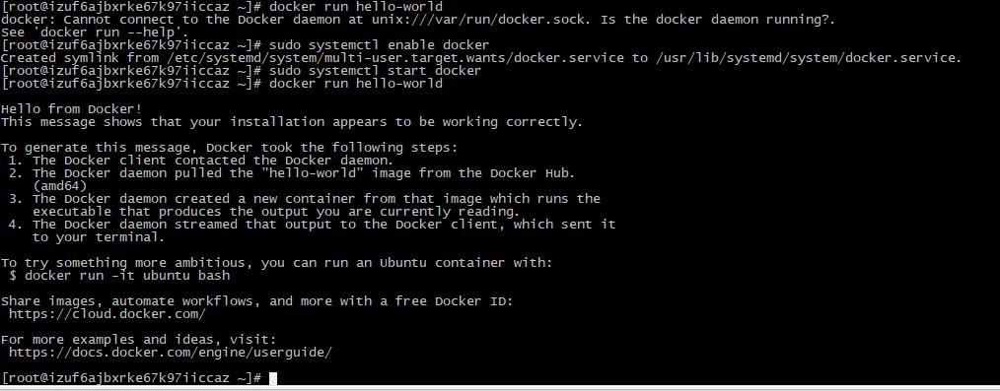
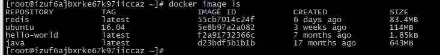
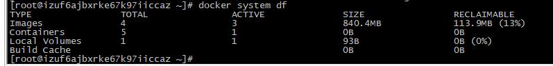
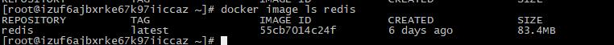
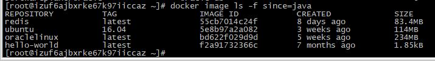
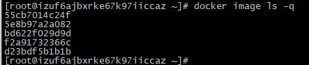
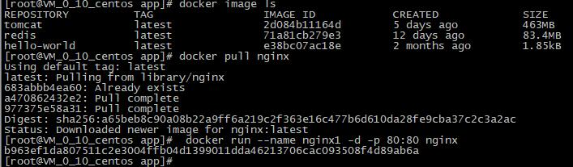
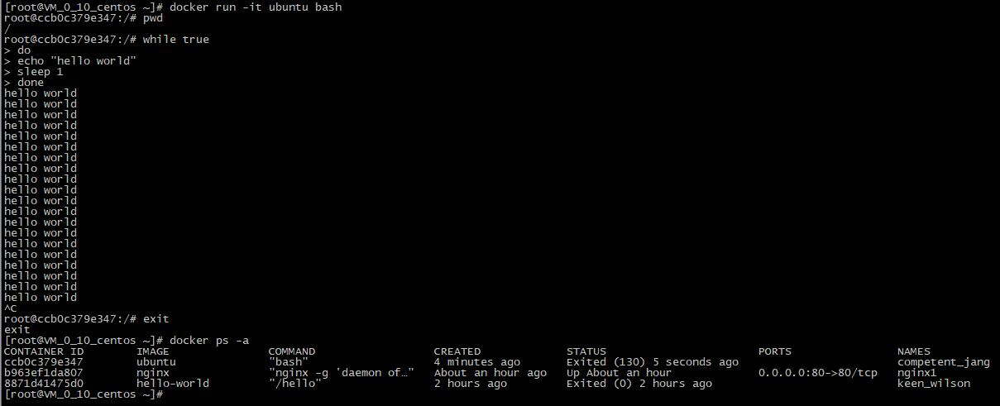
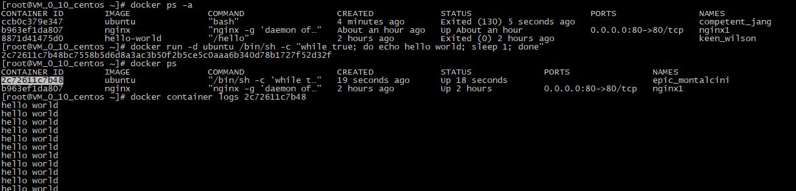

# Docker
***
## 什么是 Docker  
Docker 使用 Google 公司推出的 Go 语言 进行开发实现，基于Linux 内核的cgroup，namespace，以及 AUFS 类的 UnionFS等技术，对进程进行封装隔离，属于操作系统层面的虚拟化技术。由于隔离的进程独立于宿主和其它的隔离的进程，因此也称其为容器。最初实现是基于 LXC，从0.7 版本以后开始去除 LXC，转而使用自行开发的libcontainer，从 1.11开始，则进一步演进为使用 runC 和 containerd。
Docker 在容器的基础上，进行了进一步的封装，从文件系统、网络互联到进程隔离等等，极大的简化了容器的创建和维护。使得 Docker 技术比虚拟机技术更为轻便、快捷。

## 基本概念
1. 镜像（Image ）:Docker 镜像是一个特殊的文件系统，除了提供容器运行时所需的程序、库、资源、配置等文件外，还包含了一些为运行时准备的一些配置参数（如匿名卷、环境变量、用户等） 。镜像不包含任何动态数据，其内容在构建之后也不会被改变。
分层存储:因为镜像包含操作系统完整的 root 文件系统，其体积往往是庞大的，因此在 Docker 设计时，就充分利用 Union FS 的技术，将其设计为分层存储的架构。所以严格来说，镜像并非是像一个 ISO 那样的打包文件，镜像只是一个虚拟的概念，其实际体现并非由一个文件组成，而是由一组文件系统组成，或者说，由多层文件系统联合组成。镜像构建时，会一层层构建，前一层是后一层的基础。每一层构建完就不会再发生改变，后一层上的任何改变只发生在自己这一层。比如，删除前一层文件的操作，实际不是真的删除前一层的文件，而是仅在当前层标记为该文件已删除。在最终容器运行的时候，虽然不会看到这个文件，但是实际上该文件会一直跟随镜像。因此，在构建镜像的时候，需要额外小心，每一层尽量只包含该层需要添加的东西，任何额外的东西应该在该层构建结束前清理
掉。分层存储的特征还使得镜像的复用、定制变的更为容易。甚至可以用之前构建好的镜像作为基础层，然后进一步添加新的层，以定制自己所需的内容，构建新的镜像。
2. Docker 容器:镜像（Image ） 和容器（Container ） 的关系，就像是面向对象程序设计中的 类 和 实例
一样，镜像是静态的定义，容器是镜像运行时的实体。容器可以被创建、启动、停止、删
除、暂停等。
容器的实质是进程，但与直接在宿主执行的进程不同，容器进程运行于属于自己的独立的 命
名空间。因此容器可以拥有自己的 root 文件系统、自己的网络配置、自己的进程空间，甚
至自己的用户 ID 空间。容器内的进程是运行在一个隔离的环境里，使用起来，就好像是在一
个独立于宿主的系统下操作一样。这种特性使得容器封装的应用比直接在宿主运行更加安
全。也因为这种隔离的特性，很多人初学 Docker 时常常会混淆容器和虚拟机。
前面讲过镜像使用的是分层存储，容器也是如此。每一个容器运行时，是以镜像为基础层，
在其上创建一个当前容器的存储层，我们可以称这个为容器运行时读写而准备的存储层为容
器存储层。
容器存储层的生存周期和容器一样，容器消亡时，容器存储层也随之消亡。因此，任何保存
于容器存储层的信息都会随容器删除而丢失。
按照 Docker 最佳实践的要求，容器不应该向其存储层内写入任何数据，容器存储层要保持无
状态化。所有的文件写入操作，都应该使用 数据卷（Volume） 、或者绑定宿主目录，在这些
位置的读写会跳过容器存储层，直接对宿主（或网络存储） 发生读写，其性能和稳定性更
高。
数据卷的生存周期独立于容器，容器消亡，数据卷不会消亡。因此，使用数据卷后，容器删
除或者重新运行之后，数据却不会丢失。
3. Docker Registry :镜像构建完成后，可以很容易的在当前宿主机上运行，但是，如果需要在其它服务器上使用
这个镜像，我们就需要一个集中的存储、分发镜像的服务，Docker Registry 就是这样的服
务。
一个 Docker Registry 中可以包含多个仓库（Repository ） ；每个仓库可以包含多个标签
（Tag ） ；每个标签对应一个镜像。
通常，一个仓库会包含同一个软件不同版本的镜像，而标签就常用于对应该软件的各个版
本。我们可以通过 <仓库名>:<标签> 的格式来指定具体是这个软件哪个版本的镜像。如果不给
出标签，将以 latest 作为默认标签。
以 Ubuntu 镜像 为例， ubuntu 是仓库的名字，其内包含有不同的版本标签，如， 14.04 ,
16.04 。我们可以通过 ubuntu:14.04 ，或者 ubuntu:16.04 来具体指定所需哪个版本的镜
像。如果忽略了标签，比如 ubuntu ，那将视为 ubuntu:latest 。
仓库名经常以 两段式路径 形式出现，比如 jwilder/nginx-proxy ，前者往往意味着 Docker
Registry 多用户环境下的用户名，后者则往往是对应的软件名。但这并非绝对，取决于所使
用的具体 Docker Registry 的软件或服务。
Docker Registry 公开服务,Docker Registry 公开服务是开放给用户使用、允许用户管理镜像的 Registry 服务。一般这类
公开服务允许用户免费上传、下载公开的镜像，并可能提供收费服务供用户管理私有镜像。
最常使用的 Registry 公开服务是官方的 Docker Hub，这也是默认的 Registry，并拥有大量的
高质量的官方镜像。除此以外，还有 CoreOS 的 Quay.io，CoreOS 相关的镜像存储在这里；
Google 的 Google Container Registry，Kubernetes 的镜像使用的就是这个服务。
由于某些原因，在国内访问这些服务可能会比较慢。国内的一些云服务商提供了针对 Docker
Hub 的镜像服务（Registry Mirror ） ，这些镜像服务被称为加速器。常见的有 阿里云加速
器、DaoCloud 加速器 等。使用加速器会直接从国内的地址下载 Docker Hub 的镜像，比直接
从 Docker Hub 下载速度会提高很多。在 安装 Docker 一节中有详细的配置方法。
国内也有一些云服务商提供类似于 Docker Hub 的公开服务。比如 时速云镜像仓库、网易云
镜像服务、DaoCloud 镜像市场、阿里云镜像库 等。

## 安装Docker(CentOs)
1. 卸载旧版本:旧版本的 Docker 称为 docker 或者 docker-engine ，使用以下命令卸载旧版本：

		$ sudo yum remove docker \
		docker-common \
		docker-selinux \
		docker-engine
2. 执行以下命令安装依赖包：

		$ sudo yum install -y yum-utils \
		device-mapper-persistent-data \
		lvm2
		鉴于国内网络问题，强烈建议使用国内源，官方源请在注释中查看。
		执行下面的命令添加 yum 软件源：
		$ sudo yum-config-manager \
		--add-repo \
		https://mirrors.ustc.edu.cn/docker-ce/linux/centos/docker-ce.repo
		# 官方源
		# $ sudo yum-config-manager \
		# --add-repo \
		# https://download.docker.com/linux/centos/docker-ce.repo
		如果需要最新版本的 Docker CE 请使用以下命令：
		$ sudo yum-config-manager --enable docker-ce-edge
		如果需要测试版本的 Docker CE 请使用以下命令：
		$ sudo yum-config-manager --enable docker-ce-test
3. 安装 Docker CE

		更新 yum 软件源缓存，并安装 docker-ce 。
		$ sudo yum makecache fast
		$ sudo yum install docker-ce

		使用脚本自动安装:
		在测试或开发环境中 Docker 官方为了简化安装流程，提供了一套便捷的安装脚本，CentOS
		系统上可以使用这套脚本安装：
		$ curl -fsSL get.docker.com -o get-docker.sh
		$ sudo sh get-docker.sh --mirror Aliyun
		执行这个命令后，脚本就会自动的将一切准备工作做好，并且把 Docker CE 的 Edge 版本安
		装在系统中。

4. 锁启动 Docker CE
		
		Cgroup驱动
		sudo mkdir /etc/docker
		cat <<EOF | sudo tee /etc/docker/daemon.json
		{
		  "exec-opts": ["native.cgroupdriver=systemd"],
		  "log-driver": "json-file",
		  "log-opts": {
		    "max-size": "100m"
		  },
		  "storage-driver": "overlay2",
          "registry-mirrors": ["https://docker.mirrors.ustc.edu.cn"]
		}
		EOF

		$ sudo systemctl enable docker
		$ sudo systemctl start docker

5. 建立 docker 用户组:默认情况下， docker 命令会使用 Unix socket 与 Docker 引擎通讯。而只有 root 用户和docker 组的用户才可以访问 Docker 引擎的 Unix socket。出于安全考虑，一般 Linux 系统上不会直接使用 root 用户。因此，更好地做法是将需要使用 docker 的用户加入 docker用户组。

		建立 docker 组：

		$ sudo groupadd docker
		将当前用户加入 docker 组：
		$ sudo usermod -aG docker $USER
		退出当前终端并重新登录，进行如下测试。
		docker run hello-world
  
6. 镜像加速

		用例：中国注册镜像
		中国注册镜像的URL是registry.docker-cn.com。通过在docker pull 命令中指定完整路径（包括注册表），您可以像从其他注册表那样从该镜像中提取镜像，例如：
		
		$ docker pull registry.docker-cn.com/library/ubuntu
		您可以添加"https://registry.docker-cn.com"到registry-mirrors阵列中/etc/docker/daemon.json 以默认从China注册表镜像中拉取。
		
		{
		  "registry-mirrors": ["https://registry.docker-cn.com"]
		}
		保存文件并重新加载Docker以使更改生效。
		
		或者，您可以使用--registry-mirror启动参数配置Docker守护程序：
		
		$ dockerd --registry-mirror=https://registry.docker-cn.com
7. 添加内核参数

		默认配置下，如果在 CentOS 使用 Docker CE 看到下面的这些警告信息：
		WARNING: bridge-nf-call-iptables is disabled
		WARNING: bridge-nf-call-ip6tables is disabled
		请添加内核配置参数以启用这些功能。
		$ sudo tee -a /etc/sysctl.conf <<-EOF
		net.bridge.bridge-nf-call-ip6tables = 1
		net.bridge.bridge-nf-call-iptables = 1
		EOF
		然后重新加载 sysctl.conf 即可
		$ sudo sysctl -p

## 使用 Docker 镜像
1. 获取镜像:[Docker Hub](https://hub.docker.com/explore/) 上有大量的高质量的镜像可以用

		docker pull [选项] [Docker Registry 地址[:端口号]/]仓库名[:标签]
		具体的选项可以通过 docker pull --help 命令看到
	* Docker 镜像仓库地址：地址的格式一般是 <域名/IP>[:端口号] 。默认地址是 Docker Hub。
	* 仓库名：如之前所说，这里的仓库名是两段式名称，即 <用户名>/<软件名> 。对于 Docker Hub，如果不给出用户名，则默认为 library ，也就是官方镜像。

			比如：
			$ docker pull ubuntu:16.04
			16.04: Pulling from library/ubuntu
			bf5d46315322: Pull complete
			9f13e0ac480c: Pull complete
			e8988b5b3097: Pull complete
			40af181810e7: Pull complete
			e6f7c7e5c03e: Pull complete
			Digest: sha256:147913621d9cdea08853f6ba9116c2e27a3ceffecf3b492983ae97c3d643fbbe
			Status: Downloaded newer image for ubuntu:16.04
			上面的命令中没有给出 Docker 镜像仓库地址，因此将会从 Docker Hub 获取镜像。而镜像名
			称是 ubuntu:16.04 ，因此将会获取官方镜像 library/ubuntu 仓库中标签为 16.04 的镜
			像。
			从下载过程中可以看到我们之前提及的分层存储的概念，镜像是由多层存储所构成。下载也
			是一层层的去下载，并非单一文件。下载过程中给出了每一层的 ID 的前 12 位。并且下载结
			束后，给出该镜像完整的 sha256 的摘要，以确保下载一致性。
			在使用上面命令的时候，你可能会发现，你所看到的层 ID 以及 sha256 的摘要和这里的不一
			样。这是因为官方镜像是一直在维护的，有任何新的 bug，或者版本更新，都会进行修复再
			以原来的标签发布，这样可以确保任何使用这个标签的用户可以获得更安全、更稳定的镜
			像。
2. 运行:有了镜像后，我们就能够以这个镜像为基础启动并运行一个容器。以上面的 ubuntu:16.04 为	例，如果我们打算启动里面的 bash 并且进行交互式操作的话，可以执行下面的命令。

		$ docker run -it --rm \
		ubuntu:16.04 \
		bash
		root@e7009c6ce357:/# cat /etc/os-release
		NAME="Ubuntu"
		VERSION="16.04.4 LTS, Trusty Tahr"
		ID=ubuntu
		ID_LIKE=debian
		PRETTY_NAME="Ubuntu 16.04.4 LTS"
		VERSION_ID="16.04"
		HOME_URL="http://www.ubuntu.com/"
		SUPPORT_URL="http://help.ubuntu.com/"
		BUG_REPORT_URL="http://bugs.launchpad.net/ubuntu/"
		docker run 就是运行容器的命令，具体格式我们会在 容器 一节进行详细讲解，我们这里简
		要的说明一下上面用到的参数。
		-it ：这是两个参数，一个是 -i ：交互式操作，一个是 -t 终端。我们这里打算进入
		bash 执行一些命令并查看返回结果，因此我们需要交互式终端。
		--rm ：这个参数是说容器退出后随之将其删除。默认情况下，为了排障需求，退出的容
		器并不会立即删除，除非手动 docker rm 。我们这里只是随便执行个命令，看看结果，
		不需要排障和保留结果，因此使用 --rm 可以避免浪费空间。
		ubuntu:16.04 ：这是指用 ubuntu:16.04 镜像为基础来启动容器。
		bash ：放在镜像名后的是命令，这里我们希望有个交互式 Shell，因此用的是 bash 。
		进入容器后，我们可以在 Shell 下操作，执行任何所需的命令。这里，我们执行了 cat
		/etc/os-release ，这是 Linux 常用的查看当前系统版本的命令，从返回的结果可以看到容器
		内是 Ubuntu 16.04.4 LTS 系统。
		最后我们通过 exit 退出了这个容器。
3. 列出镜像:

		docker image ls
	

		可以通过以下命令来便捷的查看镜像、容器、数据卷所占用的空间。
		$ docker system df
		虚悬镜像已经失去了存在的价值，是可以随意删除的，可以用下面的命令删除
		$ docker image prune
	
	* 中间层镜像:为了加速镜像构建、重复利用资源，Docker 会利用 中间层镜像。所以在使用一段时间后，可
	能会看到一些依赖的中间层镜像。默认的 docker image ls 列表中只会显示顶层镜像，如果
	希望显示包括中间层镜像在内的所有镜像的话，需要加 -a 参数。与之前的虚悬镜像不同，这些无标签的镜像很多都是中间层镜像，是其它镜像所依赖的镜像。这些无标签镜像不应该删除，否则会导致上层镜像因为依赖丢失而出错。
		
			$ docker image ls -a
	* 列出部分镜像:有时候我们只希望列出部分镜像。

		 	docker image ls 有好几个参数可以帮助做到这个事情。
		

			docker image ls 还支持强大的过滤器参数 --filter ，或者简写 -f 。之前我们
			已经看到了使用过滤器来列出虚悬镜像的用法，它还有更多的用法。想查看某个位置之前的镜像也可以，只需要把 since 换成 before 即可
		
	* 以特定格式显示:默认情况下， docker image ls 会输出一个完整的表格，但是我们并非所有时候都会需要这些
内容。比如，刚才删除虚悬镜像的时候，我们需要利用 docker image ls 把所有的虚悬镜像
的 ID 列出来，然后才可以交给 docker image rm 命令作为参数来删除指定的这些镜像，这个
时候就用到了 -q 参数。

		

4. 删除本地镜像:如果要删除本地的镜像，可以使用 docker image rm 命令，其格式为：

		$ docker image rm [选项] <镜像1> [<镜像2> ...]
		其中， <镜像> 可以是 镜像短 ID 、 镜像长 ID 、 镜像名 或者 镜像摘要 。
		docker image rm 501  镜像短 ID
		也可以用 镜像名 ，也就是 <仓库名>:<标签> ，来删除镜像
		$ docker image rm centos
	* 用 docker image ls 命令来配合

			比如，我们需要删除所有仓库名为 redis 的镜像：
			$ docker image rm $(docker image ls -q redis)
			或者删除所有在 mongo:3.2 之前的镜像：
			$ docker image rm $(docker image ls -q -f before=mongo:3.2)
5. 使用 Dockerfile 定制镜像，以springboot项目为例 
	1. 在项目根目录添加Dockerfile文件，并编辑  
	
			FROM fabric8/java-alpine-openjdk8-jdk
			MAINTAINER yangzhuowei 20200623
			RUN mkdir -p /app/java/ $HOME/log/
			ENV auther=pewee
			WORKDIR /app/java/
			COPY ./build/libs/auth-0.0.1-SNAPSHOT.jar /app/java/app.jar
			ENTRYPOINT java -jar -Dspring.profiles.active=dev app.jar 

	2. 打包该项目jar包为auth-0.0.1-SNAPSHOT.jar
	3. docker build -t auth:1.0 .
	4. docker run -it -d -p 8081:8081 auth:1.0
	5. 打开浏览器查看页面127.0.0.1：8081/login.html
	6. 后续要进入该容器可以docker exec -it 容器id /bin/bash
	7. 将镜像存储:docker save nginx:latest > /root/docker-images/nginx.tar
	8. 导入镜像文件docker load --input /root/docker-images/nginx.tar
	9. 使用运行时指定参数

		* 传递系统的环境变量:docker run -e "SPRING_PROFILES_ACTIVE=prod" -p 8080:8080 -t springio/gs-spring-boot-docker
		* 加参数:docker run -d demo --spring.profiles.active=prod

#导入镜像文件
docker load --input /root/docker-images/nginx.tar

## 操作容器  
1. 创建容器:启动容器有两种方式，一种是基于镜像新建一个容器并启动，另外一个是将在终止状态（stopped ） 的容器重新启动.
	* 基于新image 
			
		
	  
	* 启动终止的容器

			docker container start 容器id
			通过docker ps查看运行容器
			docker ps -a 查看全部容器

	* 终止容器

			使用 docker container stop 容器id 来终止一个运行中的容器,docker container restart 命令会将一个运行态的容器终止，然后再重新启动它
	
	* 后台运行

			例如，下面的命令输出一个 “Hello World”，之后终止容器。
			$ docker run ubuntu:14.04 /bin/echo 'Hello world'
			Hello world 
			下面的命令则启动一个 bash 终端，允许用户进行交互。
			$ docker run -t -i ubuntu:14.04 /bin/bash
			root@af8bae53bdd3:/#
			其中， -t 选项让Docker分配一个伪终端（pseudo-tty） 并绑定到容器的标准输入上， -i
			则让容器的标准输入保持打开。
			在交互模式下，用户可以通过所创建的终端来输入命令，例如
			root@af8bae53bdd3:/# pwd
			/ r
			oot@af8bae53bdd3:/# ls
			bin boot dev etc home lib lib64 media mnt opt proc root run sbin srv sys tmp usr var
			* 当利用 docker run 来创建容器时，Docker 在后台运行的标准操作包括：
			* 检查本地是否存在指定的镜像，不存在就从公有仓库下载
			* 利用镜像创建并启动一个容器
			* 分配一个文件系统，并在只读的镜像层外面挂载一层可读写层
			* 从宿主主机配置的网桥接口中桥接一个虚拟接口到容器中去
			* 从地址池配置一个 ip 地址给容器
			* 执行用户指定的应用程序
			* 执行完毕后容器被终止

		

			需要让 Docker 在后台运行而不是直接把执行命令的结果输出在当前宿主机下。此时，可以通过添加 -d 参数来实现
			如果不使用 -d 参数运行容器。
			$ docker run ubuntu:17.10 /bin/sh -c "while true; do echo hello world; sleep 1; done"
			hello world
			hello world
			hello world
			hello world
			容器会把输出的结果 (STDOUT) 打印到宿主机上面
			如果使用了 -d 参数运行容器。
			$ docker run -d ubuntu:17.10 /bin/sh -c "while true; do echo hello world; sleep 1; don
			e"
			77b2dc01fe0f3f1265df143181e7b9af5e05279a884f4776ee75350ea9d8017a
			此时容器会在后台运行并不会把输出的结果 (STDOUT) 打印到宿主机上面(输出结果可以用
			docker logs 查看)。
			注： 容器是否会长久运行，是和 docker run 指定的命令有关，和 -d 参数无关。
			使用 -d 参数启动后会返回一个唯一的 id，也可以通过 docker container ls 命令来查看容
			器信息。
			$ docker container ls
			CONTAINER ID IMAGE COMMAND CREATED STATUS PORTS NA
			MES
			77b2dc01fe0f ubuntu:17.10 /bin/sh -c 'while tr 2 minutes ago Up 1 minute ag
			itated_wright
			要获取容器的输出信息，可以通过 docker container logs 命令。
			$ docker container logs [container ID or NAMES]
			hello world
			hello world
			hello world
		

2. 进入容器:在使用 -d 参数时，容器启动后会进入后台。某些时候需要进入容器进行操作,使用docker exec 命令
		docker exec -it 容器编号 /bin/bash

3. 参数解释 	
		
 		docker run -it -e "SERVER_PORT=80" -v C:/Users/pewee/logs/bsp/:/root/logs/bsp/ -p 8080:80 -d bsp:1.0

	* -v 本机目录:挂在到docker的目录 
	* -d 后台运行 
	* -p 本机端口:docker端口
	* -a stdin: 指定标准输入输出内容类型，可选 STDIN/STDOUT/STDERR 三项；
	* -d: 后台运行容器，并返回容器ID；
	* -i: 以交互模式运行容器，通常与 -t 同时使用；
	* -P: 随机端口映射，容器内部端口随机映射到主机的端口
	* -p: 指定端口映射，格式为：主机(宿主)端口:容器端口
	* -t: 为容器重新分配一个伪输入终端，通常与 -i 同时使用；
	* --name="nginx-lb": 为容器指定一个名称；
	* --dns 8.8.8.8: 指定容器使用的DNS服务器，默认和宿主一致；
	* --dns-search example.com: 指定容器DNS搜索域名，默认和宿主一致；
	* -h "mars": 指定容器的hostname；
	* -e username="ritchie": 设置环境变量；
	* --env-file=[]: 从指定文件读入环境变量；
	* --cpuset="0-2" or --cpuset="0,1,2": 绑定容器到指定CPU运行；
	* -m :设置容器使用内存最大值；
	* --net="bridge": 指定容器的网络连接类型，支持 bridge/host/none/container: 四种类型；
	* --link=[]: 添加链接到另一个容器；
	* --expose=[]: 开放一个端口或一组端口；这里只是声明
	* --volume , -v: 绑定一个卷
4. CC
5. DD
6. 

# 本地registry
	docker pull registry
	docker run -d -v C:/develop/dockerimages:/var/lib/registry -p 5000:5000 --restart=always --name pewee-registry registry
	docker images
    docker tag bsp:1.0 192.168.111.1:5000/bsp:1.0
	docker push 192.168.111.1:5000/bsp:1.0