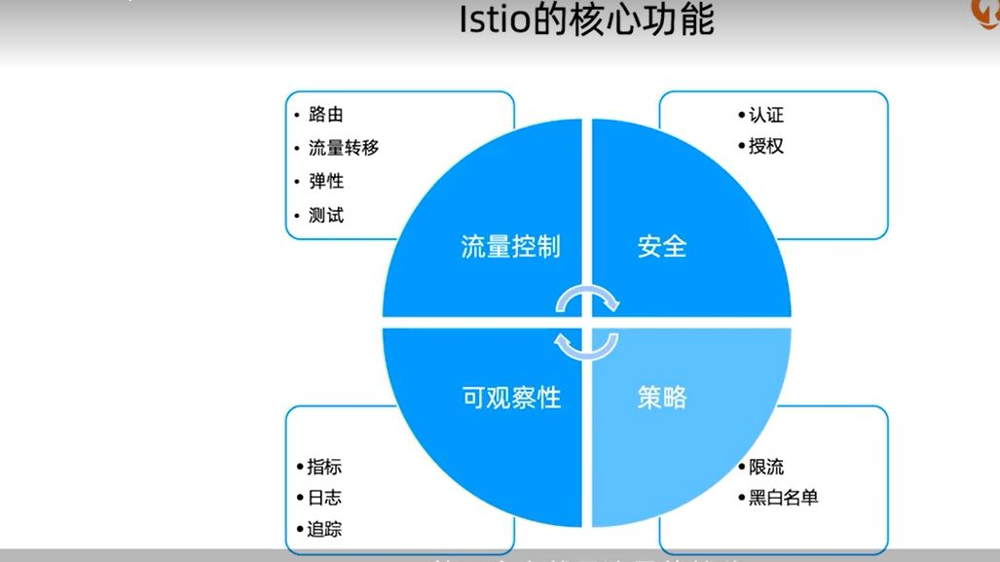
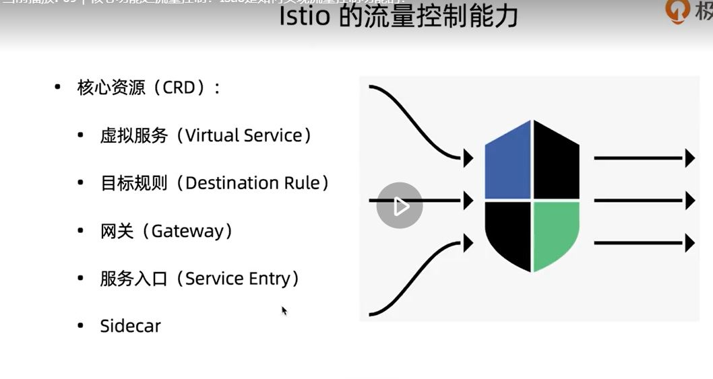
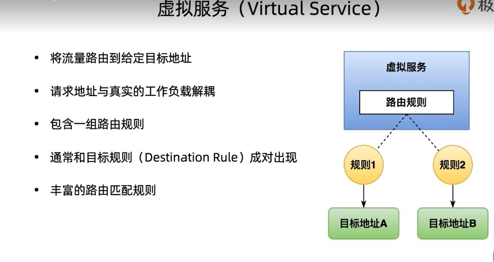
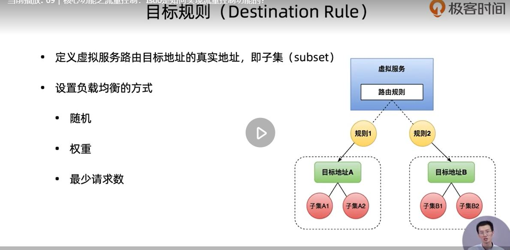
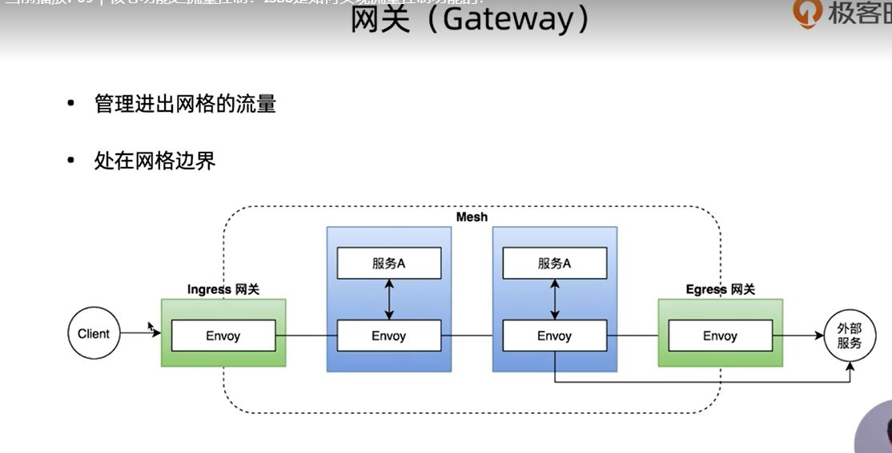
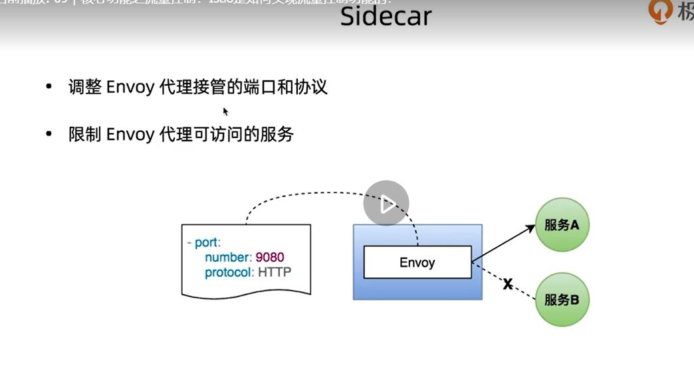
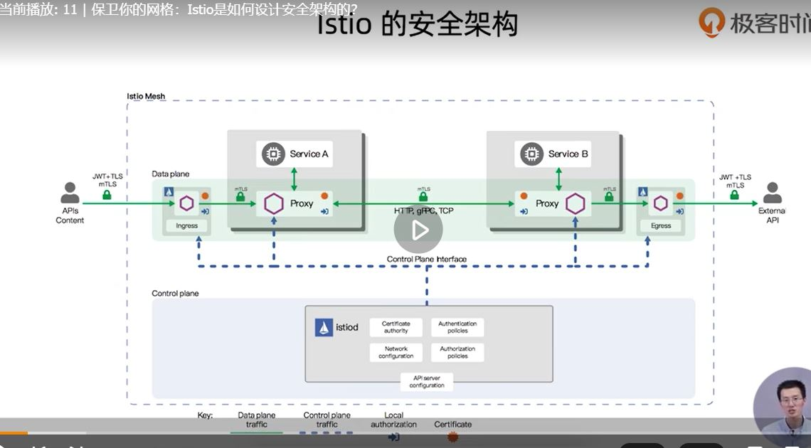
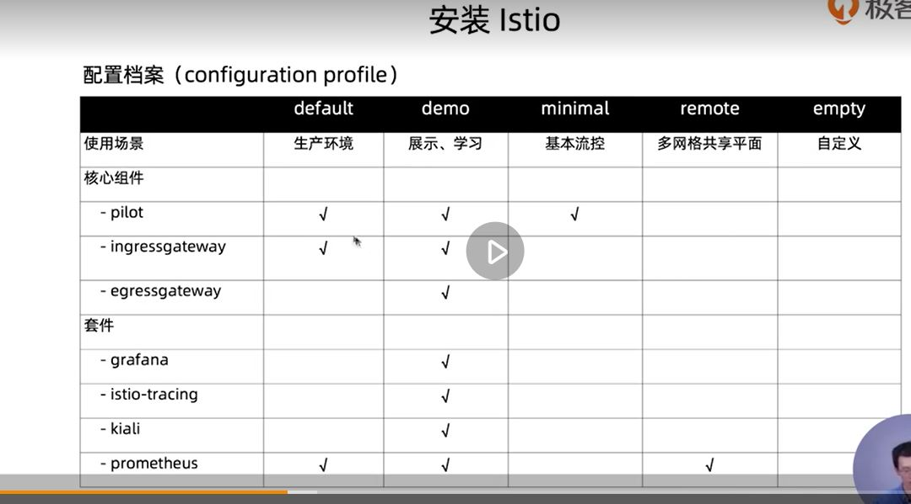
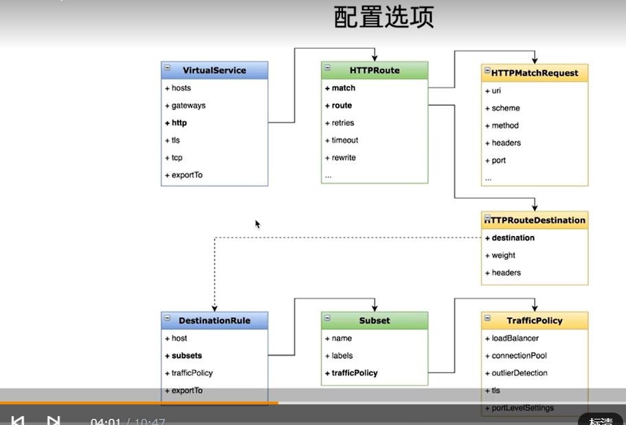

开源代码地址: https://github.com/istio/istio

官方网站: https://istio.io/

## 数据平面 + 控制平面

数据平面:

istio默认使用envoy作为数据平面

控制平面:

1. pilot:配置分发的组件,将运维人员的配置路由信息->数据平面能识别的配置,分发个slideCar代理
2. citadel: 负责安全,授权认证,TLS
3. Galley : 负责在 Istio 中验证、摄取、聚合、转换和分发配置。

### istio的流量控制

##### 虚拟服务

他需要目标规则来路由

##### 目标规则

##### 网关

上面用来管理网格内部的流流量,网关用来管理网格外部的流量

##### 服务入口

面向服务,把外部服务注册到网格内

##### clidecar

### 服务的可观察性

指标,分布式追中,日志

### 安全

## 实战
使用playground环境免得自己安装k8s
https://www.katacoda.com/courses/kubernetes/playground

下载:
curl -L https://istio.io/downloadIstio | sh -
或者
wget --no-cookie --no-check-certificate https://github.com/istio/istio/releases/download/1.11.4/istio-1.11.4-linux-amd64.tar.gz

添加环境变量

export PATH="$PATH:/app/k8s/istio-XXXX/bin"

查看环境是否配置好:
istioctl version

他的manifests为istio的安装包,提供了以下几种配置

执行以下命令安装:

默认:istioctl install

我们自己玩可以: istioctl install --set profile=demo -y

安装完成后查看启动情况:

	[root@k8s-master-node1 /app/k8s/istio-1.11.4]#kubectl get namespace
	NAME                   STATUS   AGE
	default                Active   84m
	ingress-nginx          Active   84m
	istio-system           Active   5m23s
	kube-node-lease        Active   84m
	kube-public            Active   84m
	kube-system            Active   84m
	kubernetes-dashboard   Active   83m
	[root@k8s-master-node1 /app/k8s/istio-1.11.4]# kubectl get pods -n istio-system
	NAME                                    READY   STATUS    RESTARTS   AGE
	istio-egressgateway-756d4db566-nq5qn    1/1     Running   0          6m19s
	istio-ingressgateway-8577c57fb6-cxg7g   1/1     Running   0          6m19s
	istiod-5847c59c69-gj4qz                 1/1     Running   0          6m52s

看到有三个pod启动起来了

接下来部署一个istio官方的项目验证

首先需要给k8s环境default的namespace配置一个标签,标记namespace下创建的pod需要注入envoy容器

		# kubectl label namespace default istio-injection=enabled 

这个注入利用了k8s的admission controller,结合用户自定义的webhook实现注入.

再来部署应用

	[root@k8s-master-node1 /app/k8s/istio-1.11.4]# kubectl apply -f samples/bookinfo/platform/kube/bookinfo.yaml
	service/details created
	serviceaccount/bookinfo-details created
	deployment.apps/details-v1 created
	service/ratings created
	serviceaccount/bookinfo-ratings created
	deployment.apps/ratings-v1 created
	service/reviews created
	serviceaccount/bookinfo-reviews created
	deployment.apps/reviews-v1 created
	deployment.apps/reviews-v2 created
	deployment.apps/reviews-v3 created
	service/productpage created
	serviceaccount/bookinfo-productpage created
	deployment.apps/productpage-v1 created
	[root@k8s-master-node1 /app/k8s/istio-1.11.4]# kubectl get pods
	NAME                                READY   STATUS    RESTARTS   AGE
	details-v1-79f774bdb9-pt6ff         2/2     Running   0          3m50s
	ingress-demo-app-694bf5d965-9wp5v   1/1     Running   0          131m
	ingress-demo-app-694bf5d965-qfrx9   1/1     Running   0          131m
	productpage-v1-6b746f74dc-6dlkt     2/2     Running   0          3m49s
	ratings-v1-b6994bb9-j5xc6           2/2     Running   0          3m50s
	reviews-v1-545db77b95-24lq4         2/2     Running   0          3m50s
	reviews-v2-7bf8c9648f-6kcmh         2/2     Running   0          3m49s
	reviews-v3-84779c7bbc-nnqtb         2/2     Running   0          3m49s
看到pod已经被启动了

	[root@k8s-master-node1 /app/k8s/istio-1.11.4]# kubectl get services
	NAME               TYPE        CLUSTER-IP      EXTERNAL-IP   PORT(S)    AGE
	details            ClusterIP   10.96.66.58     <none>        9080/TCP   4m51s
	ingress-demo-app   ClusterIP   10.96.106.106   <none>        80/TCP     132m
	kubernetes         ClusterIP   10.96.0.1       <none>        443/TCP    133m
	productpage        ClusterIP   10.96.30.91     <none>        9080/TCP   4m51s
	ratings            ClusterIP   10.96.170.199   <none>        9080/TCP   4m51s
	reviews            ClusterIP   10.96.162.205   <none>        9080/TCP   4m51s

接下来验证服务:

	[root@k8s-master-node1 /app/k8s/istio-1.11.4]# kubectl exec "$(kubectl get pod -l app=ratings -o jsonpath='{.items[0].metadata.name}')" -c ratings -- curl -sS productpage:9080/productpage | grep -o "<title>.*</title>"
	<title>Simple Bookstore App</title>

Bookinfo 应用程序已部署但无法从外部访问。为了使其可访问，您需要创建一个 Istio Ingress Gateway

	[root@k8s-master-node1 /app/k8s/istio-1.11.4]# kubectl apply -f samples/bookinfo/networking/bookinfo-gateway.yaml
	gateway.networking.istio.io/bookinfo-gateway created
	virtualservice.networking.istio.io/bookinfo created
	[root@k8s-master-node1 /app/k8s/istio-1.11.4]# istioctl analyze
	Warning [IST0103] (Pod ingress-demo-app-694bf5d965-9wp5v.default) The pod is missing the Istio proxy. This can often be resolved by restarting or redeploying the workload.
	Warning [IST0103] (Pod ingress-demo-app-694bf5d965-qfrx9.default) The pod is missing the Istio proxy. This can often be resolved by restarting or redeploying the workload.

提示之前部署的ingress没有envoy,只要重启即可

接下来确定服务入口 IP 和端口

执行以下命令以确定您的 Kubernetes 集群是否在支持外部负载均衡器的环境中运行：

	[root@k8s-master-node1 /app/k8s/istio-1.11.4]# kubectl get svc istio-ingressgateway -n istio-system
	NAME                   TYPE           CLUSTER-IP   EXTERNAL-IP   PORT(S)                                                                      AGE
	istio-ingressgateway   LoadBalancer   10.96.0.52   <pending>     15021:42672/TCP,80:34703/TCP,443:33844/TCP,31400:38393/TCP,15443:41802/TCP   68m

如果EXTERNAL-IP设置了该值，则您的环境具有可用于入口网关的外部负载均衡器。如果该EXTERNAL-IP值为<none>（或永久<pending>），则您的环境不会为入口网关提供外部负载均衡器。在这种情况下，您可以使用服务的nodeport访问网关。

这里我的EXTERNAL-IP值<pending>,需要以nodeport访问网关

	[root@k8s-master-node1 /app/k8s/istio-1.11.4]# export INGRESS_PORT=$(kubectl -n istio-system get service istio-ingressgateway -o jsonpath='{.spec.ports[?(@.name=="http2")].nodePort}')
	[root@k8s-master-node1 /app/k8s/istio-1.11.4]# export SECURE_INGRESS_PORT=$(kubectl -n istio-system get service istio-ingressgateway -o jsonpath='{.spec.ports[?(@.name=="https")].nodePort}')
	[root@k8s-master-node1 /app/k8s/istio-1.11.4]# export INGRESS_HOST=$(kubectl get po -l istio=ingressgateway -n istio-system -o jsonpath='{.items[0].status.hostIP}')

若果EXTERNAL-IP有信息name设置:

	$ export INGRESS_HOST=$(kubectl -n istio-system get service istio-ingressgateway -o jsonpath='{.status.loadBalancer.ingress[0].ip}')
	$ export INGRESS_PORT=$(kubectl -n istio-system get service istio-ingressgateway -o jsonpath='{.spec.ports[?(@.name=="http2")].port}')
	$ export SECURE_INGRESS_PORT=$(kubectl -n istio-system get service istio-ingressgateway -o jsonpath='{.spec.ports[?(@.name=="https")].port}')

设置GATEWAY_URL：

	export GATEWAY_URL=$INGRESS_HOST:$INGRESS_PORT

确保 IP 地址和端口已成功分配给环境变量：

	echo "$GATEWAY_URL"

验证外部访问:
	
	[root@k8s-master-node1 /app/k8s/istio-1.11.4]# echo "http://$GATEWAY_URL/productpage"
	http://10.0.4.6:34703/productpage

firewall-cmd --set-default-zone=public
firewall-cmd --zone=public --add-interface=eth0
firewall-cmd --zone=public --add-port=80/tcp --permanent

## 动态路由VirtualService+DestRule

按服务的版本进行路由或者按比例切分流量时使用

可以看到以上VietualService可以支持丰富的匹配规则

上面部署的app让他只路由到review的V1版本:

	kubectl apply -f samples/bookinfo/networking/virtual-service-all-v1.yaml
	kubectl apply -f samples/bookinfo/networking/destination-rule-all.yaml

发现现在路由到V1了;

virtual-service-all-v1.yaml的内容:

	apiVersion: networking.istio.io/v1alpha3
	kind: VirtualService
	metadata:
	  name: productpage
	spec:
	  hosts:
	  - productpage
	  http:
	  - route:
	    - destination:
	        host: productpage
	        subset: v1
	---
	apiVersion: networking.istio.io/v1alpha3
	kind: VirtualService
	metadata:
	  name: reviews
	spec:
	  hosts:
	  - reviews
	  http:
	  - route:
	    - destination:
	        host: reviews
	        subset: v1
	---
	apiVersion: networking.istio.io/v1alpha3
	kind: VirtualService
	metadata:
	  name: ratings
	spec:
	  hosts:
	  - ratings
	  http:
	  - route:
	    - destination:
	        host: ratings
	        subset: v1
	---
	apiVersion: networking.istio.io/v1alpha3
	kind: VirtualService
	metadata:
	  name: details
	spec:
	  hosts:
	  - details
	  http:
	  - route:
	    - destination:
	        host: details
	        subset: v1
	---

这里定义了4个VirtualService对应4个微服务app,我们这里关心review这个服务,这里没有定义match,任何流量都能访问.对应的路由直接到reviews,子集为V1.

再来看目标规则定义:

	apiVersion: networking.istio.io/v1alpha3
	kind: DestinationRule
	metadata:
	  name: productpage
	spec:
	  host: productpage
	  subsets:
	  - name: v1
	    labels:
	      version: v1
	---
	apiVersion: networking.istio.io/v1alpha3
	kind: DestinationRule
	metadata:
	  name: reviews
	spec:
	  host: reviews
	  subsets:
	  - name: v1
	    labels:
	      version: v1
	  - name: v2
	    labels:
	      version: v2
	  - name: v3
	    labels:
	      version: v3
	---
	apiVersion: networking.istio.io/v1alpha3
	kind: DestinationRule
	metadata:
	  name: ratings
	spec:
	  host: ratings
	  subsets:
	  - name: v1
	    labels:
	      version: v1
	  - name: v2
	    labels:
	      version: v2
	  - name: v2-mysql
	    labels:
	      version: v2-mysql
	  - name: v2-mysql-vm
	    labels:
	      version: v2-mysql-vm
	---
	apiVersion: networking.istio.io/v1alpha3
	kind: DestinationRule
	metadata:
	  name: details
	spec:
	  host: details
	  subsets:
	  - name: v1
	    labels:
	      version: v1
	  - name: v2
	    labels:
	      version: v2
	---

规则定义对4个服务都定义了子集,为review定义了3个版本,通过VirtualService指向review子集的版本

### 网关

负责外部流量的路由

在本次示例中见bookinfo-gateway.yaml:

	apiVersion: networking.istio.io/v1alpha3
	kind: Gateway
	metadata:
	  name: bookinfo-gateway
	spec:
	  selector:
	    istio: ingressgateway # use istio default controller
	  servers:
	  - port:
	      number: 80
	      name: http
	      protocol: HTTP
	    hosts:
	    - "*"
	---
	apiVersion: networking.istio.io/v1alpha3
	kind: VirtualService
	metadata:
	  name: bookinfo
	spec:
	  hosts:
	  - "*"
	  gateways:
	  - bookinfo-gateway
	  http:
	  - match:
	    - uri:
	        exact: /productpage
	    - uri:
	        prefix: /static
	    - uri:
	        exact: /login
	    - uri:
	        exact: /logout
	    - uri:
	        prefix: /api/v1/products
	    route:
	    - destination:
	        host: productpage
	        port:
	          number: 9080

首先的Gateway资源的selector指向对应网关的pod,servers有port和host字段,在网关里只定义入口,而不定义路由.这里server就是外网的入口点.

对流量晶型控制的还是虚拟服务.
在下面的虚拟服务资源里,gateways设置成我们自定义网关的名字;下面的为具体的路由配置.如以上虚拟服务将productpage服务的9080端口的4个url暴露给了外网.

### 外部服务入口

把外部服务纳入内部管理,用serviceEntry和外部服务做映射

还是使用book案例

	samples/sleep/sleep.yaml
	

sleep.yaml里面就是一个Service和Deployment资源

通过
	
	kubectl exec -it sleep-XXXXXXX -c sleep curl http://httpbin.org/headers

返回了头信息,因为istio是允许所有网格内服务直接访问网格外服务.

我们需要把他设置成关闭访问,让只有注册的服务才能访问外部服务.

	//通过修改istio的configmap配置关闭访问
	kubectl get configmap istio -n istio-system -o yaml | sed 's/mode: ALLOW_ANY/mode: REGISTRY_ONLY/g' | kubectl replace -n istio-system -f -

现在就不能直接访问了;

现在来自定义服务入口:

	apiVersion: networking.istio.io/v1alpha3
	kind: ServiceEntry
	metadata:
	  name: httpbin-ext
	spec:
	  hosts:
	  - httpbin.org
	  ports:
	  - number: 80
	    name: http
	    protocol: HTTP
	  resolution: DNS
	  location: MESH_EXTERNAL

这里定义一个叫httpbin-ext的外部服务入口,他的访问host为httpbin.org,同时定义他的port和协议.服务发现机制为DNS,location有2中,网格外部和内部,这里为外部

kubectl apply -f httpbin-ext.yml
kubectl get serviceentry
发现已经有了我定义的入口

接下来再去从服务内部访问,发现可以访问了.
以下为se的具体定义:

### 流量转移

实战:基于权重的路由(蓝绿部署)
还是以book项目为例

之前的配置:
kubectl apply -f samples/bookinfo/networking/virtual-service-all-v1.yaml
// 50流量 转到v3
kubectl apply -f samples/bookinfo/networking/virtual-service-reviews-50-v3.yaml

看一下virtual-service-reviews-50-v3.yaml

	apiVersion: networking.istio.io/v1alpha3
	kind: VirtualService
	metadata:
	  name: reviews
	spec:
	  hosts:
	    - reviews
	  http:
	  - route:
	    - destination:
	        host: reviews
	        subset: v1
	      weight: 50
	    - destination:
	        host: reviews
	        subset: v3
	      weight: 50

发现很简单,route下面配置2个服务,版本不同,权重都是50即可;

### istio的ingress

和k8s的ingress不同,K8S是7层的入口,istio的ingress为4-6层,不涉及应用层.他复用virtualService的7层路由定义.

他是通过gateway的方式去实现

案例,将内部的服务暴露给外部访问:

	apiVersion: v1
	kind: ServiceAccount
	metadata:
	  name: httpbin
	---
	apiVersion: v1
	kind: Service
	metadata:
	  name: httpbin
	  labels:
	    app: httpbin
	    service: httpbin
	spec:
	  ports:
	  - name: http
	    port: 8000
	    targetPort: 80
	  selector:
	    app: httpbin
	---
	apiVersion: apps/v1
	kind: Deployment
	metadata:
	  name: httpbin
	spec:
	  replicas: 1
	  selector:
	    matchLabels:
	      app: httpbin
	      version: v1
	  template:
	    metadata:
	      labels:
	        app: httpbin
	        version: v1
	    spec:
	      serviceAccountName: httpbin
	      containers:
	      - image: docker.io/kennethreitz/httpbin
	        imagePullPolicy: IfNotPresent
	        name: httpbin
	        ports:
	        - containerPort: 80

先发布一个service,service的端口8080.

	apiVersion: networking.istio.io/v1alpha3
	kind: Gateway
	metadata:
	  name: httpbin-gateway
	spec:
	  selector:
	    istio: ingressgateway
	  servers:
	  - port:
	      number: 80
	      name: http
	      protocol: HTTP
	    hosts:
	    - "httpbin.example.com"

发布一个gateway,定义端口80,选择istio的默认ingressgw;设置一个hosts,希望请求以这个host来访问.

	kubectl apply -f gw.yml

路由配置vs.yml:

	apiVersion: networking.istio.io/v1alpha3
	kind: VirtualService
	metadata:
	  name: httpbin
	spec:
	  hosts:
	  - "httpbin.example.com"
	  gateways:
	  - httpbin-gateway
	  http:
	  - match:
	    - uri:
	        prefix: /status
	    - uri:
	        prefix: /delay
	    route:
	    - destination:
	        port:
	          number: 8000
	        host: httpbin

暴露了2个Service的端口/status和/delay,选择了我们上面定义的gw

	kubectl get vs

看到已经有httpbin的virtualhost对应网关为httpbin-gateway

接下来访问:

curl -I -HHost:httpbin.example.com http://localhost/status/200

用curl来模拟域名为httpbin.example.com,加到了http头,发现有返回;

### Egress

istio访问外部服务方法:

默认global.outboundTrafficPolicy.mode = ALLOW_ANY
允许所有pod访问外部服务

修改成REGISTRY_ONLY后,可以使用ServiceEntry来做外部接口的映射

也可以使用Egress网关做聚合

他主要用于统一管理网格的流量出口,把所有出口流量只经过一组专有节点,或为无法访问公网的内部服务做代理;

实战:用sample的sleep访问外网服务

首先查看istio的默认egress组件是否存在

	kubectl get pods -n istio-system

看到存在egress网关的pod

然后定义ServiceEntry

	apiVersion: networking.istio.io/v1alpha3
	kind: ServiceEntry
	metadata:
	  name: httpbin
	spec:
	  hosts:
	  - httpbin.org
	  ports:
	  - number: 80
	    name: http-port
	    protocol: HTTP
	  resolution: DNS

和之前单独定义的Se不同的是没有location字段,kubectl get se查看是否配置完成

现在来看egressgatwway这个pod的日志,看看请求是不是会经过他到外部

kubectl get pod -n istio-system

还是用sleep案例

	kubectl applyy -f samples/sleep/sleep.yaml

	kubectl  logs -f istio-egressgateway-XXXXXXXX -n istio-system

再开一个窗口进sleep容器访问外网

	kubectl exec -it sleep-XXXXXXX -c sleep curl http://httpbin.org/ip

发现返回了ip

切换回egress网关日志,发现他没有接收到任何出流量.因为现在还没配置让他来接管流量到外部

定义网关

	apiVersion: networking.istio.io/v1alpha3
	kind: Gateway
	metadata:
	  name: my-istio-egressgateway
	spec:
	  selector:
	    istio: egressgateway
	  servers:
	  - port:
	      number: 80
	      name: http
	      protocol: HTTP
	    hosts:
	    - httpbin.org

这里和之前的gateway不一样,之前的gw是select ingressgateway这里变成了egressgateway,表示是一个出口网关!对应的host和端口是外部服务的host和端口~!

定义virtualservice,把流量打到egress网关

	apiVersion: networking.istio.io/v1alpha3
	kind: VirtualService
	metadata:
	  name: vs-for-egressgateway
	spec:
	  hosts:
	  - httpbin.org
	  gateways:
	  - my-istio-egressgateway
	  - mesh
	  http:
	  - match:
	    - gateways:
	      - mesh
	      port: 80
	    route:
	    - destination:
	        host: istio-egressgateway.istio-system.svc.cluster.local
	        subset: httpbin
	        port:
	          number: 80
	      weight: 100
	  - match:
	    - gateways:
	      - my-istio-egressgateway
	      port: 80
	    route:
	    - destination:
	        host: httpbin.org
	        port:
	          number: 80
	      weight: 100
	---
	apiVersion: networking.istio.io/v1alpha3
	kind: DestinationRule
	metadata:
	  name: dr-for-egressgateway
	spec:
	  host: istio-egressgateway.istio-system.svc.cluster.local
	  subsets:
	  - name: httpbin

这里DestinationRule配置的是egressgateway的DNS名称.他的作用是把网格内部的流量指向egress;
在虚拟服务gateways下面配置了2个字段.一个针对egress网关,一个针对内部网格的.我们定义了2个匹配规则
mesh是针对内部服务的,他会把请求路由到egress网关.下面my-istio-egressgateway是把针对网管的请求再次路由指向外部服务地址.实际上是2跳,第一次把内部流量全打到网关,第二条把egress流量打到外部服务.

验证

现在发现流量从egress网关出去了;

### 超时重试
首先把指向review的版本调整到V2,V2和V3才会调用rating服务;

	apiVersion: networking.istio.io/v1alpha3
	kind: VirtualService
	metadata:
	  name: reviews
	spec:
	  hosts:
	    - reviews
	  http:
	  - route:
	    - destination:
	        host: reviews
	        subset: v2

在给rating服务加上2S延迟

	apiVersion: networking.istio.io/v1alpha3
	kind: VirtualService
	metadata:
	  name: ratings
	spec:
	  hosts:
	  - ratings
	  http:
	  - fault:
	      delay:
	        percent: 100
	        fixedDelay: 2s
	    route:
	    - destination:
	        host: ratings
	        subset: v1

给review添加超时

	apiVersion: networking.istio.io/v1alpha3
	kind: VirtualService
	metadata:
	  name: reviews
	spec:
	  hosts:
	  - reviews
	  http:
	  - route:
	    - destination:
	        host: reviews
	        subset: v2
	    timeout: 1s

这样我们在访问review会快速失败,防止微服务中故障扩散;

设置重试之前要取消掉之前的超时;

	apiVersion: networking.istio.io/v1alpha3
	kind: VirtualService
	metadata:
	  name: reviews
	spec:
	  hosts:
	  - reviews
	  http:
	  - route:
	    - destination:
	        host: reviews
	        subset: v2

接下来设置rating的重试

	apiVersion: networking.istio.io/v1alpha3
	kind: VirtualService
	metadata:
	  name: ratings
	spec:
	  hosts:
	  - ratings
	  http:
	  - fault:
	      delay:
	        percent: 100
	        fixedDelay: 5s
	    route:
	    - destination:
	        host: ratings
	        subset: v1
	    retries:
	      attempts: 2
	      perTryTimeout: 1s

为ratings的Vs配置一个5S的延时,配置一个超时,重试2次

打开rating服务的slidecarlog 看是不是有2次重试

	kubectl logs -f ratings-XXXXXXXXX -c istio-proxy

### 熔断

首先安装httpbin应用

	samples\httpbin\httpbin.yaml
	
为服务配置熔断,之前已经有httlbin的service,virtualservice了,修改其destnationRule:

	apiVersion: networking.istio.io/v1alpha3
	kind: DestinationRule
	metadata:
	  name: httpbin
	spec:
	  host: httpbin
	  trafficPolicy:
	    connectionPool:
	      tcp:
	        maxConnections: 1
	      http:
	        http1MaxPendingRequests: 1//最大呗阻挡的请求书
	        maxRequestsPerConnection: 1//最大请求设置为1,所以熔断条件呗触发,因为每个连接只有1个请求
	    outlierDetection:
	      consecutiveErrors: 1//失败次数,计数器到多少失败就触发
	      interval: 1s//熔断间隔时间
	      baseEjectionTime: 3m//基础驱逐时间默认30S,驱逐时间根据他乘以驱逐次数实现指数级的退避策略
	      maxEjectionPercent: 100//最大驱逐比例,该服务多少个服务示例能被驱逐

通过DestinationRule的trafficPolicy来配置,需要2个字段connectionPool连接池和outlierDetection失败探测配合

在安装fortio负载均衡服务:

	kubectl applt -f samples/httpbin/sample-client/fortio-deploy.yaml

他是一个小工具

	FORTIO_POD=$(kubectl get pod | grep fortio | awk '{ print $1 }')
	kubectl exec -it $FORTIO_POD -c fortio /usr/bin/fortio -- load -curl http://httpbin:8000/get

### 故障

 

	
	

