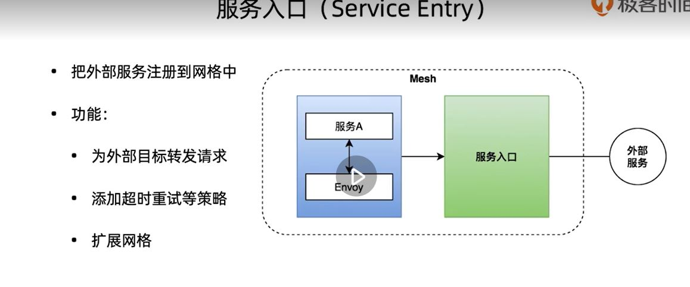

开源代码地址: https://github.com/istio/istio

官方网站: https://istio.io/

## 数据平面 + 控制平面

数据平面:

istio默认使用envoy作为数据平面

控制平面:

1. pilot:配置分发的组件,将运维人员的配置路由信息->数据平面能识别的配置,分发个slideCar代理
2. citadel: 负责安全,授权认证,TLS
3. Galley : 负责在 Istio 中验证、摄取、聚合、转换和分发配置。

### istio的流量控制

##### 虚拟服务

他需要目标规则来路由

##### 目标规则

##### 网关

上面用来管理网格内部的流流量,网关用来管理网格外部的流量

##### 服务入口

面向服务,把外部服务注册到网格内

##### clidecar

### 服务的可观察性

指标,分布式追中,日志

### 安全

## 实战

下载:
curl -L https://istio.io/downloadIstio | sh -
或者
wget --no-cookie --no-check-certificate https://github.com/istio/istio/releases/download/1.11.4/istio-1.11.4-linux-amd64.tar.gz

添加环境变量

export PATH="$PATH:/app/k8s/istio-XXXX/bin"

查看环境是否配置好:
istioctl version

他的manifests为istio的安装包,提供了以下几种配置

执行以下命令安装:

默认:istioctl install

我们自己玩可以: istioctl install --set profile=demo -y

安装完成后查看启动情况:

	[root@k8s-master-node1 /app/k8s/istio-1.11.4]#kubectl get namespace
	NAME                   STATUS   AGE
	default                Active   84m
	ingress-nginx          Active   84m
	istio-system           Active   5m23s
	kube-node-lease        Active   84m
	kube-public            Active   84m
	kube-system            Active   84m
	kubernetes-dashboard   Active   83m
	[root@k8s-master-node1 /app/k8s/istio-1.11.4]# kubectl get pods -n istio-system
	NAME                                    READY   STATUS    RESTARTS   AGE
	istio-egressgateway-756d4db566-nq5qn    1/1     Running   0          6m19s
	istio-ingressgateway-8577c57fb6-cxg7g   1/1     Running   0          6m19s
	istiod-5847c59c69-gj4qz                 1/1     Running   0          6m52s

看到有三个pod启动起来了

接下来部署一个istio官方的项目验证

首先需要给k8s环境default的namespace配置一个标签,标记namespace下创建的pod需要注入envoy容器

		# kubectl label namespace default istio-injection=enabled 

这个注入利用了k8s的admission controller,结合用户自定义的webhook实现注入.

再来部署应用

	[root@k8s-master-node1 /app/k8s/istio-1.11.4]# kubectl apply -f samples/bookinfo/platform/kube/bookinfo.yaml
	service/details created
	serviceaccount/bookinfo-details created
	deployment.apps/details-v1 created
	service/ratings created
	serviceaccount/bookinfo-ratings created
	deployment.apps/ratings-v1 created
	service/reviews created
	serviceaccount/bookinfo-reviews created
	deployment.apps/reviews-v1 created
	deployment.apps/reviews-v2 created
	deployment.apps/reviews-v3 created
	service/productpage created
	serviceaccount/bookinfo-productpage created
	deployment.apps/productpage-v1 created
	[root@k8s-master-node1 /app/k8s/istio-1.11.4]# kubectl get pods
	NAME                                READY   STATUS    RESTARTS   AGE
	details-v1-79f774bdb9-pt6ff         2/2     Running   0          3m50s
	ingress-demo-app-694bf5d965-9wp5v   1/1     Running   0          131m
	ingress-demo-app-694bf5d965-qfrx9   1/1     Running   0          131m
	productpage-v1-6b746f74dc-6dlkt     2/2     Running   0          3m49s
	ratings-v1-b6994bb9-j5xc6           2/2     Running   0          3m50s
	reviews-v1-545db77b95-24lq4         2/2     Running   0          3m50s
	reviews-v2-7bf8c9648f-6kcmh         2/2     Running   0          3m49s
	reviews-v3-84779c7bbc-nnqtb         2/2     Running   0          3m49s
看到pod已经被启动了

	[root@k8s-master-node1 /app/k8s/istio-1.11.4]# kubectl get services
	NAME               TYPE        CLUSTER-IP      EXTERNAL-IP   PORT(S)    AGE
	details            ClusterIP   10.96.66.58     <none>        9080/TCP   4m51s
	ingress-demo-app   ClusterIP   10.96.106.106   <none>        80/TCP     132m
	kubernetes         ClusterIP   10.96.0.1       <none>        443/TCP    133m
	productpage        ClusterIP   10.96.30.91     <none>        9080/TCP   4m51s
	ratings            ClusterIP   10.96.170.199   <none>        9080/TCP   4m51s
	reviews            ClusterIP   10.96.162.205   <none>        9080/TCP   4m51s

接下来验证服务:

	[root@k8s-master-node1 /app/k8s/istio-1.11.4]# kubectl exec "$(kubectl get pod -l app=ratings -o jsonpath='{.items[0].metadata.name}')" -c ratings -- curl -sS productpage:9080/productpage | grep -o "<title>.*</title>"
	<title>Simple Bookstore App</title>

Bookinfo 应用程序已部署但无法从外部访问。为了使其可访问，您需要创建一个 Istio Ingress Gateway

	[root@k8s-master-node1 /app/k8s/istio-1.11.4]# kubectl apply -f samples/bookinfo/networking/bookinfo-gateway.yaml
	gateway.networking.istio.io/bookinfo-gateway created
	virtualservice.networking.istio.io/bookinfo created
	[root@k8s-master-node1 /app/k8s/istio-1.11.4]# istioctl analyze
	Warning [IST0103] (Pod ingress-demo-app-694bf5d965-9wp5v.default) The pod is missing the Istio proxy. This can often be resolved by restarting or redeploying the workload.
	Warning [IST0103] (Pod ingress-demo-app-694bf5d965-qfrx9.default) The pod is missing the Istio proxy. This can often be resolved by restarting or redeploying the workload.

提示之前部署的ingress没有envoy,只要重启即可

接下来确定服务入口 IP 和端口

执行以下命令以确定您的 Kubernetes 集群是否在支持外部负载均衡器的环境中运行：

	[root@k8s-master-node1 /app/k8s/istio-1.11.4]# kubectl get svc istio-ingressgateway -n istio-system
	NAME                   TYPE           CLUSTER-IP   EXTERNAL-IP   PORT(S)                                                                      AGE
	istio-ingressgateway   LoadBalancer   10.96.0.52   <pending>     15021:42672/TCP,80:34703/TCP,443:33844/TCP,31400:38393/TCP,15443:41802/TCP   68m

如果EXTERNAL-IP设置了该值，则您的环境具有可用于入口网关的外部负载均衡器。如果该EXTERNAL-IP值为<none>（或永久<pending>），则您的环境不会为入口网关提供外部负载均衡器。在这种情况下，您可以使用服务的nodeport访问网关。

这里我的EXTERNAL-IP值<pending>,需要以nodeport访问网关

	[root@k8s-master-node1 /app/k8s/istio-1.11.4]# export INGRESS_PORT=$(kubectl -n istio-system get service istio-ingressgateway -o jsonpath='{.spec.ports[?(@.name=="http2")].nodePort}')
	[root@k8s-master-node1 /app/k8s/istio-1.11.4]# export SECURE_INGRESS_PORT=$(kubectl -n istio-system get service istio-ingressgateway -o jsonpath='{.spec.ports[?(@.name=="https")].nodePort}')
	[root@k8s-master-node1 /app/k8s/istio-1.11.4]# export INGRESS_HOST=$(kubectl get po -l istio=ingressgateway -n istio-system -o jsonpath='{.items[0].status.hostIP}')

设置GATEWAY_URL：

	export GATEWAY_URL=$INGRESS_HOST:$INGRESS_PORT

确保 IP 地址和端口已成功分配给环境变量：

	echo "$GATEWAY_URL"

验证外部访问:
	
	[root@k8s-master-node1 /app/k8s/istio-1.11.4]# echo "http://$GATEWAY_URL/productpage"
	http://10.0.4.6:34703/productpage

firewall-cmd --set-default-zone=public
firewall-cmd --zone=public --add-interface=eth0

	
	

