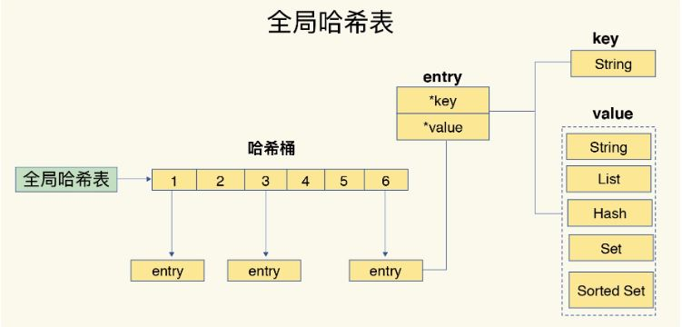
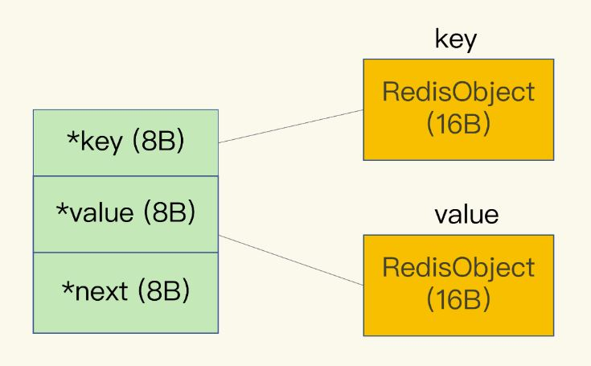
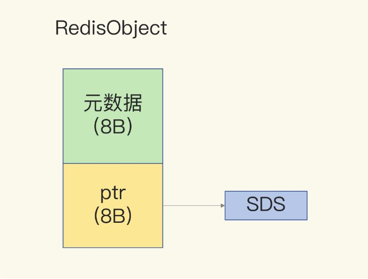
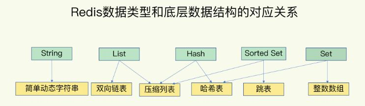
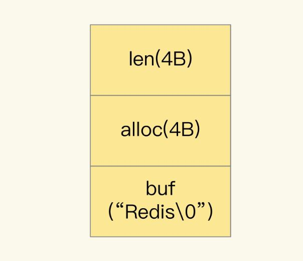
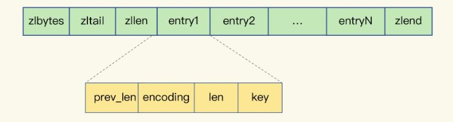

## 缓存策略

#### 容量
思考系统的设计容量,使用容量,峰值是我们做架构的一个常识
缓存容量是我们必须要考虑的问题,那些数据需要放入缓存.

#### 过期策略

FIFO? LRU? 按固定时间? 按业务时间加权?

## 缓存穿透问题
大量并发查询不存在的key,导致这些压力传递到数据库
解决办法: 1 . 缓存空值得key
2. 使用roaringbitmap或bloomfilter;roaringbitmap介绍见https://zhuanlan.zhihu.com/p/351365841
3. 所有的查询只查询到缓存.通过另外的机制来同步数据源和缓存

## 缓存击穿
当某个key失效的时候,敲好有大量并发请求去访问这个key
解决办法:1. 添加全局互斥锁
2. 所有的查询只走缓存.通过另外的机制来同步数据源和缓存

## 缓存雪崩
当某一时刻大规模缓存的key失效.导致数据库压力变大直接宕机
解决办法:1. 数据的更新时间,key的失效策略做到比较均匀
2. 把热数据分散到不同的机器
3. 系统实现熔断限流机制,对系统压力做控制
4. 数据做主从复制或多副本,减少单个数据源压力

## redis相关

#### redis的数据结构

1. 为了实现key-value的快速访问,redis使用了一个全局的hash表来存储所有的键值对,hash表中的hash桶放的entry元素中保存了*key和*value指针.
 
2. 当hash桶中的entry的key发生hash冲突时,桶中的元素会使用链表链接.redis的查找效率会退化为o(n).
    > redis的渐进式hash:为了不阻塞redis线程.redis在每个请求中处理一个hash桶的所有entry,这样就巧妙地把一次性大量拷贝的开销，分摊到了多次处理请求的过程中，避免了耗时操作，保证了数据的快速访问
3. Redis 的数据类型有很多，而且，不同数据类型都有些相同的元数据要记录（比如最后一次访问的时间、被引用的次数等），所以，Redis 会用一个 RedisObject 结构体来统一记录这些元数据，同时指向实际数据,一个 RedisObject 包含了 8 字节的元数据和一个 8 字节指针.
     
     

redis的编码格式

可以看到除了sds,其他编码结构都是集合的形式.

* sds:字符串的编码方式:,当字符串为一个数字时,redisobject中指向数据结构的ptr指针变为一个8个字节的数字.
* 整数数组&双向链表:对集合中元素的查找都是通过小标遍历或者链表指针向后指,效率都比较低为o(n).
* ziplist:压缩列表类似于一个数组，数组中的每一个元素都对应保存一个数据。和数组不同的是，压缩列表在表头有三个字段 zlbytes、zltail 和 zllen，分别表示列表长度、列表尾的偏移量和列表中的 entry 个数；压缩列表在表尾还有一个 zlend，表示列表结束。这些entry在内存中连续存放,不使用指针连接(注意此entry不是全局hash表的entry,而是全局hash表中value的结构为ziplist的entry,比如hset aaa bbb ccc,他的key为hash结构中value的key bbb.当ziplist很长时,全局hash的value结构会进化为hash表).这种结构让ziplist在首尾访问时速度会很快,但在遍历时复杂度会到o(n);
    
    1. prev_len: 表示前一个 entry 的长度。
    2. len表示自身长度，4 字节；
    3. encoding表示编码方式，1 字节；
    4. content保存实际数据。
* skiplist:用空间换时间的典型,建立多级索引.查找复杂度O(logN).
* hashtable:类似于hashmap.查找复杂度为o(1).和ziplist不同,entry需要使用指针连接.内存消耗变大.

#### redis的操作复杂度
1. redis的单个元素操作的复杂度由其对应的redisobject编码类型决定其操作复杂度.
2. 范围操作,如HGETALL,SMEMBERS,List 类型的 LRANGE 和 ZSet 类型的 ZRANGE.这类操作的复杂度一般是 O(N)，比较耗时，我们应该尽量避免。
3. 统计操作，是指集合类型对集合中所有元素个数的记录，例如 LLEN 和 SCARD。这类操作复杂度只有 O(1)，这是因为当集合类型采用压缩列表、双向链表、整数数组这些数据结构时，这些结构中专门记录了元素的个数统计，因此可以高效地完成相关操作。
4. 压缩列表和双向链表都会记录表头和表尾的偏移量。这样一来，对于 List 类型的 LPOP、RPOP、LPUSH、RPUSH 这四个操作来说，它们是在列表的头尾增删元素，这就可以通过偏移量直接定位，所以它们的复杂度也只有 O(1)，可以实现快速操作。

#### redis的io模型
这里直接复习一下操作系统的io模型;见https://blog.csdn.net/haogenmin/article/details/118527213

传统的阻塞io模型会在socket的accept() 和 recv()上阻塞.当然我们可以在accept()时创建线程而不使用主线程来处理后续的io防止主线程被阻塞,不过线程的大量创建与销毁或者是使用线程池的大小有限,无法应对大量的连接.

Socket 网络模型的非阻塞模式设置.socket() 方法会返回主动套接字，然后调用 listen() 方法，将主动套接字转化为监听套接字，此时，可以监听来自客户端的连接请求。最后，调用 accept() 方法接收到达的客户端连接，并返回已连接套接字。listen和accept可以设置为非阻塞;在recv()和send()函数调用时,不会阻塞而是会返回错误码,程序员要自己写代码去处理这些错误(如缓冲区已满,无数据可读等等)这种模式下主线程可以维护大量的socket连接.但是需要程序员自己为每个连接去内核轮询数据是否准备好,会大量浪费cpu资源.

高性能模型之多路复用I/O模型

1. select:基于轮询,使用 select 函数，通知内核挂起进程，当一个或多个 I/O 事件发生后，控制权返还给应用程序，由应用程序进行 I/O 事件的处理,IO事件包括可读,新连接,可写,超时等.程序员维护好需要让内核检查的socket,调用select方法,这个操作会把程序员维护的socket集合传入内核,并把线程挂起,内核会检查fd集合的状态,有事件时(也有可能超时),会在fd集合中的fd里设置一个标记表示他有事件,并唤醒调用线程,返回有事件的fd的个数.程序员在遍历socket集合查看(通过系统调用查看)并处理这些打了标记的socket;

    缺点:1. 每次调用select，都需要把fd集合从用户态拷贝到内核态，这个开销在fd很多时会很大

    缺点:2. 系统调用返回后不知道哪些socket就绪问题,程序被唤醒之后，还需要新一轮的系统调用，去检查哪个socket是就绪状态的
2. epoll:基于事件回调的;程序员通过epoll_ctl把需要监控的socket与之前创建的epoll描述符绑定.在调用epoll_wait时线程被挂起，在等待内核 I/O 事件的返回.内核返回结果前会把绪的socket事件信息(accept,read,write)拷贝到入参的数组里面,调用者可以直接拿到全部就绪的socket列表;这样做避免了没此系统调用都需要拷贝整个socket数组,而且返回的时候能直接获取全部有事件的socket.

redis采用的是epoll;Redis 线程不会阻塞在某一个特定的监听或已连接套接字上，也就是说，不会阻塞在某一个特定的客户端请求处理上。正因为此，Redis 可以同时和多个客户端连接并处理请求，从而提升并发性。

##### Redis单线程处理IO请求性能瓶颈
1. 任意一个请求在server中一旦发生耗时，都会影响整个server的性能

   * 操作BIGKEY:写入BIGKEY分配内存需要耗费更多时间,删除释放内存也会更耗时
   * 使用复杂度很高的命令:SORT,SUNION,lrange 0 -1,或者其他o(N)的命令,集合全量查询或全量聚合操作
   * 大量key集中过期:redis的过期机制在主线程中,会导致一个请求耗费大量的时间在删除过期的key.
   * aof设置为每个命令执行完刷一次盘
   * 主从同步生成RDB快照:采用fork子进程方式生成,但fork是会阻塞主线程,redis的快照示例越大,fork越耗时.

2. 并发量非常大时，单线程读写客户端IO数据存在性能瓶颈:应该考虑使用workerGroupThread来处理读写数据.充分利用CPU多核.

fork子进程需要拷贝进程必要的数据结构，其中有一项就是拷贝内存页表（虚拟内存和物理内存的映射索引表），这个拷贝过程会消耗大量CPU资源，拷贝完成之前整个进程是会阻塞的，阻塞时间取决于整个实例的内存大小，实例越大，内存页表越大，fork阻塞时间越久。拷贝内存页表完成后，子进程与父进程指向相同的内存地址空间，也就是说此时虽然产生了子进程，但是并没有申请与父进程相同的内存大小

### Redis 的持久化主要有两大机制，即 AOF（Append Only File）日志和 RDB 快照。

#### redis AOF

redis 是先执行命令，把数据写入内存，然后才记录日志

Always策略的同步操作是在主进程的主线程中进行的，由于fsync的阻塞特性，会导致其挂起，在此期间无法服务新的请求，因而吞吐量下降，但确实能够保证内存和硬盘中数据的一致性。

Everysec策略的同步操作是通过后台I/O线程进行的,写入aof缓冲区,每隔一秒把缓冲区中的内容写入磁盘，由于是在子线程中进行，所以主线程并不会被阻塞，可以继续服务新的请求，但是内存和硬盘中的数据会有1秒的差别（不一定精准），这是一种折衷的方案，寻求了一个平衡。

No策略则是将同步操作的控制权交由操作系统，不阻塞主线程，但是数据一致性可能会偏差很大。

AOF 重写
重写过程是由后台子进程 bgrewriteaof 来完成的，这也是为了避免阻塞主线程.子进程会单独写自己的aof日志,不影响主线程的aof日志,重写完了才会使用重写的aof日志.

当有新的请求写redis时候,子进程和主进程会同时写aof日志到自己的缓冲区,这样aof失败或者aof重写都不会丢数据.

#### rdb

和 AOF 相比，RDB 记录的是某一时刻的数据，并不是操作，所以，在做数据恢复时，我们可以直接把 RDB 文件读入内存，很快地完成恢复。

Redis 提供了两个命令来生成 RDB 文件，分别是 save 和 bgsave。

* save：在主线程中执行，会导致阻塞；
* bgsave：创建一个子进程，专门用于写入 RDB 文件，避免了主线程的阻塞，这也是 Redis RDB 文件生成的默认配置。

Redis 会借助操作系统提供的写时复制技术（Copy-On-Write, COW），在执行快照的同时，正常处理写操作。bgsave 子进程是由主线程 fork 生成的，可以共享主线程的所有内存数据。bgsave 子进程运行后，开始读取主线程的内存数据，并把它们写入 RDB 文件。

线程对这些数据也都是读操作（例如图中的键值对 A），那么，主线程和 bgsave 子进程相互不影响。但是，如果主线程要修改一块数据（例如图中的键值对 C），那么，这块数据就会被复制一份，生成该数据的副本（键值对 C’）。然后，主线程在这个数据副本上进行修改。同时，bgsave 子进程可以继续把原来的数据（键值对 C）写入 RDB 文件。

Redis 4.0 中提出了一个混合使用 AOF 日志和内存快照的方法。简单来说，内存快照以一定的频率执行，在两次快照之间，使用 AOF 日志记录这期间的所有命令操作。通过aof-use-rdb-preamble yes来开启.

redis的 AOF 重写的时候就直接把 RDB 的内容写到 AOF 文件开头，将增量的以指令的方式Append到AOF，这样做的好处是可以结合 RDB 和 AOF 的优点, 快速加载同时避免丢失过多的数据。当然缺点也是有的， AOF 里面的 RDB 部分就是压缩格式不再是 AOF 格式，可读性较差。Redis服务在读取AOF文件的怎么判断是否AOF文件中是否包含RDB，它会查看是否以 REDIS 开头；人为的看的话，也可以看到以REDIS开头，RDB的文件也打开也是乱码。

#### 主从同步

高可用的2层含义

1. 保证数据不丢失或尽量减少数据丢失(aof和rdb)
2. 保证服务不中断(cluster,主从)

##### 第一次同步

第一次同步采用全量复制方式

1. 从库和主库建立起连接，从库给主库发送 psync 命令，表示要进行数据同步，主库根据这个命令的参数来启动复制。psync 命令包含了主库的 runID 和复制进度 offset 两个参数。主库收到 psync 命令后，会用 FULLRESYNC 响应命令带上两个参数：主库 runID 和主库目前的复制进度 offset，返回给从库。
2. 主库执行 bgsave 命令，生成 RDB 文件，接着将文件发给从库。从库接收到 RDB 文件后，会先清空当前数据库，然后加载 RDB 文件。主库将数据同步给从库的过程中，接收请求会在内存中用专门的 replication buffer，记录 RDB 文件生成后收到的所有写操作。
3. 库会把第二阶段执行过程中新收到的写命令，再发送给从库。具体的操作是，当主库完成 RDB 文件发送后，就会把此时 replication buffer 中的修改操作发给从库，从库再重新执行这些操作。这样一来，主从库就实现同步了。
4. 一旦主从库完成了全量复制，它们之间就会一直维护一个网络连接，主库会通过这个连接将后续陆续收到的命令操作再同步给从库，这个过程也称为基于长连接的命令传播，可以避免频繁建立连接的开销。

#### redis的聚合操作

1. 排序,list和zset,List 是按照元素进入 List 的顺序进行排序的，而 Sorted Set 可以根据元素的权重来排序
2. 二值状态统计:使用bitmap
3. 交集,并集,差集:set

推荐实践:把需要做聚合的redis做单独部署集群,不影响线上其他业务的进行.

#### 时间序列数据

在实际应用中，时间序列数据通常是持续高并发写入的，例如，需要连续记录数万个设备的实时状态值。同时，时间序列数据的写入主要就是插入新数据，而不是更新一个已存在的数据，也就是说，一个时间序列数据被记录后通常就不会变了，因为它就代表了一个设备在某个时刻的状态值（例如，一个设备在某个时刻的温度测量值，一旦记录下来，这个值本身就不会再变了）。

物联网项目的数据存取需求，和这个很相似。我们需要周期性地统计近万台设备的实时状态，包括设备 ID、压力、温度、湿度，以及对应的时间戳：DeviceID, Pressure, Temperature, Humidity, TimeStamp

这些与发生时间相关的一组数据，就是时间序列数据。这些数据的特点是没有严格的关系模型，记录的信息可以表示成键和值的关系（例如，一个设备 ID 对应一条记录），所以，并不需要专门用关系型数据库（例如 MySQL）来保存。模型，正好可以满足这里的数据存取需求。Redis 基于自身数据结构以及扩展模块，提供了两种解决方案。

这种数据的写入特点很简单，就是插入数据快，这就要求我们选择的数据类型，在进行数据插入时，复杂度要低，尽量不要阻塞

查询时间序列数据时，既有对单条记录的(查询例如查询某个设备在某一个时刻的运行状态信息，对应的就是这个设备的一条记录），也有对某个时间范围内的数据的查询（例如每天早上 8 点到 10 点的所有设备的状态信息）。

除此之外，还有一些更复杂的查询，比如对某个时间范围内的数据做聚合计算。这里的聚合计算，就是对符合查询条件的所有数据做计算，包括计算均值、最大 / 最小值、求和等。例如，我们要计算某个时间段内的设备压力的最大值，来判断是否有故障发生。

1. 基于hash和zset

   * hash可以实现对单键的快速查询。这就满足了时间序列数据的单键查询需求。可以把时间戳作为 Hash 集合的 key，把记录的设备状态值作为 Hash 集合的 value。(HGET device:{deviceId}:temperature 20220705).但是hash不支持范围查询.
   * Sorted Set 来保存时间序列数据，因为它能够根据元素的权重分数来排序。我们可以把时间戳作为 Sorted Set 集合的元素分数，把时间点上记录的数据作为元素本身。(ZRANGEBYSCORE device:{deviceId}:temperature 202008030907 202008030910);

这种方案会同时写hash和zset,需要用lua脚本保证同时写;

关于聚合运算,比如我要查询最近3分钟哪个设备的温度有超过阈值,这里就很难统计,只能把3分钟的数据都取回来,这无疑是一个很大的网络开销~!(若15S每个设备产生一个值,那3分钟12个,1W个设备,每个设备100个指标,那3分钟就有1200W条数据);

2. 使用RedisTimeSeries

    以上案例虽然支持单key的查询,不支持聚合计算.需要把数据查询到客户端计算,有可能导致大量数据IO;可以使用RedisTimeSeries,他不是redis的默认数据类型,需要我么你自己编译源码加载如redis.他支持avg,max,min,sum等聚合类型的计算.

#### redis的阻塞点

1. 和客户端交互

    * 集合全量查询和聚合操作。
    * 集合自身的删除操作(本质是要释放键值对占用的内存空间,尤其是bigkey删除)
    * 清空数据库。（例如 FLUSHDB 和 FLUSHALL 操作）

2. 和磁盘交互

    * AOF 日志同步写。

3. 主从节点交互

    * 主库在复制的过程中，创建和传输 RDB 文件都是由子进程来完成的，不会阻塞主线程.从库需要使用 FLUSHDB 命令清空当前数据库,清空当前数据库后，还需要把 RDB 文件加载到内存，这个过程的快慢和 RDB 文件的大小密切相关，RDB 文件越大，加载过程越慢.
    * 切片集群实例交互时的阻塞点:当cluster集群模式,有新的redis实例加入或有redis实例删除,需要移动hashslot.若hashslot中有bigkey会阻塞主线程.

异步的子线程机制
Redis 主线程启动后，会使用操作系统提供的 pthread_create 函数创建 3 个子线程，分别由它们负责 AOF 日志写操作(非always情况下,若为always的话还是在主线程写aof)、键值对删除(异步删除操作是 Redis 4.0 以后才有的功能但是默认是关闭的，需要手动开启,即使开启了lazy-free，如果直接使用DEL命令还是会同步删除key，只有使用UNLINK命令才会可能异步删除key。Redis 6.0又提供一个选项：lazyfree-lazy-user-del打开这个选项后，使用DEL和UNLINK就没有区别了)以及文件关闭的异步执行。

