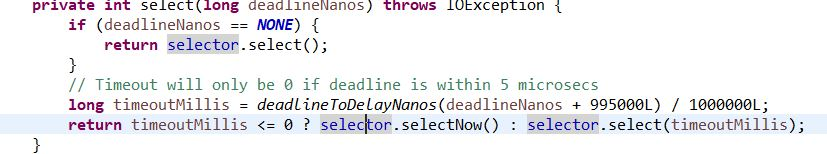
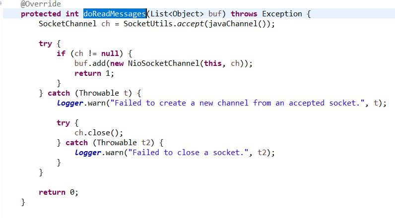

## netty建立连接
### nioeventloop的循环

见nioeventloop的run方法,他是一个死循环,会不断select并处理select的事件.同时还会处理nio的task队列

    protected void run() {
        int selectCnt = 0;
        for (;;) {
            try {
                int strategy;
                try {
					//计算这次循环要做什么
                    strategy = selectStrategy.calculateStrategy(selectNowSupplier, hasTasks());
                    switch (strategy) {
                    case SelectStrategy.CONTINUE:
                        continue;

                    case SelectStrategy.BUSY_WAIT:
                        // fall-through to SELECT since the busy-wait is not supported with NIO
					//做select操作
                    case SelectStrategy.SELECT:
                        long curDeadlineNanos = nextScheduledTaskDeadlineNanos();
                        if (curDeadlineNanos == -1L) {
                            curDeadlineNanos = NONE; // nothing on the calendar
                        }
                        nextWakeupNanos.set(curDeadlineNanos);
                        try {
                            if (!hasTasks()) {
                                strategy = select(curDeadlineNanos);
                            }
                        } finally {
                            // This update is just to help block unnecessary selector wakeups
                            // so use of lazySet is ok (no race condition)
                            nextWakeupNanos.lazySet(AWAKE);
                        }
                        // fall through
                    default:
                    }
                } catch (IOException e) {
                    // If we receive an IOException here its because the Selector is messed up. Let's rebuild
                    // the selector and retry. https://github.com/netty/netty/issues/8566
                    rebuildSelector0();
                    selectCnt = 0;
                    handleLoopException(e);
                    continue;
                }

                selectCnt++;
                cancelledKeys = 0;
                needsToSelectAgain = false;
                final int ioRatio = this.ioRatio;
                boolean ranTasks;
				//处理select到的事件
                if (ioRatio == 100) {
                    try {
                        if (strategy > 0) {
                            processSelectedKeys();
                        }
                    } finally {
                        // Ensure we always run tasks.
                        ranTasks = runAllTasks();
                    }
                } else if (strategy > 0) {
                    final long ioStartTime = System.nanoTime();
                    try {
                        processSelectedKeys();
                    } finally {
                        // Ensure we always run tasks.
                        final long ioTime = System.nanoTime() - ioStartTime;
                        ranTasks = runAllTasks(ioTime * (100 - ioRatio) / ioRatio);
                    }
                } else {
					//处理nio线程队列中的task
                    ranTasks = runAllTasks(0); // This will run the minimum number of tasks
                }

                if (ranTasks || strategy > 0) {
                    if (selectCnt > MIN_PREMATURE_SELECTOR_RETURNS && logger.isDebugEnabled()) {
                        logger.debug("Selector.select() returned prematurely {} times in a row for Selector {}.",
                                selectCnt - 1, selector);
                    }
                    selectCnt = 0;
                } else if (unexpectedSelectorWakeup(selectCnt)) { // Unexpected wakeup (unusual case)
                    selectCnt = 0;
                }
            } catch (CancelledKeyException e) {
                // Harmless exception - log anyway
                if (logger.isDebugEnabled()) {
                    logger.debug(CancelledKeyException.class.getSimpleName() + " raised by a Selector {} - JDK bug?",
                            selector, e);
                }
            } catch (Error e) {
                throw (Error) e;
            } catch (Throwable t) {
                handleLoopException(t);
            } finally {
                // Always handle shutdown even if the loop processing threw an exception.
                try {
                    if (isShuttingDown()) {
                        closeAll();
                        if (confirmShutdown()) {
                            return;
                        }
                    }
                } catch (Error e) {
                    throw (Error) e;
                } catch (Throwable t) {
                    handleLoopException(t);
                }
            }
        }
    }

先来看看select(curDeadlineNanos);方法,

注意selector.select()是一个blocking的select操作,会阻塞到select出至少一个channel;而selectNow是非blocking的,他会马上返回select到的key数量,可能为0;

他是selectkey的操作,这里在select之前,会计算出队列中的task执行的deadline时间,如果没有task,deadlinenanos = NONE,然后会进入select(timeout)的流程,否则本次loop就去执行task了.

进入select(timeout),会看否则计算现在的时间是不是到了timeout,如果task队列中的任务timeout了就直接selectNow返回,否则会一直递归调用select(timeout)到select出一个channel.

接下来看处理select到key的逻辑,,那就去处理io事件,即processSelectedKeys,然后按照IOratio来调节task线程占用的时间来执行task,这里IORatio为io事件和task事件处理的比例,100%那就是优先处理io事件,完成了在处理task事件.否则会去计算执行task任务占用时间.

#### 处理io事件逻辑
processSelectedKeysOptimized为优化后的select逻辑,效率比processSelectedKeysPlain(selector.selectedKeys());JDK的高1-2%

我们来看NioEventLoop的processSelectedKeysOptimized();逻辑:

    private void processSelectedKeysOptimized() {
		//遍历select的key
        for (int i = 0; i < selectedKeys.size; ++i) {
            final SelectionKey k = selectedKeys.keys[i];
            // null out entry in the array to allow to have it GC'ed once the Channel close
            // See https://github.com/netty/netty/issues/2363
            selectedKeys.keys[i] = null;

            final Object a = k.attachment();
			//看attach的类型是不是AbstractNioChannel,在前面我们绑定selector的时候把NioServerSocketChannel当做attach传了进去
            if (a instanceof AbstractNioChannel) {
                processSelectedKey(k, (AbstractNioChannel) a);
            } else {
                @SuppressWarnings("unchecked")
                NioTask<SelectableChannel> task = (NioTask<SelectableChannel>) a;
                processSelectedKey(k, task);
            }

            if (needsToSelectAgain) {
                // null out entries in the array to allow to have it GC'ed once the Channel close
                // See https://github.com/netty/netty/issues/2363
                selectedKeys.reset(i + 1);

                selectAgain();
                i = -1;
            }
        }
    }

由于在channel绑定selector的时候doRegister,将自己作为attach传进去.这里逻辑走的是processSelectedKey(k, (AbstractNioChannel) a);

   	private void processSelectedKey(SelectionKey k, AbstractNioChannel ch) {
        final AbstractNioChannel.NioUnsafe unsafe = ch.unsafe();
		//key的合法性判断与处理        
		if (!k.isValid()) {
            ...
            return;
        }

        try {
            int readyOps = k.readyOps();
            // We first need to call finishConnect() before try to trigger a read(...) or write(...) as otherwise
            // the NIO JDK channel implementation may throw a NotYetConnectedException.
            //
			if ((readyOps & SelectionKey.OP_CONNECT) != 0) {
                // remove OP_CONNECT as otherwise Selector.select(..) will always return without blocking
                // See https://github.com/netty/netty/issues/924
                int ops = k.interestOps();
                ops &= ~SelectionKey.OP_CONNECT;
                k.interestOps(ops);

                unsafe.finishConnect();
            }

            // Process OP_WRITE first as we may be able to write some queued buffers and so free memory.
            if ((readyOps & SelectionKey.OP_WRITE) != 0) {
                // Call forceFlush which will also take care of clear the OP_WRITE once there is nothing left to write
                ch.unsafe().forceFlush();
            }

            // Also check for readOps of 0 to workaround possible JDK bug which may otherwise lead
            // to a spin loop
			//处理读请求(断开连接)和创建连接
            if ((readyOps & (SelectionKey.OP_READ | SelectionKey.OP_ACCEPT)) != 0 || readyOps == 0) {
                unsafe.read();
            }
        } catch (CancelledKeyException ignored) {
            unsafe.close(unsafe.voidPromise());
        }
    }

在这个方法中先判断key的合法性,再根据key的类型做处理.

创建连接的时候是readyOps = OP_ACCEPT= 16,进去unsafe.read();

他的实现类是AbstractNioMessageChannel.NioMessageUnsafe#read()

        @Override
        public void read() {
            assert eventLoop().inEventLoop();
            final ChannelConfig config = config();
            final ChannelPipeline pipeline = pipeline();
            final RecvByteBufAllocator.Handle allocHandle = unsafe().recvBufAllocHandle();
            allocHandle.reset(config);

            boolean closed = false;
            Throwable exception = null;
            try {
                try {
                    do {
						//channel的读操作,这时模板方法,具体实现靠子类
                        int localRead = doReadMessages(readBuf);
                        if (localRead == 0) {
                            break;
                        }
                        if (localRead < 0) {
                            closed = true;
                            break;
                        }
						//记录创建连接的次数
                        allocHandle.incMessagesRead(localRead);
                    } while (continueReading(allocHandle));
                } catch (Throwable t) {
                    exception = t;
                }

                int size = readBuf.size();
                for (int i = 0; i < size; i ++) {
                    readPending = false;
					//将socketchannel的读操作传播进流水线
                    pipeline.fireChannelRead(readBuf.get(i));
                }
                readBuf.clear();
                allocHandle.readComplete();
                pipeline.fireChannelReadComplete();

                if (exception != null) {
                    closed = closeOnReadError(exception);

                    pipeline.fireExceptionCaught(exception);
                }

                if (closed) {
                    inputShutdown = true;
                    if (isOpen()) {
                        close(voidPromise());
                    }
                }
            } finally {
                // Check if there is a readPending which was not processed yet.
                // This could be for two reasons:
                // * The user called Channel.read() or ChannelHandlerContext.read() in channelRead(...) method
                // * The user called Channel.read() or ChannelHandlerContext.read() in channelReadComplete(...) method
                //
                // See https://github.com/netty/netty/issues/2254
                if (!readPending && !config.isAutoRead()) {
                    removeReadOp();
                }
            }
        }

进入doReadMessages方法;由于这里是NioServerSocketChannel,看他的实现

这里会调用accept方法接收连接返回一个新的socketchannel,然后把创建的socketchannel当做参数放入对象数组里,并返回1表示建立了一个连接;

再回到AbstractNioMessageChannel.NioMessageUnsafe#read(),

		pipeline.fireChannelRead(readBuf.get(i));

把新建的socketchannel传播到了流水线,在ServerSocketChannel的流水线上的hanlder上有之前初始化channel流程时放入的ServerBootstrapAcceptor,我们进去看他的read方法:

	    public void channelRead(ChannelHandlerContext ctx, Object msg) {
            final Channel child = (Channel) msg;
			//添加handler流水线;
            child.pipeline().addLast(childHandler);
			//设置channel参数
            setChannelOptions(child, childOptions, logger);
			//设置属性
            for (Entry<AttributeKey<?>, Object> e: childAttrs) {
                child.attr((AttributeKey<Object>) e.getKey()).set(e.getValue());
            }
			
            try {
				//注册到workGroup
                childGroup.register(child).addListener(new ChannelFutureListener() {
                    @Override
                    public void operationComplete(ChannelFuture future) throws Exception {
                        if (!future.isSuccess()) {
                            forceClose(child, future.cause());
                        }
                    }
                });
            } catch (Throwable t) {
                forceClose(child, t);
            }
        }

在这里他负责初始化由ServerSocketChannel攒尖出来的socketChanel;包括设置参数,hanlerpipeline,以及从wockerEnentloop中选出一个eventloop执行对该channel的注册;

来看AbstractChannel#AbstractUnsafe.register()

	//这里是BossGroup的nio线程,所以进下面的流程,去启动workThread
	if (eventLoop.inEventLoop()) {
                register0(promise);
            } else {
                try {
                    eventLoop.execute(new Runnable() {
                        @Override
                        public void run() {
                            register0(promise);
                        }
                    });
                } catch (Throwable t) {
                    logger.warn(
                            "Force-closing a channel whose registration task was not accepted by an event loop: {}",
                            AbstractChannel.this, t);
                    closeForcibly();
                    closeFuture.setClosed();
                    safeSetFailure(promise, t);
                }
            }

这个注册流程和serversocketchannel注册到bosseventloop的流程是一样的,只不过注册boss的是main线程或用户线程.而这次去做register的是nio的boss线程,他当然也不在workerEventLoop的enentloop中,于是他又把注册操作打包成Task,然后去启动了work线程!这里就不再赘述,后面的流程和ServerSocketChannel的注册是一样的,只不过他没有bind流程,并且sockertChannel的isActive直接返回true,在register0中就会调用pipeline.fireChannelActive,在其中设置了interestOps=1 = OP_READ;本次loop结束!!!

