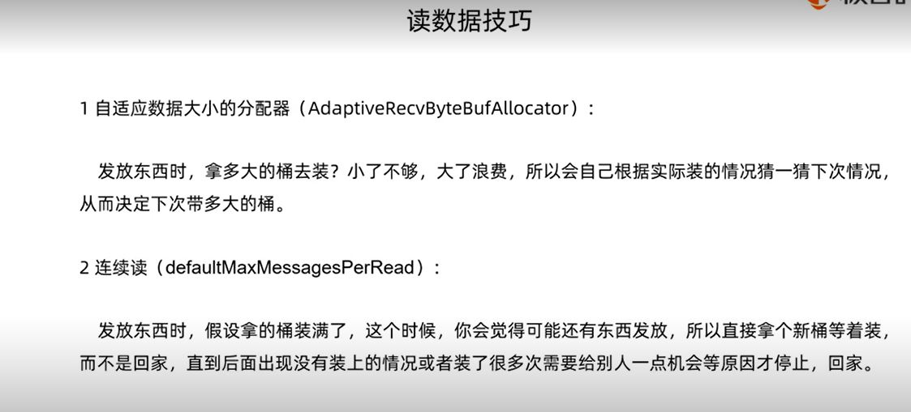
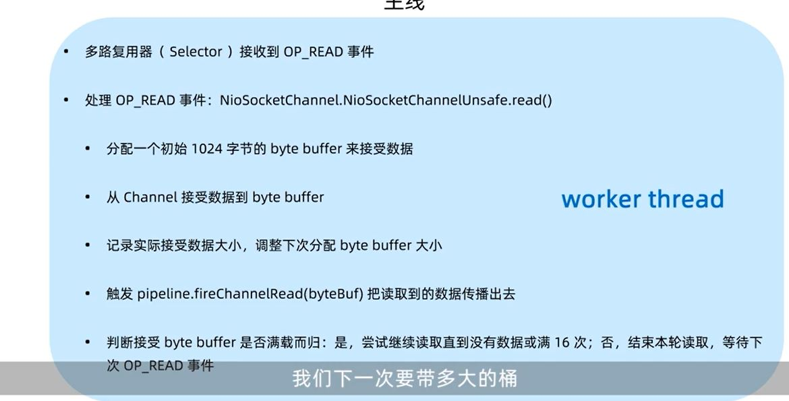
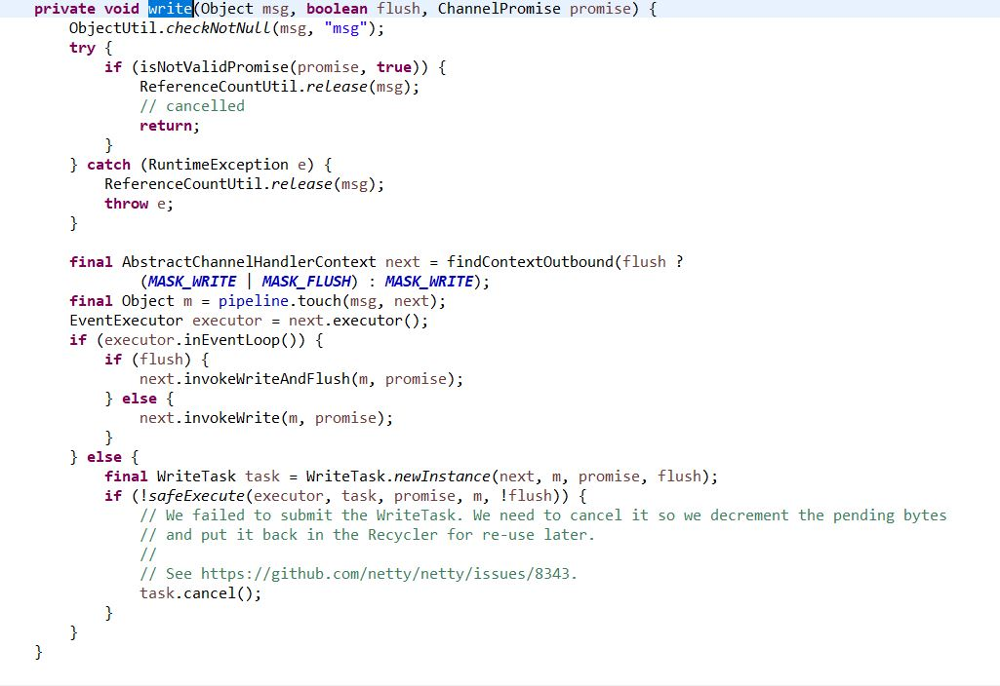

## netty读数据

#### nioeventloop

我们的读数据从eventloop开始,由workernio线程发起(之前介绍的bossnio线程的读是创建连接)

NioEventLoop.processSelectedKey(SelectionKey, AbstractNioChannel)方法中

	// Also check for readOps of 0 to workaround possible JDK bug which may otherwise lead
    // to a spin loop
    if ((readyOps & (SelectionKey.OP_READ | SelectionKey.OP_ACCEPT)) != 0 || readyOps == 0) {
         unsafe.read();
    }

这次他的实现和NioServerSocketChannel的不一样了,serverSocketChannel的是AbstractNioMessageChannel.NioMessageUnsafe#read,而socketChannel的是AbstractNioByteChannel.NioByteUnsafe.read()

代码如下:

        @Override
        public final void read() {
            final ChannelConfig config = config();
            if (shouldBreakReadReady(config)) {
                clearReadPending();
                return;
            }
            final ChannelPipeline pipeline = pipeline();
			//获取ByteBuf的分配器
            final ByteBufAllocator allocator = config.getAllocator();
			//动态决定分配多少内存的handler:: AdaptiveRecvByteBufAllocator
            final RecvByteBufAllocator.Handle allocHandle = recvBufAllocHandle();
            allocHandle.reset(config);

            ByteBuf byteBuf = null;
            boolean close = false;
            try {
                do {
					//第一次读默认分配1024
                    byteBuf = allocHandle.allocate(allocator);
					//记录每次读的大小
                    allocHandle.lastBytesRead(doReadBytes(byteBuf));
                    if (allocHandle.lastBytesRead() <= 0) {
                        // nothing was read. release the buffer.
                        byteBuf.release();
                        byteBuf = null;
                        close = allocHandle.lastBytesRead() < 0;
                        if (close) {
                            // There is nothing left to read as we received an EOF.
                            readPending = false;
                        }
                        break;
                    }
					//记录读了多少次
                    allocHandle.incMessagesRead(1);
                    readPending = false;
					//将读到的数据传递出去,这时netty的业务读的核心流程
                    pipeline.fireChannelRead(byteBuf);
                    byteBuf = null;
				//判断是不是继续读的关键逻辑
				//1.上次读的>0
				//2.读的次数没有满16次
				//3.上次读把bytebuff读满了
                } while (allocHandle.continueReading());
				//记录这次读事件总共读了多少数据,计算下次分配大小
                allocHandle.readComplete();
				//传播完成读事件
                pipeline.fireChannelReadComplete();

                if (close) {
                    closeOnRead(pipeline);
                }
            } catch (Throwable t) {
                handleReadException(pipeline, byteBuf, t, close, allocHandle);
            } finally {
                // Check if there is a readPending which was not processed yet.
                // This could be for two reasons:
                // * The user called Channel.read() or ChannelHandlerContext.read() in channelRead(...) method
                // * The user called Channel.read() or ChannelHandlerContext.read() in channelReadComplete(...) method
                //
                // See https://github.com/netty/netty/issues/2254
                if (!readPending && !config.isAutoRead()) {
                    removeReadOp();
                }
            }
        }
    }

查看扩容,缩容逻辑,发现2次才会缩,每次都会扩

        private void record(int actualReadBytes) {
            if (actualReadBytes <= SIZE_TABLE[max(0, index - INDEX_DECREMENT)]) {
                if (decreaseNow) {
                    index = max(index - INDEX_DECREMENT, minIndex);
                    nextReceiveBufferSize = SIZE_TABLE[index];
                    decreaseNow = false;
                } else {
                    decreaseNow = true;
                }
            } else if (actualReadBytes >= nextReceiveBufferSize) {
                index = min(index + INDEX_INCREMENT, maxIndex);
                nextReceiveBufferSize = SIZE_TABLE[index];
                decreaseNow = false;
            }

注意:读取数据流程由nio线程触发,并传播到流水线(在流水线上我们可以切换为用户线程来执行一些操作,以免NIO线程阻塞,如pipeline.addLast(executor,handler)就可以为自定义handler自定义线程池,在DefaultChannelPipeline.fireChannelRead(Object)中若有自定义线程,则会切换自定义线程来读),读是一个inbound的过程,由pipeline流水线的head->tail.

读的inbound切换线程逻辑见 AbstractChannelHandlerContext#invokeChannelRead 

    static void invokeChannelRead(final AbstractChannelHandlerContext next, Object msg) {
        final Object m = next.pipeline.touch(ObjectUtil.checkNotNull(msg, "msg"), next);
		//获取下一个handler的 executor,也就是我们在pipeline.addLast(executor,handler)中指定的线程池中的子线程       
		EventExecutor executor = next.executor();
		//我们指定的executor的thread,这里的看是不是eventloop的逻辑简单暴力,看当前线程是不是和自己的线程是一个线程,在这里他肯定不是inEventLoop,因为现在在nio线程里!!!
        if (executor.inEventLoop()) {
			//未指定线程池的话这里的线程是nio线程,channel的handler拿到的都是channel注册到的那个nio线程,进这个逻辑,继续用nio线程乡下传播
            next.invokeChannelRead(m);
        } else {
			//若为自定义线程,直接用自定义线程执行读
            executor.execute(new Runnable() {
                @Override
                public void run() {
                    next.invokeChannelRead(m);
                }
            });
        }
    }

这里的逻辑同样也适用于用户自定义线程切换到nio线程:目前线程为自定义线程的,调用下一个handler若未指定线程池,则为nio线程,那目前线程和nio的线程不同,会进下面的逻辑,nio线程会把打包成task放入队列.在下一次loop中由nio线程执行,这样就完成了线程切换!!!

### outbound

outbound是从tail-> head

在DefaultChennelPipeline中有headhandler和tailhandler

从读的流程是从head-> 用户定义的handler -> tailerhandler,要是任何inbound(read,active)到tailhandler还没被处理的话,tailhandler会有默认处理方法 onUnhandledXXXXX,比如read这里就会释放该MSg的引用,释放资源让垃圾回收回收掉;

如下:

		@Override
        public void channelActive(ChannelHandlerContext ctx) {
            onUnhandledInboundChannelActive();
        }

        @Override
        public void channelInactive(ChannelHandlerContext ctx) {
            onUnhandledInboundChannelInactive();
        }

        @Override
        public void channelWritabilityChanged(ChannelHandlerContext ctx) {
            onUnhandledChannelWritabilityChanged();

相反,ctx.channel().write操作和ctx.channel().writeAndFlush的代码见AbstractChannel.writeAndFlush(Object),

    @Override
    public ChannelFuture writeAndFlush(Object msg) {
        return pipeline.writeAndFlush(msg);
    }

他的实现在DefaultChannelPipeline  :

	    @Override
	    public final ChannelFuture write(Object msg, ChannelPromise promise) {
	        return tail.write(msg, promise);
	    }
	
	    @Override
	    public final ChannelFuture writeAndFlush(Object msg, ChannelPromise promise) {
	        return tail.writeAndFlush(msg, promise);
	    }
可以发现,ctx.channel()的写操作都是由tailhandler -> 用户handler-> headhandler,

再来看ctx.write和ctx.writeAndFlush(Object);
发现直接调用的是AbstractChannelHandlerContext.write(Object, boolean, ChannelPromise),这个下面来讲;大概逻辑是从当前handler的下一个handler的write开始执行!

在回到tailHandler;tail.write和tail.writeAndFlush的区别就是实际调用AbstractChannelHandlerContext.write(Object, boolean, ChannelPromise)的时候中间的flush一个为true一个为false

先来看AbstractChannelHandlerContext.write:

pipeline.touch用于引用计数,防止内存泄漏
我们发现这里的套路和AbstractChannelHandlerContext#invokeChannelRead切换线程逻辑一致.在AbstractChannelHandlerContext.write里面会拿到下一个handler自定义线程池(若我们定义handler的时候没有定义,他就是这个channel所register的eventloop线程),看当前线程是否和下一个executor的线程一致,一致的话就会直接执行,否则会调用自定义线程执行(nio->自定义)或nio线程打包成task(自定义->nio);

再来看AbstractChannelHandlerContext#invokeWriteAndFlush和#invokeWrite

    void invokeWriteAndFlush(Object msg, ChannelPromise promise) {
        if (invokeHandler()) {
            invokeWrite0(msg, promise);
            invokeFlush0();
        } else {
            writeAndFlush(msg, promise);
        }
    }

其实就是调用下个handler的invokeWrite0,这会级联触发流水线的链调用

在write0完成后再流水线上传播flush的链调用,如下图

    private void invokeWrite0(Object msg, ChannelPromise promise) {
        try {
            ((ChannelOutboundHandler) handler()).write(this, msg, promise);
        } catch (Throwable t) {
            notifyOutboundHandlerException(t, promise);
        }
    }

    private void invokeFlush0() {
        try {
            ((ChannelOutboundHandler) handler()).flush(this);
        } catch (Throwable t) {
            invokeExceptionCaught(t);
        }
    }

到了headhandler了以后呢?

        @Override
        public void write(ChannelHandlerContext ctx, Object msg, ChannelPromise promise) {
            unsafe.write(msg, promise);
        }

我们发现DefaultChannelPipeline.HeadContext.write(ChannelHandlerContext, Object, ChannelPromise)实际上调用unsafe.write

我们来看AbstractChannel.AbstractUnsafe.write(Object, ChannelPromise),

        @Override
        public final void write(Object msg, ChannelPromise promise) {
            assertEventLoop();

            ChannelOutboundBuffer outboundBuffer = this.outboundBuffer;
            if (outboundBuffer == null) {
                try {
                    // channel关闭了,释放资源以免内存泄露
                    ReferenceCountUtil.release(msg);
                } finally {
                    // If the outboundBuffer is null we know the channel was closed and so
                    // need to fail the future right away. If it is not null the handling of the rest
                    // will be done in flush0()
                    // See https://github.com/netty/netty/issues/2362
                    safeSetFailure(promise,
                            newClosedChannelException(initialCloseCause, "write(Object, ChannelPromise)"));
                }
                return;
            }

            int size;
            try {
				//计算msg的大概size
                msg = filterOutboundMessage(msg);
                size = pipeline.estimatorHandle().size(msg);
                if (size < 0) {
                    size = 0;
                }
            } catch (Throwable t) {
                try {
                    ReferenceCountUtil.release(msg);
                } finally {
                    safeSetFailure(promise, t);
                }
                return;
            }
			//消息放入channel的缓存链表
            outboundBuffer.addMessage(msg, size, promise);
        }

可以看见核心就是 outboundBuffer.addMessage(msg, size, promise);这个outboundBuffer为每个socketChannel的一个送缓冲.

    public void addMessage(Object msg, int size, ChannelPromise promise) {
        Entry entry = Entry.newInstance(msg, size, total(msg), promise);
        if (tailEntry == null) {
            flushedEntry = null;
        } else {
            Entry tail = tailEntry;
            tail.next = entry;
        }
        tailEntry = entry;
        if (unflushedEntry == null) {
            unflushedEntry = entry;
        }

        // increment pending bytes after adding message to the unflushed arrays.
        // See https://github.com/netty/netty/issues/1619
		//
		//根据这次要写的数据,更新看目前还有多少数据在缓冲区没有处理完,如果没有处理的内容过多大于写高水位线,就把buffer的状态设置为不可写,并在pipeline上传播@Override
    ChannelPipeline fireChannelWritabilityChanged();可以由用户决定怎么处理接下来的内容
        incrementPendingOutboundBytes(entry.pendingSize, false);
    }

也就是说write方法其实只是把消息加入了outboundBuffer;并没有真正发送.outboundBuffer是一个链表的结构,每次的write都会在链表节点的结尾添加一个Entry,并把第一个没flush的Entry指向unflushedEntry.接下来开始flush了

再来看AbstractChannel.AbstractUnsafe#flush

        @Override
        public final void flush() {
            assertEventLoop();

            ChannelOutboundBuffer outboundBuffer = this.outboundBuffer;
            if (outboundBuffer == null) {
                return;
            }

            outboundBuffer.addFlush();
            flush0();
        }

其中outboundBuffer.addFlush();把链表的第一个没flush的Entry取出来,往下遍历,标记成flush,把unflushedEntry标记为null,整个链表变成了一个以flushedEntry为头节点的链表.准备发送!!

    public void addFlush() {
        // There is no need to process all entries if there was already a flush before and no new messages
        // where added in the meantime.
        //
        // See https://github.com/netty/netty/issues/2577
        Entry entry = unflushedEntry;
        if (entry != null) {
            if (flushedEntry == null) {
                // there is no flushedEntry yet, so start with the entry
                flushedEntry = entry;
            }
            do {
                flushed ++;
                if (!entry.promise.setUncancellable()) {
                    // Was cancelled so make sure we free up memory and notify about the freed bytes
                    int pending = entry.cancel();
                    decrementPendingOutboundBytes(pending, false, true);
                }
                entry = entry.next;
            } while (entry != null);

            // All flushed so reset unflushedEntry
            unflushedEntry = null;
        }
    }

再来看flush0里面的doWrite(outboundBuffer);他的实现在NioSocketChannel.doWrite(ChannelOutboundBuffer)

    @Override
    protected void doWrite(ChannelOutboundBuffer in) throws Exception {
        SocketChannel ch = javaChannel();
		//一次写最多尝试的写次数,为16次
        int writeSpinCount = config().getWriteSpinCount();
        do {
			//数据空了就不写了,退出
            if (in.isEmpty()) {
                // All written so clear OP_WRITE
                clearOpWrite();
                // Directly return here so incompleteWrite(...) is not called.
                return;
            }

            // Ensure the pending writes are made of ByteBufs only.
			//每次聚合最大写入,会动态变化,根据写的结果变
            int maxBytesPerGatheringWrite = ((NioSocketChannelConfig) config).getMaxBytesPerGatheringWrite();
			//1024控制ChannelOutboundBuffer缓存ByteBuffer的数组内容个数,maxBytesPerGatheringWrite控制buffer的大小,这个操作把entry里的数据组装到ChannelOutboundBuffer的buffer里面,这个buffer是一个threadlocal,每次在doWrite的时候通过该方法组装.
            ByteBuffer[] nioBuffers = in.nioBuffers(1024, maxBytesPerGatheringWrite);
            //缓存buffer的bytebuff数据个数
			int nioBufferCnt = in.nioBufferCount();

            // Always use nioBuffers() to workaround data-corruption.
            // See https://github.com/netty/netty/issues/2761
            switch (nioBufferCnt) {
                case 0:
                    // We have something else beside ByteBuffers to write so fallback to normal writes.
                    writeSpinCount -= doWrite0(in);
                    break;
                case 1: {
					//只有一个数据的时候调用的是channel.write(ByteBuffer)方法,这个channel是jdkchannel
  					//一个数据不需要做聚合写操作
                    // Only one ByteBuf so use non-gathering write
                    // Zero length buffers are not added to nioBuffers by ChannelOutboundBuffer, so there is no need
                    // to check if the total size of all the buffers is non-zero.
                    ByteBuffer buffer = nioBuffers[0];
                    int attemptedBytes = buffer.remaining();
					//已经写入内核数据量
                    final int localWrittenBytes = ch.write(buffer);
                    if (localWrittenBytes <= 0) {
						//如果因为网络堵塞内核不能写入的话把该channel的key上注册一个OP_WRITE事件,等待内核缓冲区能写入了,nio线程在把channel select出来做写入操作
                        incompleteWrite(true);
						//这种情况下不会写16次,直接退出了
                        return;
                    }
					//调整聚合写的大小,代码在下面讲解
                    adjustMaxBytesPerGatheringWrite(attemptedBytes, localWrittenBytes, maxBytesPerGatheringWrite);
					//将写入的数据从netty的channelbuffer里面清理掉,否则会引起内存泄漏,下面讲解代码
                    in.removeBytes(localWrittenBytes);
					//减少count
                    --writeSpinCount;
                    break;
                }
                default: {
					//对于多个数据会使用聚合写
                    // Zero length buffers are not added to nioBuffers by ChannelOutboundBuffer, so there is no need
                    // to check if the total size of all the buffers is non-zero.
                    // We limit the max amount to int above so cast is safe
                    long attemptedBytes = in.nioBufferSize();
                    final long localWrittenBytes = ch.write(nioBuffers, 0, nioBufferCnt);
                    if (localWrittenBytes <= 0) {
                        incompleteWrite(true);
                        return;
                    }
                    // Casting to int is safe because we limit the total amount of data in the nioBuffers to int above.
                    adjustMaxBytesPerGatheringWrite((int) attemptedBytes, (int) localWrittenBytes,
                            maxBytesPerGatheringWrite);
                    in.removeBytes(localWrittenBytes);
                    --writeSpinCount;
                    break;
                }
            }
        } while (writeSpinCount > 0);
		//对于写了16次还没写完的数据,writeSpinCount = 0 ,这时不会去注册OP_WRITE,而是用nio线程去执行打包成task的flush0操作,因为我们知道这个时候内核是可写的,这个操作是为了让出本次nio线程时间,不然这个写太久,影响别的事件执行
        incompleteWrite(writeSpinCount < 0);
    }

这里才是真正发送的核心部分

来看动态调节聚合写的方法:

    private void adjustMaxBytesPerGatheringWrite(int attempted, int written, int oldMaxBytesPerGatheringWrite) {
        // By default we track the SO_SNDBUF when ever it is explicitly set. However some OSes may dynamically change
        // SO_SNDBUF (and other characteristics that determine how much data can be written at once) so we should try
        // make a best effort to adjust as OS behavior changes.
		//如果一次就把数据写完,尝试扩大聚合写的量
        if (attempted == written) {
            if (attempted << 1 > oldMaxBytesPerGatheringWrite) {
                ((NioSocketChannelConfig) config).setMaxBytesPerGatheringWrite(attempted << 1);
            }
		//一次写不完,要缩小写入的量了
        } else if (attempted > MAX_BYTES_PER_GATHERING_WRITE_ATTEMPTED_LOW_THRESHOLD && written < attempted >>> 1) {
            ((NioSocketChannelConfig) config).setMaxBytesPerGatheringWrite(attempted >>> 1);
        }
    }

再来看清除channelbuffer的操作:

    public void removeBytes(long writtenBytes) {
        for (;;) {
			//获取被标记为flushed的entry的节点,也就是第一个没被删除的flush节点
            Object msg = current();
            if (!(msg instanceof ByteBuf)) {
                assert writtenBytes == 0;
                break;
            }

            final ByteBuf buf = (ByteBuf) msg;
            final int readerIndex = buf.readerIndex();
			//计算当前entry的大小
            final int readableBytes = buf.writerIndex() - readerIndex;
			//当前entry的大小小于已经写入的数据量,说明已经完全写入,删除掉已经完全写入的entry
            if (readableBytes <= writtenBytes) {
                if (writtenBytes != 0) {
					//调用promise通知用户lietener,通常我们会添加lietenerr来监控发送进度,如发了多少byte
                    progress(readableBytes);
					//对writtenBytes减去本entry的大小,准备用来和下一个entry比较
                    writtenBytes -= readableBytes;
                }
				//把outboundbuffer里的这个entry从链表上删除
                remove();
			//对于那些只写了一部分的entry,更新read index
            } else { // readableBytes > writtenBytes
                if (writtenBytes != 0) {
					//记录reader index,这样下次写可以从reader index开始组装数据写入buffer数组
                    buf.readerIndex(readerIndex + (int) writtenBytes);
                    progress(writtenBytes);
                }
                break;
            }
        }
		//清除channelOutboundBuffer的buffer,他是一个threadlocal,每次在发送的时候由entry来组装,发送完的emntry已经删除,发送了一半的也已经标记,这里没发完的内容应该清空掉!!
		//这里的操作是把这个bytebuffer数组容器里的内容全部设为null
        clearNioBuffers();
    }