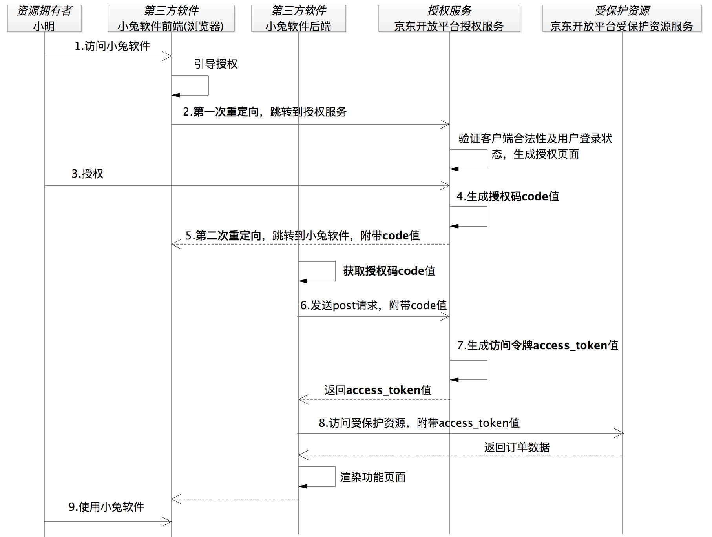

# oauth2.0

授权码模式:

app模式:
以微信为例

# OpenID Connect协议

OIDC 其实就是一种用户身份认证的开放标准,OAuth2.0 是一种授权协议，而不是身份认证协议。OIDC 才是身份认证协议，而且是基于 OAuth 2.0 来执行用户身份认证的互通协议。更概括地说，OIDC 就是直接基于 OAuth 2.0 构建的身份认证框架协议。

OIDC 的三个主要角色

1. EU（End User），代表最终用户。
2. RP（Relying Party），代表认证服务的依赖方，就是第三方软件。
3. OP（OpenID Provider），代表提供身份认证服务方。

以极客时间通过微信登录为例:

OIDC流程:

比oauth2多了个id_token(ID 令牌),ID 令牌是一个 JWT 格式的令牌,需要能够标识出用户、失效时间等属性来达到身份认证的目的.

jwt payload中需要有5个属性:

1. iss，令牌的颁发者，其值就是身份认证服务（OP）的 URL。
2. sub，令牌的主题，其值是一个能够代表最终用户（EU）的全局唯一标识符。
3. aud，令牌的目标受众，其值是三方软件（RP）的 app_id。
4. exp，令牌的到期时间戳，所有的 ID 令牌都会有一个过期时间。
5. iat，颁发令牌的时间戳。

示例代码如下:

		
	//GENATE ID TOKEN
	String id_token=genrateIdToken(appId,user);
	
	private String genrateIdToken(String appId,String user){
	    String sharedTokenSecret="hellooauthhellooauthhellooauthhellooauth";//秘钥
	    Key key = new SecretKeySpec(sharedTokenSecret.getBytes(),
	            SignatureAlgorithm.HS256.getJcaName());//采用HS256算法
	
	    Map<String, Object> headerMap = new HashMap<>();//ID令牌的头部信息
	    headerMap.put("typ", "JWT");
	    headerMap.put("alg", "HS256");
	
	    Map<String, Object> payloadMap = new HashMap<>();//ID令牌的主体信息
	    payloadMap.put("iss", "http://localhost:8081/");
	    payloadMap.put("sub", user);
	    payloadMap.put("aud", appId);
	    payloadMap.put("exp", 1584105790703L);
	    payloadMap.put("iat", 1584105948372L);
	
	    return Jwts.builder().setHeaderParams(headerMap).setClaims(payloadMap).signWith(key,SignatureAlgorithm.HS256).compact();
	}

第三方软件拿到access_token和id_token后对id_token解析,代码示例如下:

	private Map<String,String> parseJwt(String jwt){
	        String sharedTokenSecret="hellooauthhellooauthhellooauthhellooauth";//密钥
	        Key key = new SecretKeySpec(sharedTokenSecret.getBytes(),
	                SignatureAlgorithm.HS256.getJcaName());//HS256算法
	
	        Map<String,String> map = new HashMap<String, String>();
	        Jws<Claims> claimsJws = Jwts.parserBuilder().setSigningKey(key).build().parseClaimsJws(jwt);
	        //解析ID令牌主体信息
	        Claims body = claimsJws.getBody();
	        map.put("sub",body.getSubject());
	        map.put("aud",body.getAudience());
	        map.put("iss",body.getIssuer());
	        map.put("exp",String.valueOf(body.getExpiration().getTime()));
	        map.put("iat",String.valueOf(body.getIssuedAt().getTime()));
	        
	        return map;
	    }

这样当第三方软件（RP）拿到 ID 令牌之后，就已经获得了处理身份认证标识动作的信息，也就是拿到了那个能够唯一标识最终用户（EU）的 ID 值，比如 3521。

为了提升第三方软件对用户的友好性，在页面上显示 “您好，3521” 肯定不如显示 “您好，小明同学”的体验好,第三方应用用访问令牌获取 ID 令牌之外的信息.

